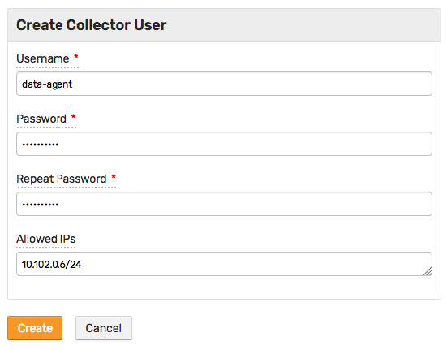

# Collector Account

Creating one or multiple **collector** accounts with permissions limited to data collection is recommended for enhanced security.

This type of account can be used in tools such as data collection agents for inserting series, properties, and messages into the database using Data and Meta API.

The **collector** user inserts data of all types (series, properties, and messages) for many entities, including new entities, and requires both the `API_DATA_WRITE` and `API_META_WRITE` roles and `write` permissions for all entities.

## Create `collectors` User Group

* Login into ATSD as administrator
* Open the **Settings > Users > User Groups > Create** page
* Create the `collectors` group with **[All Entities] Write** permission

## Create `collector` User

* Open the **Settings > Users > Create** page
* Create a `collector` user with **API_DATA_WRITE** and **API_META_WRITE** roles
* Check the `collectors` row in the User Groups table to add the user to the `collectors` group

## Collector User Wizard

To simplify the process of creating collector accounts, the database provide a wizards to create a typical **collector** user.

The instruments inserting data under the **collector** account are typically located within a specific network segment and an option to specify the allowed IP range could be used to enhance access security.

To create a new user of this type, open the **Settings > Users** page and select **Create Collector User** option from the split button located below the 'Users' table.

The wizard will automatically create a new user account and assign it as a member to the 'Data Collectors' user group with all entity `write` permissions.

