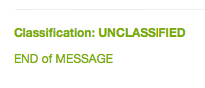
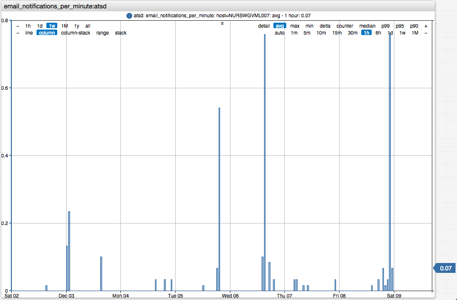

# Mail Client

## Overview

The mail client is used for sending email notifications generated by the rule engine as well as by scheduled export and SQL jobs.

## Configuration

* Open the **Settings > Mail Client** page.
* Configure the client properties to enable email notifications.
* Click [Update].
* Click [Send Message] to test the configuration by sending a message to a recipient.

## Settings

| **Field** | **Description** |
| :--- | :--- |
| Enabled | Set this property to true in order to enable email notifications. |
| Server Name | Server specified in the "From" field, for example `ATSD {hostname} - DEV`. |
| Server | Hostname or IP address of your mail server, for example `smtp.mycompany.com`. |
| Port | Mail server port. |
| Sender Address | Address specified in the "From" field, for example `notify@mycompany.com`. |
| Authentication | Set this property to true to enable authentication. |
| SSL | Set this property to enable SSL encryption. |
| Upgrade SSL | Upgrade an insecure connection to a secure connection using SSL/TLS. |
| User | Username of the mailbox user. |
| Password | Password of the mailbox user. |


## Header and Footer

The header and footer can be specified as plain text of HTML. If enabled, they are appended to all messages. These parts do not support any placeholders.

```html
<p style="color: #8db600; font-weight: bold; margin: 0px; padding: 0px;">Classification: UNCLASSIFIED</p>
```

```html
<p style="color: #8db600;">END of MESSAGE</p>
```



### Monitoring

The number of messages sent per minute can be monitored with the [`email_notifications_per_minute`](monitoring.md#rule-engine) setting collected by ATSD.

```elm
    https://atsd_hostname:8443/portals/series?entity=atsd&metric=email_notifications_per_minute
```


