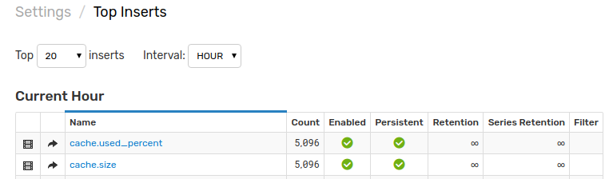
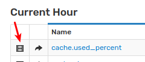
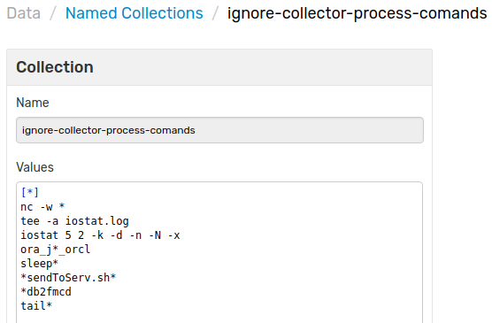
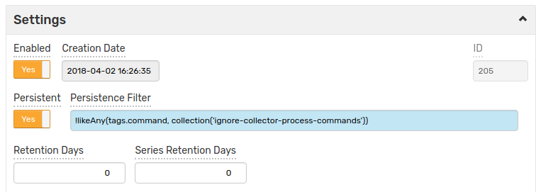

# Metric Persistence Filter

The metric persistence filter, configurable in the metric editor, can be used to discard incoming series commands according to a filter expression. Commands for which the expression returns `false` will not be stored in the database.

## Expression Syntax

The filter is a boolean condition that can include fields, operators, and functions.

### Fields

| **Name** | **Type**| **Description** | **Example** |
|:---|:---|:---|:---|
| `entity` | string|Entity name. | `entity LIKE "?tsd"`|
| `value` | number|Numeric value. | `value > 0`|
| `message` | string|Text value (annotation). | `message = "a"`|
| `timestamp`| number| Series command timestamp. |`timestamp < 1522683114614`|
| `tags.{name}` or `tags['name']` | string|Value of command tag with name `name`. <br>Tag names are case-**in**sensitive.<br> |`tags.location NOT IN ('a', 'b', 'c')`<br>`tags['fs'] LIKE "ext*"`. |

### Operators

Comparison operators: `=`, `==`, `!=`, `LIKE`.

Logical operators: `AND`, `OR`, `NOT` as well as `&&` , `||`, `!`

### Wildcards

* Wildcard `*` means zero or more characters. 
* Wildcard `?` means any character.

### Functions

The following built-in functions can be used in the filter expression:

* [collection](#collection)
* [list](#list)
* [likeAll](#likeall)
* [likeAny](#likeany)
* [matches](#matches)
* [startsWithAny](#startswithany)
* [contains](#contains)
* [collection_contains](#collection_contains)
* [collection_intersects](#collection_intersects)
* [upper](#upper)
* [lower](#lower)
* [size](#size)
* [isEmpty](#isempty)
* [IN](#in)

Filter expression may contain [Math](https://docs.oracle.com/javase/8/docs/api/java/lang/Math.html) functions:

```javascript
Math.sin(Math.toRadians(value)) < 0.5
```

### `collection`

```javascript
  collection(string s) [string]
```

Returns an array of strings which have been loaded with the specified string `s`.

Named collections are listed on the **Data > Named Collections** page.

To check the size of the collection, use the `.size()` method.

To access the *n*-th element in the collection, use square brackets as in `[index]` or the `get(index)` method (starting with 0 for the first element).

```javascript
entity = collection('hosts')[0]

tags.request_ip = collection('ip_white_list').get(1)
```

### `list`

```javascript
  list(string s[, string p]) [string]
```

Splits string `s` using separator `p` (default is comma ',') into a collection of string values. The function discards duplicate items by preserving only the first occurrence of each element. 

To access the n-th element in the collection, use square brackets as in `[index]` or the `get(index)` method (starting with 0 for the first element).

Examples:

```javascript
entity = list('atsd,nurswgvml007').get(0) 
```

### `likeAll`

```javascript
  likeAll(object s, [string] c) boolean
```

Returns `true`, if the first argument `s` matches **every** element in the collection of patterns `c`. The collection `c` can be specified inline as an array of strings or reference a named collection.

Examples:

```javascript

likeAll(tags.request_ip, ['10.50.*', '10.50.102.?'])
```

### `likeAny`

```javascript
  likeAny(object s, [string] c) boolean
```

Returns `true`, if the first argument `s` matches **at least one** element in the collection of patterns `c`. The collection `c` can be specified inline as an array of strings or reference a named collection.

Examples:

```javascript
likeAny(tags.os, ['Ubuntu*', 'Centos*'])

likeAny(tags.request_ip, collection('ip_white_list'))
```

### `matches`

```javascript
  matches(string p, [string] c) boolean
```

Returns `true` if one of the elements in collection `c` matches (satisfies) the specified pattern `p`.  The collection `c` can be specified inline as an array of strings or reference a named collection.

The pattern supports `?` and `*` wildcards.

Example:

```javascript
matches(entity, collection('hosts'))

matches(message, ['OK', 'stable'])
```  

### `startsWithAny`

```javascript
  startsWithAny(object s, [string] c) boolean
```

Returns `true`, if the first argument `s` starts with any of strings from collection `c`. Collection `c` can be specified inline as an array of strings or reference a named collection.

Examples:

```javascript
startsWithAny(entity, ['a', 'nur'])
```

### `contains`

```javascript
  [string].contains(string s) boolean
```

Returns `true` if `s` is contained in the collection. The collection `c` can be specified inline as an array of strings or reference a named collection.

Example:

```javascript
collection('ip_white_list').contains(tags.request_ip)
```

### `collection_contains`

```javascript
  collection_contains(object v, [] c) boolean
```

Returns `true`, if collection `c` contains object `v`. The collection `c` can be specified inline as an array of strings or reference a named collection.

Examples:

```javascript
NOT collection_contains(tags['os'], collection('ignore_os'))   
```

### `collection_intersects`

```javascript
  collection_intersects([] f, [] s) boolean
```
Returns `true`, if collection `f` has elements in common with collection `s`. The collections can be specified inline as an arrays of strings or reference a named collections.

Examples:

```javascript
collection_intersects(tags.values(), collection('ip_white_list'))
```

### `upper`

```javascript
  upper(string s) string
```

Converts `s` to uppercase letters.

### `lower`

```javascript
  lower(string s) string
```
Converts `s` to lowercase letters.

### `size`

```javascript
  [].size() integer
```

Returns the number of elements in the collection.

> This function can be applied to collections of any type (string, number) as well as maps.

Examples:

```javascript
tags.size() > 1
```    

### `isEmpty`

```javascript
  [].isEmpty() boolean
```

Returns `true` if the number of elements in the collection is zero.

> This function can be applied to collections of any type (string, number) as well as maps.

Example:

```javascript
NOT tags.isEmpty()
```  

### `IN`

```javascript
  string s IN (string a[, string b[...]]) boolean
```

Returns `true` if `s` is contained in the collection of strings enclosed in round brackets.

Examples:

```javascript
entity IN ('nurswgvml007', 'nurswgvml008')

tags.location IN ('NUR', 'SVL')
```  

## Using Persistence Filter

If space utilization needs to be controlled, open the **Settings > Receive Statistics** page to view metrics with the highest number of inserted commands:



The _Series_ icon opens a list of unique tags for the selected metric. 



If some of the incoming data is of low value it may not be worth storing it.


To stop storing such series, create a collection with filter patterns on the **Data > Named Collections** page.



Open the metric editor and create a filter expression to ignore matching series.

```bash
!likeAny(tags.command, collection('ignore-collector-process-commands'))
```



As a result, the number of stored series will be reduced.


