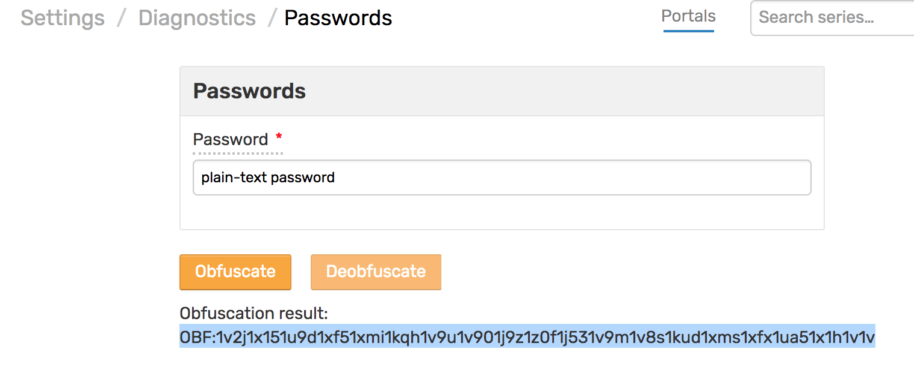
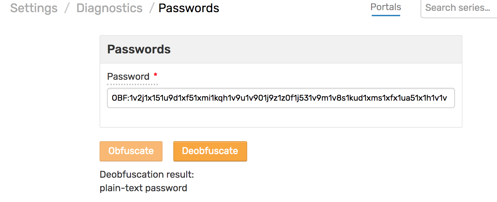

# Password Obfuscation

## Obfuscation

To obfuscate a password, open the **Settings > Diagnostics > Passwords** page.

Enter the plain text password and click `Obfuscate`.

The result will be an obfuscated string with `OBF:` prefix which can be specified in the `server.properties` file.



Sample `server.properties` file with obfuscated passwords:

```txt
...
https.keyStorePassword=OBF:1s3g1zlo1y0y1rpg1ri31vv11vu91rib1rp61y0s1zlu1s3m
https.keyManagerPassword=OBF:1s3g1zlo1y0y1rpg1ri31vv11vu91rib1rp61y0s1zlu1s3m
...
```

## Deobfuscation

To convert an obfuscated text back to plain text, open the **Settings > Diagnostics > Passwords** page.

The input text should start with `OBF:` prefix.

Enter the text  and click `Deobfuscate` to view the plain text.



## Security

Obfuscation is not based on encryption and cannot be considered a secure way to store passwords. The above procedures can be performed on any ATSD instance or using a Jetty server as described in this [article](https://docs.oracle.com/cd/E35822_01/server.740/es_admin/src/tadm_ssl_jetty_passwords.html).
