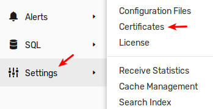
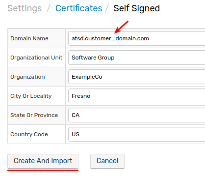

# Installing Self-signed SSL Certificate

## Overview

The default certificate installed in ATSD is generated for DNS name (`commonName`) 'atsd'. This document describes the process of creating and installing a self-signed SSL certificate to match the actual DNS name (fully qualified hostname) at which the ATSD server will be accessible.

As with all self-signed certificates, the new certificate will still cause a security exception in user browsers and will require passing `-k/--insecure` parameter when connecting to ATSD using `curl` and similar tools in order to skip certificate validation.

## Create and Import Certificate

There are two options to create and import self-signed certificates into ATSD:

* [User Interface](#user-interface)
* [Endpoint Request](#endpoint-request)

The certificates will be installed without an ATSD restart.

### User Interface

Login as a user with administrative privileges.

Open the **Settings > Certificates** page and click **Self Signed Certificate** in the multi-action button:




Enter the certificate information and click on **Create And Import**. Only the `Domain Name` field is required.



> `Country Code` must contain two letters if specified.

### Endpoint Request

Replace `{USR}` and `{PWD}` with administrator credentials, `{atsd_hostname}` with the hostname or IP address of the ATSD server and specify appropriate parameters in the command below.

```sh
curl -k -u {USR}:{PWD} https://{atsd_hostname}:8443/admin/certificates/self-signed \
  -d "domainName=atsd.customer_domain.com" 
  -w "\n%{http_code}\n"
```

The response status code should be `2xx` or `3xx`.

You can specify additional fields if necessary. The `countryCode` field must contain two letters if specified.

```elm
curl -v -k -u {USR}:{PWD} https://{HOST}:8443/admin/certificates/self-signed \
  -d "domainName=atsd.customer_domain.com" \
  -d "organizationalUnit=Software Group" \
  -d "organization=ExampleCo" \
  -d "cityOrLocality=Fresno" \
  -d "stateOrProvince=CA" \
  -d "countryCode=US" \
  -w "\n%{http_code}\n"
```

## Verify Certificate

Log in to ATSD by entering DNS name in the browser address bar.

Review the new certificate on the **Settings > Certificates** page and check its **Days to Expiration** field, which is set to 364 days from now.

The certificate is highlighted in orange which means it's self-signed.
