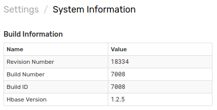

# Manual Update

## Login into Axibase Time Series Database Server

```sh
su axibase
cd /opt/atsd
```

## Download the Latest ATSD Distribution Files

* [hbase 1.2.5](https://www.axibase.com/public/atsd_update_latest.htm)

The archive will contain the latest ATSD release with the revision number included in the file name, for example `atsd.17239.tar.gz`.

Copy the archive to the ATSD server.

## Unpack the Archive

```sh
tar xzf atsd.tar.gz
```

## View Files in the Archive

```sh
cd target
ls
atsd.<revision number>.jar
atsd-hbase.<revision number>.jar
```

## Stop ATSD

```sh
/opt/atsd/bin/atsd-all.sh stop
```

## Replace JAR Files

```sh
rm -rf /opt/atsd/hbase/lib/atsd*jar
mv atsd-hbase* /opt/atsd/hbase/lib/
```

```sh
rm -rf /opt/atsd/atsd/bin/atsd*jar
mv atsd* /opt/atsd/atsd/bin/
```

## Start ATSD

```sh
/opt/atsd/bin/atsd-all.sh start
```

It may take up to 5 minutes for the database to initialize.

## Login into ATSD user interface

```sh
https://atsd_host:8443/
```

* Open the **Settings > System Information** page.
* Verify that the Revision Number has been updated.



## Remove the Archive

```markdown
rm /opt/atsd/atsd.tar.gz
```