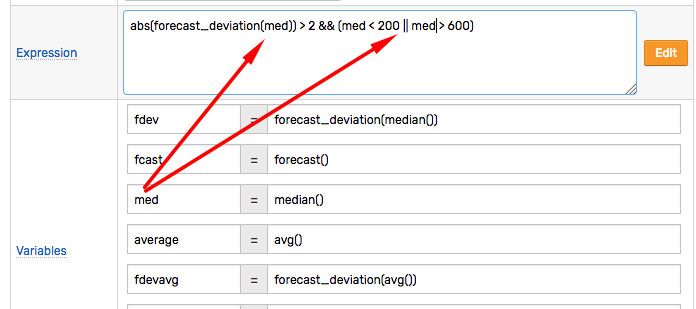
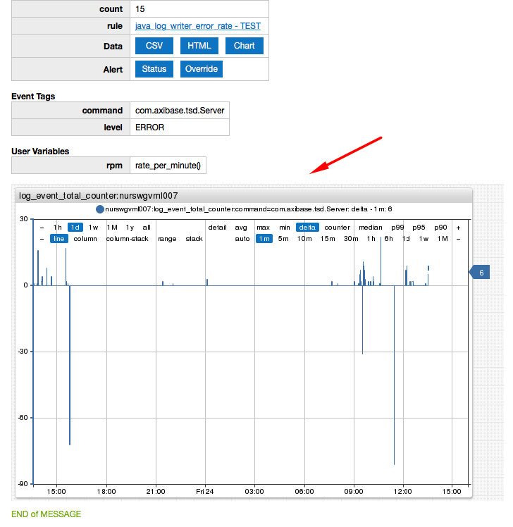
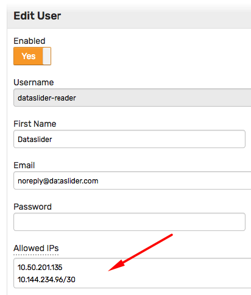

# Weekly Change Log: November 20, 2017 - November 26, 2017

## ATSD

| Issue| Category    | Type    | Subject              |
|------|-------------|---------|----------------------|
| [4745](#issue-4745) | rule engine | Feature | Implement `matchList` function to simplify name collection checks. |
| 4745| rule engine | Bug | Skip variable replacement in logging messages if rule logging is disabled. |
| [4734](#issue-4734) | rule engine | Bug | The screenshot portal should include functions specified in user variables. |
| 4732 | admin | Feature | Compress backup XML files to `gz` format to save local disk space. |
| [4730](#issue-4730) | rest api | Feature | Add support for `addMeta` parameter in [series](../../api/meta/metric/series.md) method. |
| [4724](#issue-4724) | rule engine | Feature | Implement functions to access status of another rule for correlation purposes. |
| [4715](#issue-4715) | rest api | Feature | Implement [series tags](../../api/meta/metric/series-tags.md) method to retrieve unique tag values. |
| 4713 | rest api | Bug | Include entity and metric metadata in series queries for `FORECAST` datatype. |
| [4710](#issue-4710) | rule engine | Feature | Include alert screenshots as inline images instead of attachments. |
| 4704 | rule engine | Feature | Customize charts used in alert screenshots to display aggregation functions referenced in the rule expression. |
| [4599](#issue-4599) | security | Feature | Add support for user IP access restrictions. |

## Axibase Collector

| Issue| Category    | Type    | Subject              |
|------|-------------|---------|----------------------|
| 4740 | docker | Bug | Container entity tags are missing if storage driver is not properly configured on collector startup.  |
| 4703 | docker | Bug | Collector CPU may get abnormally high when multiple Docker jobs are running. |
| 4695 | docker | Bug | Docker job may hang when multiple Docker jobs are running.. |

---

### Issue 4745

The `matchList` functions is a less verbose alternative to `likeAny` function.

```java
  matchList(tags.request_ip, 'ip_white_list')

  likeAny(tags.request_ip, collection('ip_white_list'))
```

### Issue 4734



### Issue 4730

Support for `addMeta` parameter added to the [series](../../api/meta/metric/series.md#query-parameters) method.

```elm
/api/v1/metrics/gc_time_percent/series?addMeta=true
```

```json
[{
  "metric": "gc_time_percent",
  "entity": "atsd",
  "tags": {
    "collector": "Copy",
    "host": "NURSWGVML007"
  },
  "lastInsertDate": "2017-11-24T16:05:26.945Z",
  "meta": {
    "metric": {
      "name": "gc_time_percent",
      "enabled": true,
      "dataType": "FLOAT",
      "persistent": true,
      "tags": {},
      "timePrecision": "MILLISECONDS",
      "retentionDays": 0,
      "seriesRetentionDays": 0,
      "invalidAction": "NONE",
      "versioned": false,
      "interpolate": "LINEAR"
    },
    "entity": {
      "name": "atsd",
      "enabled": true,
      "tags": {
        "test": "test",
        "testkey": "testvalue"
      }
    }
  }
}]
```

### Issue 4724

[Rule functions](../../rule-engine/functions-rules.md) provide a way to check the status of windows created by other rules.

The `rule_open` function checks if there is at least one window with the 'OPEN' or 'REPEAT' status for the specified rule.

```java
  rule_open(S ruleName)

  // example
  avg() > 10 && rule_open('disk_used_check')
```

The `rule_window` function returns the first matching window for the specified rule.

```java
  rule_window(S ruleName)
  // example
  avg() > 10 && rule_window('disk_used_check') != null && rule_window('disk_used_check').status != 'CANCEL'
```

### Issue 4715

The [series tags](../../api/meta/metric/series-tags.md) method returns unique series tags values for the specified metric.

```elm
/api/v1/metrics/disk_used/series/tags?entity=nurswgvml007
```

```json
{
  "file_system": ["/dev/mapper/vg_nurswgvml006-lv_root", "/dev/sdb1"],
  "mount_point": ["/", "/media/datadrive"]
}
```

### Issue 4710

The inline screenshots are positioned after the message content and before the message footer.



### Issue 4599

The 'Allowed IPs' field enables specifying a list of addresses or address ranges in CIDR format from which the user will be allowed to access the database.

The checks are enforced to requests made over the HTTP and HTTPs protocols.

Both IPv4 and IPv6 protocols are supported.


