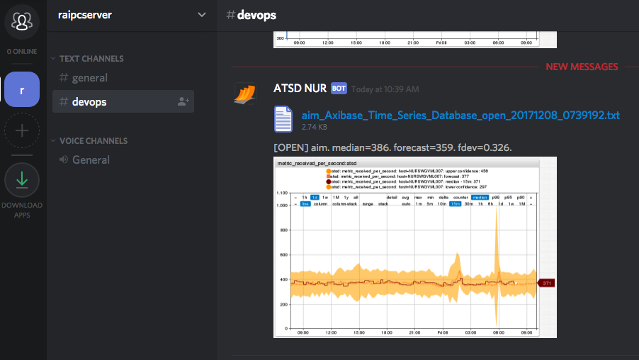

# Weekly Change Log: December 4, 2017 - December 10, 2017

## ATSD

| Issue| Category    | Type    | Subject              |
|------|-------------|---------|----------------------|
| 4788 | rule editor | Feature | Add endpoint links in the web notification drop-down. |
| 4787 | rule editor | Bug | Set default values for empty fields in [`CUSTOM`](../../rule-engine/notifications/custom.md) notification type. |
| 4782 | security | Bug | Prevent browser auto-complete to submit user credentials on the web notification forms. |
| 4779 | api-rest | Bug | Series query: invalid JSON returned if `addMeta` parameter for unknown metric is specified. |
| [4778](#issue-4778) | rule editor | Feature | Implement placeholders for the [Details Table](../../rule-engine/placeholders.md#alert-table-placeholders). |
| 4776 | rule engine | Feature | Extract functions from the [`db_last`](../../rule-engine/functions-db.md#db_last-function) and [`db_statistic`](../../rule-engine/functions-db.md#db_statistic-function) functions to include in notification charts. |
| 4775 | rule editor | Bug | Raise error on invalid syntax in [database](../../rule-engine/functions-db.md) functions. |
| 4773 | api-rest | Bug | Series query: fix for empty response when `seriesLimit` is enforced. |
| [4772](#issue-4772) | rule editor | Feature | Add setting 'Group by All Tags'. |
| 4767 | rule engine | Bug | Web Notifications: Timeout waiting for connection from pool on CircleCI. |
| [4765](#issue-4765) | rule engine | Feature | Implement [derived](../../rule-engine/derived.md) commands. |
| 4757 | rule engine | Bug | Remove excessive rounding in variables. |
| [4754](#issue-4754) | rule engine | Feature | Add [window](../../rule-engine/window.md) viewer. |
| 4753 | rule engine | Bug |  Alert does not reopen when 'Message on Cancel' is empty. |
| 4728 | portal | Bug | Charts and portals - ensure `LTR` layout regardless of the browser setting. |
| 4717 | api-rest | Bug | Series query: wrong below median `PERCENTILE_*` calculations (equals to `MIN`). |
| 4713 | api-rest | Bug | Series query with `FORECAST` type: add support for `addMeta` parameter. |
| [4781](#issue-4781) | rule engine | Feature | Implement [`HipChat Data Center`](../../rule-engine/notifications/hipchat.md) notifications. |
| 4738 | rule engine | Feature | Implement [`WEBHOOK`](../../rule-engine/notifications/webhook.md) notifications. |
| 4579a | rule engine | Feature | Implement [`CUSTOM`](../../rule-engine/notifications/custom.md) notifications. |
| [4579b](#issue-4579b) | rule engine | Feature | Implement [`SLACK`](../../rule-engine/notifications/slack.md) notifications. |
| [4579c](#issue-4579c) | rule engine | Feature | Implement [`TELEGRAM`](../../rule-engine/notifications/telegram.md) notifications. |
| [4579d](#issue-4579d) | rule engine | Feature | Implement [`DISCORD`](../../rule-engine/notifications/discord.md) notifications. |

## Axibase Collector

| Issue| Category    | Type    | Subject              |
|------|-------------|---------|----------------------|
| 4780 | docker | Bug | Collector CPU is abnormally high if TCP checks are enabled.  |

---

### Issue 4778

The alert details table can embedded into the target document using the same format as the host document.

```javascript
${detailsTable('markdown')}
${detailsTable('ascii')}
${detailsTable('html')}
${detailsTable('property')}
${detailsTable('csv')}
${detailsTable('json')}
```

### Issue 4772

The new settings automatically creates as many series as there are incoming series to simplify the initial configuration. For `message` and `property` commands, the setting is set to 'No Tags'.


### Issue 4765

The derived command action allows storing new calculated metrics in the database by executing custom command templates in the [Network API](../../api/network/README.md) syntax.

```ls
series e:${entity} m:jvm_memory_free_avg_percent=${round(100 - avg(), 3)}
```

The new commands can be executed at the frequency of incoming commands or decreased with a custom repeat interval.


### Issue 4781

HipChat Data Center notifications.


### Issue 4579b

Slack notifications.


### Issue 4579c

Telegram notifications.


### Issue 4579d

Discord notifications.


