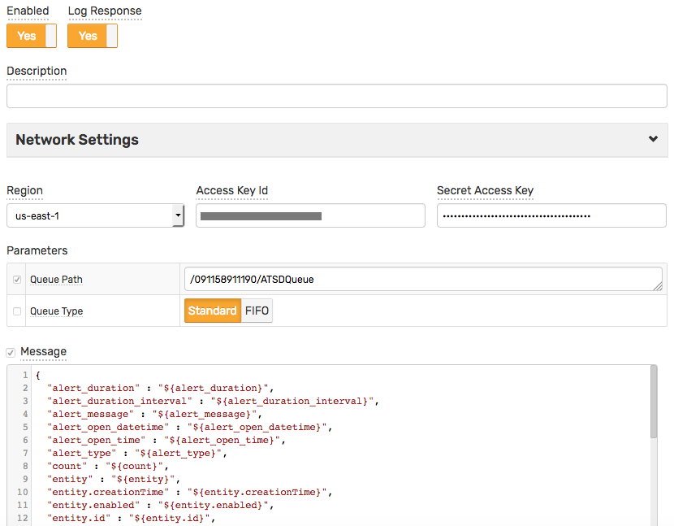

# Weekly Change Log: December 11, 2017 - December 17, 2017

## ATSD

| Issue| Category    | Type    | Subject              |
|------|-------------|---------|----------------------|
| 4809 | admin | Bug | Enforce `UTF-8` file encoding in ATSD start scripts. |
| [4808](#issue-4808) | rule engine | Feature | Implement [`value('metricName')`](../../rule-engine/functions-value.md) function to access other metrics in the same `series` command by name. |
| 4798 | rule engine | Feature | Web notifications: add support for [proxy and reverse-proxy](../../rule-engine/web-notifications.md#network-settings) network connections to external cloud services. |
| [4796](#issue-4796) | rule engine | Feature | Portal: add Freemarker functions to check user role and group membership. |
| [4795](#issue-4795) | rule engine | Feature | Implement [`BETWEEN AND`](../../rule-engine/condition.md#text-operators) clause. |
| [4794](#issue-4794) | rule engine | Feature | Implement [`random selector`](../../rule-engine/functions.md#random--distribution-functions) functions. |
| [4793](#issue-4793) | rule engine | Feature | Implement statistical functions [with interval/count](../../rule-engine/functions.md#interval-selection): `avg('1 minute')`, `max(10)`. |
| [4792](#issue-4792) | rule engine | Feature | Implement statistical functions [with conditions](../../rule-engine/functions.md#conditional-functions): `countIf`, `sumIf`, `avgIf`. |
| [4785](#issue-4785) | rule engine | Feature | Implement [`AWS SQS`](../../rule-engine/notifications/aws-sqs.md) notification. |
| [4741](#issue-4741) | rule engine | Feature | Implement [`AWS SNS`](../../rule-engine/notifications/aws-sns.md) notification. |
| 4705 | admin | Bug | ATSD doesn't start after update via `docker exec`. |

---

### Issue 4808

The value functions provide access to other metrics submitted within the same `series` command or parsed from the same row in the CSV file.

```javascript
value > 1.5 && value('temperature') > 50
```

```ls
series e:sensor01 m:pressure=3.5 m:temperature=80
```

Assuming the rule was created for the pressure metric, the condition will evaluate to `true` for the above series command.

```javascript
3.5 > 1.5 && 80 > 50
```

### Issue 4796

The functions simplify the design of role-based portals.

```javascript
// Returns true if the user belongs to the specified user group.
userInGroup(String userGroupname)

// Returns true if the user has read permissions for the specified entity.
userAllowEntity(String entityName)

// Returns true if the user has the specified role: USER, EDITOR, etc.
userHasRole(String roleName)

// Returns true if the user has READ permissions to the specified entity group.
userAllowEntityGroup(String entityGroupName)
```

### Issue 4795

```javascript
  value BETWEEN 75 AND 90
```

```javascript
  dateStr BETWEEN '18:30:00' AND '18:34:59'
```

### Issue 4794

```javascript
randomKey(replacementTable('oncall-person'))
```

```javascript
randomKey(excludeKeys(replacementTable('oncall-person'),['John']))
```

```javascript
randomItem(collection('ip_white_list'))
```

### Issue 4793

```javascript
  avg('1 minute') / avg() > 2
```

```javascript
  max(5) == max()
```

### Issue 4792

```javascript
  countIf('value > 10') < 5
```

### Issue 4785

* SQS



### Issue 4741

* SNS


