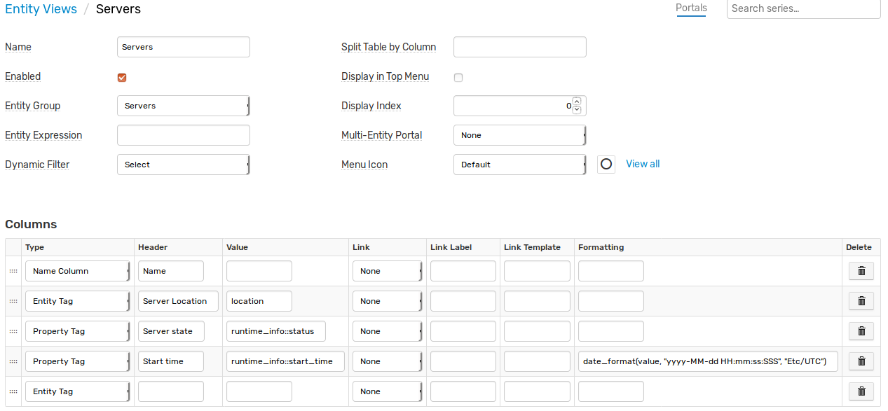
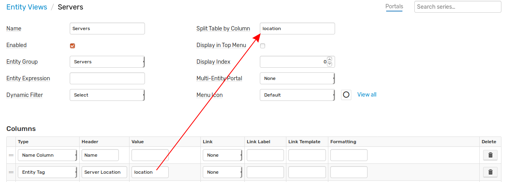
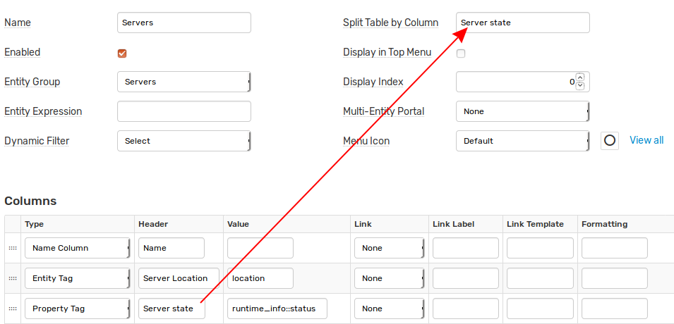
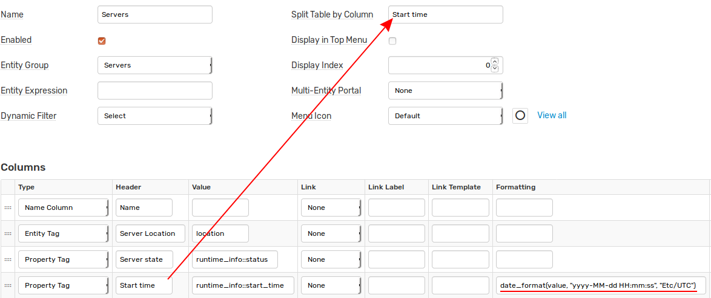

# Entity Views

## Overview

Entity Views provide a way to construct customized tabular presentations for subsets of entities that typically share similar attributes. The enabled entity views are listed under the [Entities] tab drop-down in the top menu.

## Access Controls

The view can be accessed by users with a 'read' permission for the entity group to which the view is linked.

## Settings

**Name** | **Description**
---|---
Name | View name displayed in the [Entities] tab drop-down.
Enabled | Enabled or disabled status. Disabled entity views are not visible in the [Entities] tab drop-down.
Entity Group | Entity Group which members are included in the view.
Entity Expression | A additional condition that entity group members must satisfy in order to be included in the view. The syntax is the same as supported by expression-based entity groups.
Dynamic Filter | The default [dynamic filter](#dynamic-filters) applied to entities on initial page load.
Split Table by Column | Enter column header (name) or its value to group entities into separate tables.
Display in Main Menu | If enabled, the view is accessible under its own tab in the main menu.
Display Index | Applies if entity view is displayed in the top menu. Specifies relative position of the tab. The tabs are sorted by index in ascending order.
Multi-Entity Portal | [Portal](#portal) with time series charts for multiple entities displayed in the view. If no multi-entity portal is assigned, the default portal containing metrics in Series Value column is displayed.
Menu Icon | Icon assigned to the view in the main menu.

## Filters

The list of displayed entities is established as follows:

* The list of entities is initially set to the current members of the selected entity group.
* If the **Entity Expression** is specified, the members are checked with this expression. Members that fail to satisfy the condition are hidden.
* If a **Dynamic Filter** is set by the user, the entities are additionally checked with the filter. Entities that fail to satisfy the filter condition are hidden.
* If a **Search** text is specified, only entities with a column value containing the search keyword are displayed.

> While the Dynamic Filter can be toggled by the user, the Entity Group and Entity Expression (if specified) are enforced at all times.

## Search

The search is performed based on column values displayed in the table. An entity meets the condition if one of the column values for the entity row contains the specified search keyword.

## Table

The table consists of multiple columns, one row per entity. Each cell displays a particular attribute such as entity tag value or property tag value for a given entity.

### Table Header

**Name** | **Description**
---|---
Type | Column type.
Header | Column name.
Value | Applicable to 'Entity Tag', 'Property Tag', 'Series Value' and 'Last Insert' [column types](#column-types). Contains entity tag name, [property search expression](../rule-engine/property-search.md) or metric name respectively.
Link | Specifies if the cell value should also be clickable as a link. See [Links](#links) options.
Link Label | Text value displayed for the link. If `icon-` is specified, the text is replaced with an [icon](http://getbootstrap.com/2.3.2/base-css.html#icons), such as `icon-search`. If Link is set to 'Entity Property', the text is resolved to the property expression value.
Link Template | Path to a page in the user interface with support for placeholders: `${entity}` and `${value}` (current cell value).
Formatting | A [function](#formatting) or an expression to round numbers and convert units.

### Column Types

**Name** | **Description**
---|---
Enabled Column | Entity status.
Entity Tag | Name of the entity tag.
Property Tag | [Property search expression](../rule-engine/property-search.md) in the format of `type:[{key-name=key-value}]:tag-name`.
Series Value | Name of the metric for which the last value for this entity will be displayed.<br>If multiple series match the specified metric and entity, the value for the latest series will be displayed.
Name Column | Entity name with a link to the editor page for the entity.
Label Column | Entity label with a link to the editor page for the entity.
Portals Column | Link to the portals page for the entity.
Properties Column | Link to the properties page for the entity.
Last Insert | Last insert date for all or one metric collected by the entity with a link to the last insert table.<br>If the column value is not specified, the last insert date is calculated for all metrics. The column value accepts settings in the format of `metric:[lag]`, where the optional `lag` parameter denotes the maximum delay in seconds. If the last insert date for the entity is before `now - lag`, the cell is highlighted with orange background.

#### Last Insert

  * Highlight entitities if last insert date for **all** metrics is before `now - 900 seconds`

  ```javascript
  :900
  ```
  
  * Highlight entitities if last insert date for the metric `cpu_busy` is before `now - 900 seconds`

  ```javascript
  cpu_busy:900
  ```  
  
  * Display last insert date for the metric `cpu_busy` without highlighting. Note the terminating colon after the metric name. 

  ```javascript
  cpu_busy:
  ```    

### Links

**Name** | **Description**
---|---
Entity | Entity editor page.
Property | Portal with a property widget for the given entity and property type.
Chart | Portal with a time chart displaying the data for the specified metric and entity.
Entity Property | Portal with a property widget for another entity retrieved with the property expression.
Entity Tag | Displays the value of the specified entity tag for another entity, whose name is set in the tag of the current entity.

### Formatting

The following functions are available in 'Formatting' section:

#### Text Functions 

* [upper](../rule-engine/functions-text.md#upper)
* [lower](../rule-engine/functions-text.md#lower)
* [truncate](../rule-engine/functions-text.md#truncate)
* [coalesce](../rule-engine/functions-text.md#coalesce)
* [keepAfter](../rule-engine/functions-text.md#keepafter)
* [keepAfterLast](../rule-engine/functions-text.md#keepafterlast)
* [keepBefore](../rule-engine/functions-text.md#keepbefore)
* [keepBeforeLast](../rule-engine/functions-text.md#keepbeforelast)
* [replace](../rule-engine/functions-text.md#replace)
* [capFirst](../rule-engine/functions-text.md#capfirst)
* [capitalize](../rule-engine/functions-text.md#capitalize)
* [removeBeginning](../rule-engine/functions-text.md#removebeginning)
* [removeEnding](../rule-engine/functions-text.md#removeending)
* [urlencode](../rule-engine/functions-text.md#urlencode)
* [jsonencode](../rule-engine/functions-text.md#jsonencode)
* [htmlDecode](../rule-engine/functions-text.md#htmldecode)
* [unquote](../rule-engine/functions-text.md#unquote)
* [countMatches](../rule-engine/functions-text.md#countmatches)
* [abbreviate](../rule-engine/functions-text.md#abbreviate)
* [indexOf](../rule-engine/functions-text.md#indexof)
* [locate](../rule-engine/functions-text.md#locate)
* [trim](../rule-engine/functions-text.md#trim)
* [length](../rule-engine/functions-text.md#length)

#### Formatting Functions 

* [convert](../rule-engine/functions-format.md#convert)
* [formatNumber](../rule-engine/functions-format.md#formatnumber)
* [date_format](../rule-engine/functions-format.md#date_format)
* [formatInterval](../rule-engine/functions-format.md#formatinterval)
* [formatIntervalShort](../rule-engine/functions-format.md#formatintervalshort)

#### Time Functions

* [elapsedTime](../rule-engine/functions-time.md#elapsedtime)


## Dynamic Filters

**Name** | **Description**
---|---
Name | Filter name displayed in the drop-down.
Expression | A condition that entities must satisfy when the filter is selected in the drop-down. The expression may refer to `name` and `tags.{name}` columns defined in the entity view.

Filter expression examples:

```java
// name column
name like 'nur*'
```

```java
// entity tag column
upper(tags.name) LIKE '*SVL*'
```

```java
// entity tag column
lower(tags.app) LIKE '*hbase*'
```

```java
// property tag column
tags['configuration::codename'] = 'Santiago'
```

## Split Table by Column

If **Split Table by Column** is specified, the entities are grouped into multiple tables. 

The **Split Table by Column** field accepts an existing column header or its value.

### Split Examples

Assuming there are five entities in the selected entity group:

* Entity name starts with `server*`.
* Each entity has entity tag `location`
* Each entity has properties `start_time` and `status` of type `runtime_info`.

Default entity view configuration:



The entity view without table splitting is displayed as follows, with all entities places into one table:


To split the table by entity tag 'location', specify the tag's name in the **Split Table by Column** field:



  

To group entities by column **header**, set the header name in the **Split Table by Column** field:



  

If splitting by column **header** is enabled, grouping is performed based on formatted values.




## Portal

If the Multi-Entity Portal is assigned manually or the entity view contains 'Series Value' columns, the statistics for entities can be viewed on a portal accessible with the [View Portal] button. 

If no portal is selected, the default portal displays metrics for columns of type 'Series Value'.

The multi-entity portal is any portal that displays a metric for multiple entities using the `${entities}` placeholder.

```ls
[widget]
  type = chart
  [series]
    metric = docker.cpu.avg.usage.total.percent
    entities = ${entities}
```
