# Data Forecasting

## Overview

- Axibase Time Series Database (ATSD) includes built-in forecasting algorithms that can predict abnormalities based on historical data.
- The accuracy of predictions and the percentage of false positives/negatives depends on the frequency of data collection, the retention interval, and algorithms.
- Built-in auto-regressive time series extrapolation algorithms (Holt-Winters, ARIMA) in ATSD can [predict failures](../administration/monitoring-metrics/rule-engine.md) at early stages.
- Dynamic predictions eliminate the need to set manual thresholds.
 
#### Forecasting Example with Abnormal Deviation:


Forecasts are accessible under the **Data > Forecasts** tab.

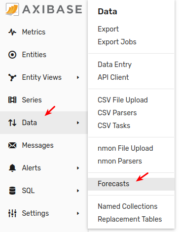

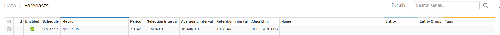

## Reference

 * [Editor Settings](#editor-settings)
 * [Tools](#tools) 
 * [View Forecast Data](#view-forecast-data)
 * [Data API](#data-api)
 * [Chart Settings](#chart-settings)

## Editor Settings

### General Settings

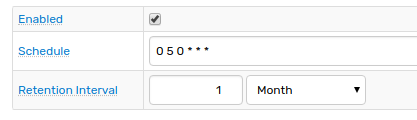

| Setting | Description | 
| --- | --- | 
|Enabled| Enabled Settings are executed on _Schedule_ .| 
|Schedule|[Cron](https://github.com/axibase/axibase-collector/blob/master/scheduling.md#cron-expressions) expression for calculating and storing forecasts on schedule.<br>The expression is evaluated based on local server time.<br> Examples:<br>0 0 2 * * MON-FRI</b> - 02:00 on workdays<br>0 5 0 * *</b> - at 00:05 daily"|
|Retention Interval|Specifies for how long the forecasts should be stored in the database. Forecasts that are older than `current time` (or [_End Time_](#selection-settings), if specified) minus `Retention Interval` are deleted on schedule.|

### Filter Settings

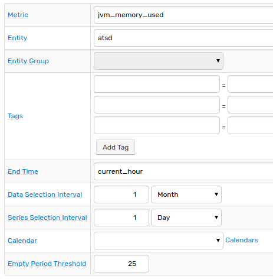

| Setting | Description | 
| --- | --- | 
|Metric |Metric name for which forecasts will be calculated.| 
|Entity  |If selected, forecasts will be limited to the specified entity. Supersedes Entity Group selector. If neither entity nor entity group is specified, forecasts will be prepared for all entities.| 
|Entity Group  |If selected, forecasts will be limited to entities contained in the specified entity group.|
|Tags  |Limit the selected historical data to specified series tags.| 
|End Time  |End time of the _Data Selection Interval_ and _Series Selection Interval_. This field supports [calendar](../shared/calendar.md) syntax,for example 'current_day'. If End Time is not defined, it is set to current time at the time the job is run.| 
|Data Selection Interval  |Time frame for selecting detailed data that will be used as forecast input. End of the _Selection Interval_ can be optionally specified in _End Time_ field, otherwise it is set to current time.| 
|Series Selection Interval  |Ignore series with Last Insert Time different from _End Time_ by more than the specified interval. The option can be used to ignore series which have not been updated for a long time.| 
|Calendar  |Ignore detailed values within the time intervals listed in the calendar.| 
|Empty Period Threshold  |Ignore series if percentage of empty periods exceeds the specified threshold. Calculated as 100 * (number of empty periods before interpolation)/(total number of aggregation periods in _Data Selection Interval_).| 

### Aggregation Settings

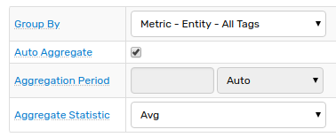

| Setting | Description | 
| --- | --- | 
|Group By |Grouping key for merging multiple series into one series. Detailed data for multiple series sharing the same grouping key are merged into one array prior to computing aggregate statistic.|
|Auto Aggregate|Let server automatically identify an aggregation period that produces the most accurate forecast - forecast with minimal variance from observed historical data.| 
|Aggregation Period |Period of time over which the detailed samples are aggregated.| 
|Aggregate Statistic |Aggregation function applied to raw data in order to regularize the series. Aggregate values for empty periods without detailed data are interpolated as values of aggregate functions for previous periods.| 

### Algorithm Settings

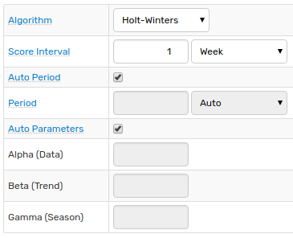

| Setting | Description | 
| --- | --- | 
|Algorithm |Holt-Winters or ARIMA forecasting algorithms.| 
|Score Interval |Part of _Data Selection Interval_ that will be used to compute variance between observed values and forecast to rank forecasts by variance. The shorter the _Score Interval_ - the more weight is assigned to the recently observed values.| 
|Auto Period |Let server automatically identify seasonality of the underlying series that produces the most accurate forecast - forecast with minimum variance from observed historical data.| 
|Period |Specify seasonality of the underlying series.| 
|Auto Parameters |Let server automatically identify algorithm parameters that produce the most accurate forecast - forecast with minimum variance from observed historical data.| 

### Storing Settings

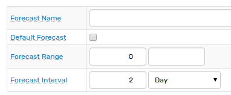

| Setting | Description | 
| --- | --- | 
|Forecast Name |An optional name that can be used to differentiate forecasts for the same underlying series prepared with different forecast settings.<br>Use cases:<br> &bull; [`forecastName`](../api/data/series/query.md#forecast-filter) field in Data API<br>&bull; [`forecast(name)`](../rule-engine/functions-forecast.md#forecaststring-n) Rule Engine function<br>&bull; [`forecast-name`](#chart-settings) Chart setting | 
|Default Forecast |Use these settings instead of default settings when calculating on-demand forecast. On-demand forecast is calculated at request time in case pre-stored forecast is not available.| 
|Forecast Range |Minimum and Maximum constraints applied to the stored forecast values to ensure that such values are within the specified range. Constraints are applied to the winning forecast after scoring stage.| 
|Forecast Interval |The length of time into the future for which forecasts are to be prepared and stored in the database. Can be rounded upwards to the nearest forecast period.| 

## Tools

Forecast Settings Editor provides a set of following tools:

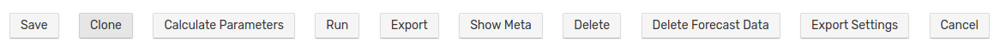

   * **Calculate Parameters**
   
        This option allows to calculate algorithm parameters:   
      
        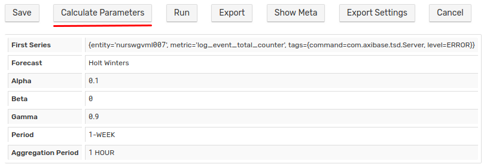
      
   * **Run**
   
        This option runs the forecast job. It can be used for tests:
      
        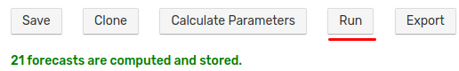
   
   * **Export**
   
        Export forecast data in csv:
         
        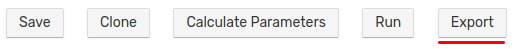
        
        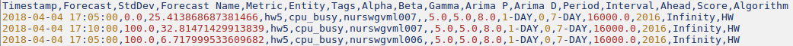
   
   * **Show Meta**
   
        This option displays values of the main settings by which this forecast is calculated:
        
        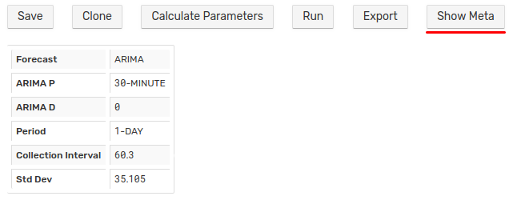  
   
        Metadata is stored with the forecast. Collection interval is an interval within the real data were extracted to build the forecast.
        
_Create_ drop-down in the **Data > Forecasts** page allows to specify [Exceptions](calendar_exceptions_testing.md#exceptions) and perform [Testing](calendar_exceptions_testing.md#testing):

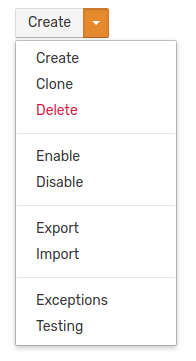
  
## View Forecast Data

Forecast data can be retrieved on the [Ad hoc Export](../reporting/ad-hoc-exporting.md) page, via a scheduled [Export Job](../reporting/scheduled-exporting.md) and using [Data API](#data-api).

### Ad hoc Export page

Set _Data Type_ setting to 'Forecast', optionally specify the forecast name:

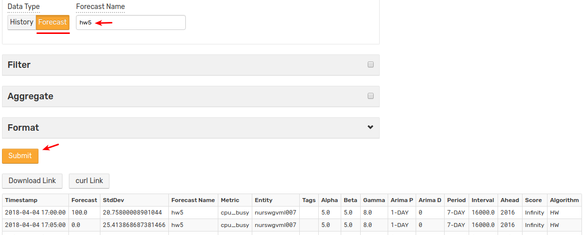
 
## Data API

Data API provides the way to [insert](../api/data/series/insert.md#fields) and [query](../api/data/series/query.md#forecast-filter) forecast values.

Examples:

* [Insert Forecast](../api/data/series/examples/insert-forecast.md) 
* [Insert Named Forecast](../api/data/series/examples/insert-named-forecast.md)
* [Insert Forecast Deviation](../api/data/series/examples/insert-forecast-deviation.md)
* [Query Named Forecast](../api/data/series/examples/query-named-forecast.md)

## Chart Settings

To display forecast values in time charts use the following settings:

### [series] section

```ls
[series]
    entity = nurswgvml007
    metric = cpu_busy
    data-type = forecast
```

|Name|Example|Description|Chart Lab|
|---|---|---|---|
|data-type|`data-type = forecast`|Data type for the current series.<br>Possible values: historical, forecast, forecast_deviation, lower_confidence, upper_confidence.|[View](https://apps.axibase.com/chartlab/f80b8e53)|
|forecast-name|`forecast-name = hw5`|Unique identifier of the forecast.<br>Useful when creating multiple forecasts for the same series.<br>If no forecast name is set, the default forecast will be loaded.|[View](https://apps.axibase.com/chartlab/92b7e471/3/)|
|style|`style = stroke-dasharray: none;`|Remove dashes from forecast line on the chart.|[View](https://apps.axibase.com/chartlab/92b7e471/4/)|
|value|`value = (1 - forecast('free') / forecast('total')) * 100`|Returns forecast for the underlying series.|[View](https://apps.axibase.com/chartlab/da03b8a5/11/)|
|load-future-data|`load-future-data = true`|Load future series values.<br>Usually used to view imported forecasts generated with 3rd party tools, like R Language.<br>Possible values: true, false.|[View](https://apps.axibase.com/chartlab/87c197be)|

### [widget] section

```ls
[widget]
    type = chart
    statistics = average    
    forecast-style = stroke: magenta;
```
|Name|Example|Description|Chart Lab|
|---|---|---|---|
|forecast-style|`forecast-style = stroke: magenta;`|CSS styles applied to forecasts in column and column-stack modes.|[View](https://apps.axibase.com/chartlab/37c39d18/3/)|