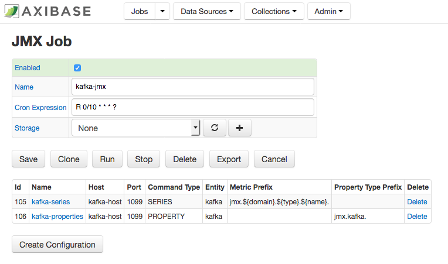
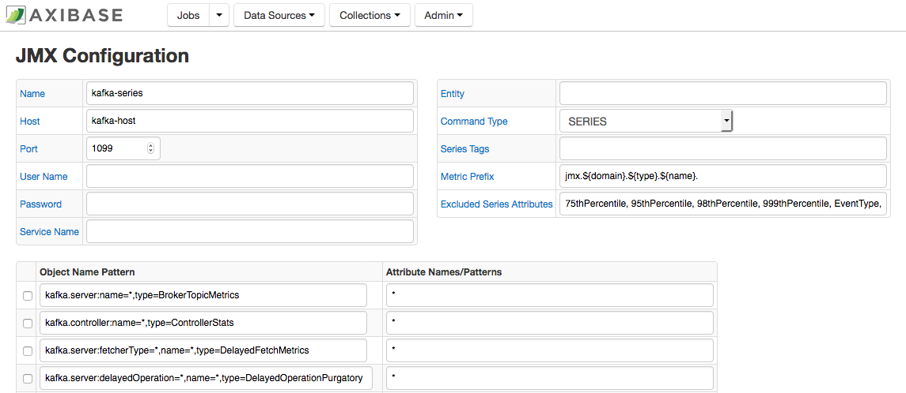
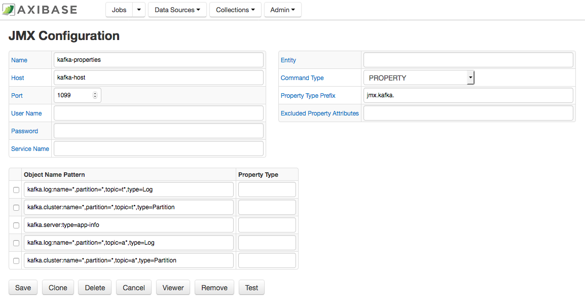
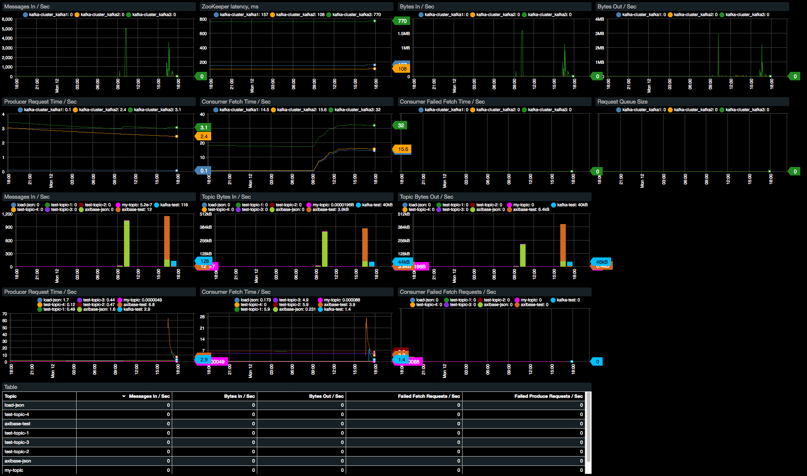
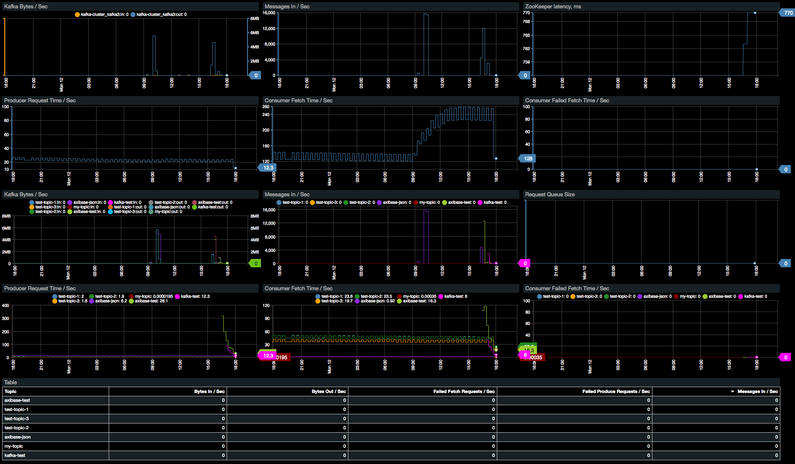

# Monitoring Kafka with ATSD

This document describes how to monitor availability and performance of [Apache Kafka](https://kafka.apache.org/) using Axibase Time Series Database.

## Step 1: Configure Axibase Collector

1. Login into Axibase Collector at https://collector_hostname:9443
1. Click the Jobs tab in the top menu and press the Import button.
1. Import the [kafka-jmx](resources/job_jmx_kafka-jmx.xml) job.
1. Locate the `kafka-jmx` job in the list of jobs.
1. On the JMX Job page, enable the job status by checking on the Enabled check box.
1. Adjust the cron expression if required. For more information on cron expressions, see [Scheduling](https://github.com/axibase/axibase-collector/blob/master/scheduling.md).  
1. Select a target ATSD database for storing data.
1. Click Save.



### Configure series collection

1. Select 'kafka-series' configuration.
1. On the JMX Configuration page, enter the JMX connection parameters:

   **Host** — Kafka hostname.  
   **Port** — JMX port.  
   **User Name** — JMX user name.  
   **Password** — Password for JMX user.  
   **Entity** — Optionally, specify the output of the hostname command on the Kafka server if it’s different from `kafka_hostname` (for example if `kafka_hostname` represents a fully qualified name).  
Other parameters are optional. For more information on JMX configuration, see [JMX](https://github.com/axibase/axibase-collector/blob/master/jobs/jmx.md).   

1. Click Test to validate the configuration.  
1. Click Save.

    

### Configure properties collection

1. Select 'kafka-properties' configuration.
1. Set Host, Port, User Name, Password, and Entity fields as described in the previous section.
1. Click Test to validate the configuration.
1. Click Save.

    

## Step 2: Configure Kafka in ATSD

1. Login into the target Axibase Time Series Database instance at https://atsd_hostname:8443.
1. Go to Metrics page and verify that `jmx.kafka.*` metrics are available.
1. Go to Entities page and verify that `jmx.kafka.*` properties are available for entities from `kafka-properties` configuration.
1. Go to `Settings -> Entity Groups` and import [Kafka](resources/groups.xml) entity group.
1. Go to `Portals -> Configure` and import [Kafka](resources/portal-configs.xml) portals (check on the Auto-enable New Portals check box).
1. Go to  `Alerts -> Rules` and import [Kafka](resources/rules.xml) rules (check on the Auto-enable New Rules check box).
1. Go to  `Entity Views -> Configure` and import [Kafka](resources/entity-views.xml) entity view.


## Step 3: Verification

1. Select `Kafka` on `Entity Views` menu and open it:

    

1. Verify that portal in table header is available and refer to Kafka portal:

    

1. Verify that portals for each entity is refer to Broker portal:

    


## Consumer Lag

Consumer lag calculation requires information about producer offset and consumer offset. 

The producer offset is collected from Kafka brokers by the JMX Job above.

The consumer offset is collected using a Kafka console consumer reading events from  the `__consumer_offset` topic on one of the Kafka servers in the cluster. 

Login into the Kafka server.

Download the [script](resources/send_offset.sh) into Kafka `bin` directory.

```
# assign execute permission
chmod +x /opt/kafka_2.12-1.0.0/bin/send_offset.sh
```

For Kafka versions before 0.10.2.0 use `--zookeeper` option instead `bootstrap-server` in the script.

Replace `ATSD_HOST` and `TCP_PORT` with actual values and launch the script. 

> The default ATSD TCP command port is `8081`. 

The script will read topic offsets and send them to ATSD under the hostname entity.

```
# launch the script 
nohup /opt/kafka_2.12-1.0.0/bin/send_offset.sh ATSD_HOST TCP_PORT &
```

If the hostname is different from the entity name used in the JMX job, specify the entity manually.

```
nohup /opt/kafka_2.12-1.0.0/bin/send_offset.sh ATSD_HOST TCP_PORT ENTITY &
```

The script will continuously read consumer offsets from Kafka and send the offsets to ATSD as series commands. The commands will also be copied to stdout for debugging.

```ls
series e:nurswgvml702 m:kafka.consumer_offset=455 t:groupid="console-consumer-72620" t:topic="test" t:partition=0 ms:1519893731570
series e:nurswgvml702 m:kafka.consumer_offset=492 t:groupid="console-consumer-72620" t:topic="test" t:partition=0 ms:1519893736569
series e:nurswgvml702 m:kafka.consumer_offset=492 t:groupid="console-consumer-72620" t:topic="test" t:partition=0 ms:1519893741570
series e:nurswgvml702 m:kafka.consumer_offset=550 t:groupid="console-consumer-72620" t:topic="test" t:partition=0 ms:1519893746570
```

1. Check that metric `kafka.consumer_offset` is available on the Metrics tab in ATSD.
1. Import [consumer lag portal](resources/consumer-lag.xml) into ATSD and change the topic name to view the consumer lag.


