# Portals Overview

## Reference

* [Create Portal](#create-portal)
* [Configure Portal](#configure-portal)
* [Portals Page](#portals-page)
* [Portal Types](#portal-types)
* [Portal Links](#portal-links)
* [Portal Themes](#portal-themes)

## Create Portal

* Click on the **Portals** link in the top menu.

  

* Click on **Create**.

  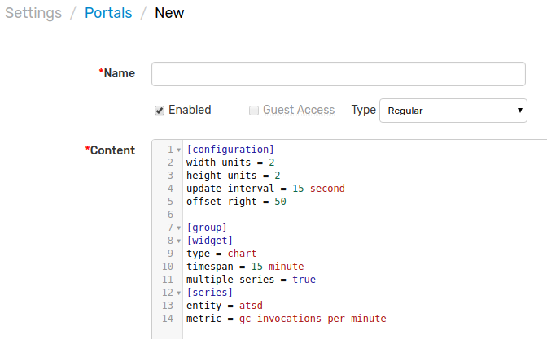

* Specify portal settings.

| **Property** | **Description** |
|---|---|
| Name | User-friendly portal name.|
| Enabled | Portal status. Disabled portals are not visible to users. |
| Guest Access| Enable anonymous view of the portal.|
| Type | Portal type: **regular** or **template**. See type descriptions [below](#portal-types).  |
| Display Index | Applicable to template portals. The order in which portals are listed on multiple-portal pages. |
| Theme | Graphics style to render the widgets: Default or Black. Custom themes can be installed as described [below](#portal-themes).|
| Content | Portal [configuration](#configure-portal) text specified using the [Charts](https://github.com/axibase/charts#axibase-charts) syntax. |

## Configure Portal

### Syntax

The portal is configured using the [Charts](https://github.com/axibase/charts#axibase-charts) syntax which is a domain-specific language for assembling visualizations in a declarative manner. The basic components of the syntax are **sections** and **settings**.

* **Section** is enclosed in square brackets, for example, `[widget]`. The section may include the nested sections and settings. The section terminates when another section is specified.
* **Setting** includes name and value, separated by equal sign, for example, `timespan = 1 hour`.

```ls
# this is a section named [widget]
[widget]
  # this is a setting that belongs to section [widget]
  timespan = 1 hour
```

### Layout

Widgets are positioned on the portal page using a **grid** layout. The dimensions of the grid are specified under the `[configuration]` tag using the `width-units` and `height-units` settings. Each widgets occupies 1 horizontal and 1 vertical unit by default.

The following example creates a grid containing 6 units, with 3 widgets placed in the first row and 2 placed in the second.

```ls
[configuration]
  width-units = 3
  height-units = 2
  # portal-level settings
  # shared widget settings
[group]
  [widget]
     # widget settings
     type = chart
     [series]
       # series settings
       metric = view_count
       entity = axibase.com
       [tags]
         page_name = index.htm
  [widget]
    type = chart
  [widget]
    type = pie
[group]
  [widget]
    type = chart
  [widget]
    type = chart
```


Review the following guides describing the basic syntax:

* [Selecting Series](selecting-series.md)

* [Portal Settings](portal-settings.md)

* [Generic Widget Settings](https://axibase.com/products/axibase-time-series-database/visualization/widgets/configuring-the-widgets/)

* [Widgets](https://axibase.com/products/axibase-time-series-database/visualization/widgets/)

## Portals Page

The portals are listed on the **Portals** page located at `https://atsd_hostname:8443/portals/list`.

To access the **Portals** page via ATSD web interface click on **Portals** drop-down at the right upper corner and click on **Configure** button.

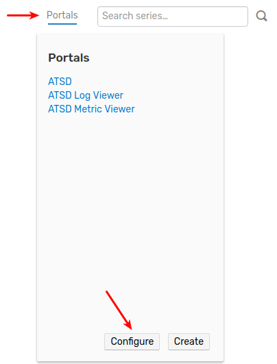

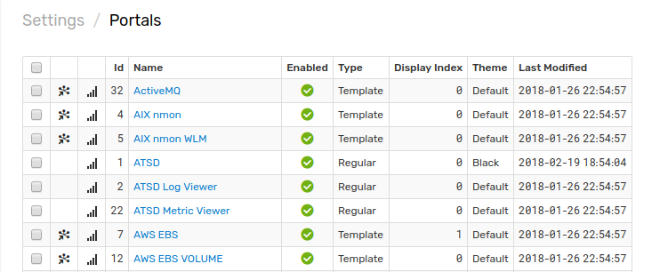

Use drop-down at the bottom of the page to manage portals:

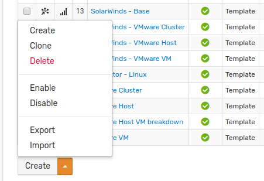

## Portal Types

Two types of portals are supported:

* [Regular portals](#regular-portals)
* [Template portals](#template-portals)

### Regular Portals

The regular portal doesn't depend on external parameters and can be rendered as is.

Sample link for a regular portal:

```elm
https://atsd_hostname:8443/portal/4.xhtml
```

Enabled regular portals are listed under the **Portals** link in the top menu.

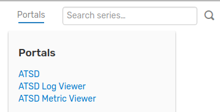

### Template Portals

The template portal requires an entity name to be passed as a request parameter. It allows the same parameterized portal to be viewed for all entities of the same type.

Additional parameters can be passed in the query string to customize the portal as described [below](#request-parameters).

Sample link to a template portal:

```elm
https://atsd_hostname:8443/portal/111.xhtml?entity=nurswgvml013
```

The above link passes the `entity` parameter to a template portal which substitutes all `${entity}` placeholders in the Configure Portal text.

```ls
[widget]
  type = chart
  [series]
    metric = jmx.derby.hitcount
    entity = ${entity}
```

The actual configuration displayed replaces the `${entity}` placeholder with the parameter value as follows:

```ls
[widget]
  type = chart
  [series]
    metric = jmx.derby.hitcount
    entity = nurswgvml013
```

To open a template portal directly in the browser address bar, substitute the `{portal_id}` below with _portal identifier_ displayed at the [Portals Page](#portals-page) and specify a valid entity name in the `{entity}` request parameter.

```elm
https://atsd_hostname:8443/portal/{portal_id}.xhtml?entity={entity}
```

Alternatively, assign an entity group to the template portal so that the link to this portal is available on the **Entities** page for all entities that are members of the entity group:

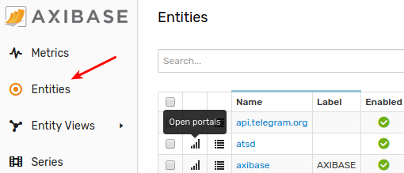

* Open the [Portals Page](#portals-page).
* Locate the template portal that you'd like to assign.
* Click on the _assign_ icon.

    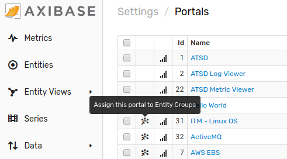

* Select entity groups to which the portal will be assigned.

    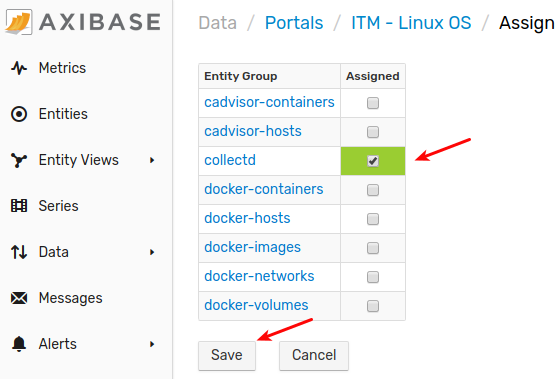

> Note an entity group can be assigned to the portal from portal editor:
> 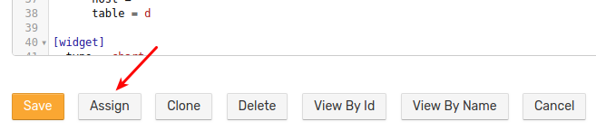

* Click on **Save** at the bottom of the page.
* Open the **Entities** page.
* Select an entity group in the drop-down filter.
* Click on the _portals_ icon for an entity and verify that the portal was assigned.

    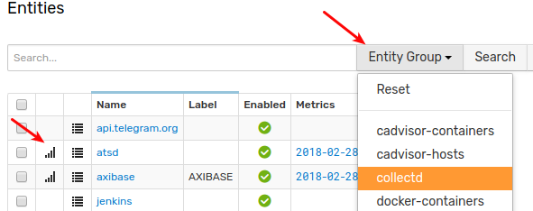

    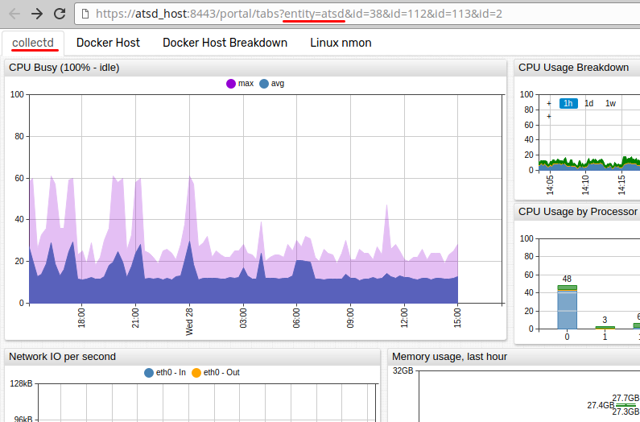

## Portal Links

The portals are available at the following URLs:

* Using portal id displayed at the [Portals Page](#portals-page):

```elm
https://atsd_hostname:8443/portal/{portal_id}.xhtml
```

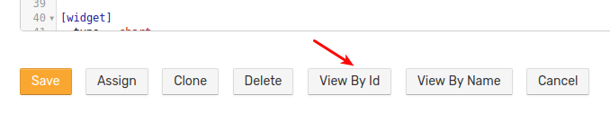

* Using portal name (case-sensitive):

```elm
https://atsd_hostname:8443/portal/name/{name}
```

> Names containing whitespace and other special properties must be url-encoded.

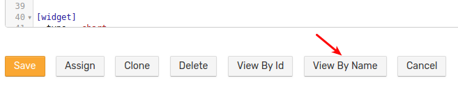

### Request Parameters

The template portal requires the `entity` parameter to be present in the query string regardless if the portal is accessed with an identifier or name.

```elm
https://atsd_hostname:8443/portal/name/linux-os?entity=nurswgvml008
```

Additional parameters can be passed in the query string to customize the portal.

```elm
# add extra dtype parameter
https://atsd_hostname:8443/portal/name/linux-disk?entity=nurswgvml008&dtype=nfs
```

Such request parameter values can be referenced with `${parameter_name}` placeholders in the Configure Portal text.

```ls
  [series]
    metric = disk_io_writes
    entity = ${entity}
    [tags]
      disk_type = ${dtype}
      disk_name = *
```

## Portal Themes

| Default Theme| Black Theme |
|---|---|
|  |  |

You can install your own themes by modifying the default CSS theme files and uploading them to the `/opt/atsd/conf/portal/themes/` directory.

After you upload your custom theme, it will appear in the list of available themes in the portal editor.
