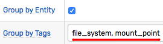
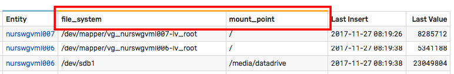
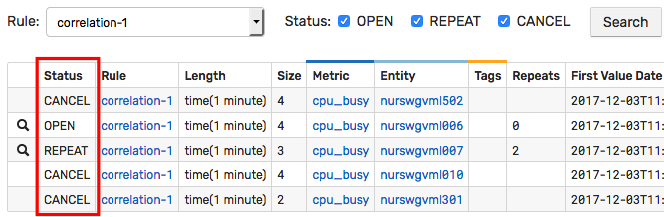
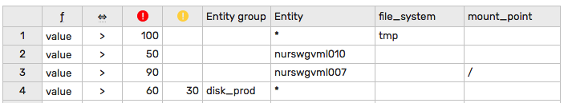
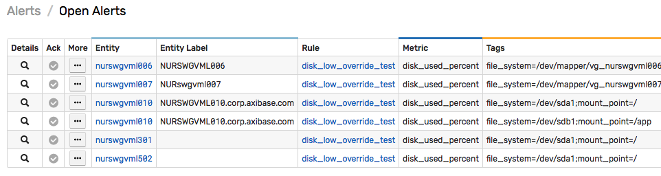

# Rule Engine

## Overview

The rule engine enables automation of repetitive tasks based on real-time statistical analysis of the incoming data.

Such tasks may include triggering a web hook, executing a system command, sending an alert to an [email](email.md) or [Slack channel](web-notifications.md), or generating derived metrics.

The engine evaluates rule conditions against incoming series, message, and property commands and executes response actions when appropriate:

```javascript
    IF condition = true THEN action-1, ... action-N
```

Example

```javascript
    IF percentile(75) > 300 THEN alert_slack_channel
```

The condition can operate on a single metric defined in the current rule or correlate multiple metrics using [`db functions`](functions-db.md) or [`rule functions`](functions-rules.md).

## Concepts

* [Windows](window.md)
* [Grouping](grouping.md)
* [Condition](condition.md)
* [Filters](filters.md)
* [Functions](functions.md)
* [Placeholders](placeholders.md)
* [Overrides](overrides.md)
* [Web Notifications](web-notifications.md)
* [Email Notifications](email.md)
* [System Commands](commands.md)
* [Derived Commands](derived.md)
* [Logging](logging.md)

## In-Memory Processing

The incoming data is processed by the rule engine in-memory, before the data is stored on disk.


The data is maintained in [windows](window.md) which are in-memory structures initialized for each unique combination of metric, entity, and grouping tags extracted from incoming commands.

## Processing Stages

### Filtering

The incoming data samples are processed by a chain of filters prior to reaching the grouping stage. Such filters include:

* **Input Filter**. All samples are discarded if the **Settings:Input Settings > Rule Engine** option is disabled.

* **Status Filter**. Samples are discarded for metrics and entities that are disabled.

* [Rule Filters](filters.md) accept only data that satisfies the metric, entity, and tag filters specified in the rule.

### Grouping

Once the sample passes through the filter chain, it is added to matching
[windows](window.md) grouped by metric, entity, and optional tags. Each window maintains its own array of data samples.

The commands can be associated with windows in a 1-to-1 fashion by enumerating all series tags as the [grouping](grouping.md) tags.





If the 'Group by Entity' option is unchecked, the window is grouped only by metric and optional tags.

## Window Length

The rule engine supports two types of windows:

* Count-based
* Time-based

**Count-based** windows accumulate up to the specified number of samples. The samples are sorted in order of arrival, with the most recently received sample placed at the end of the array. When the window becomes full, the first (oldest by arrival time) sample is removed from the window to free up space at the end of the array for an incoming sample.

**Time-based** windows store samples that were recorded within the specified interval of time, ending with the current time. The time-based window doesn't limit how many samples are held by the window. Its time range is continuously updated. Old records are automatically removed from the window once they're outside of the time range.

### Condition Checking

[Windows](window.md) are continuously updated as new samples are added and old samples are
removed to maintain the size of the given window at a constant interval length or sample count.

When a window is updated, the rule engine checks the condition that triggers response actions.

Condition example:

```javascript
    avg() > 80
```

## Window Status

[Windows](window.md) are stateful. When the condition for a given window becomes `true`, it is maintained in memory with status `OPEN`.

On subsequent `true` evaluations, the window status changes to `REPEAT`.

When the condition returns `false`, the window status is reverted to `CANCEL`.

Window status can be accessed on the **Alerts > Rule Windows** page.



## Actions

Actions are triggered on window status changes, for example on `OPEN` status or on every N-th `REPEAT` status occurrence.

Supported response actions:

* [Send email](email.md)
* [Send chat message](web-notifications.md#collaboration-services)
* [Send webhook](notifications/webhook.md)
* [Execute system command](commands.md)
* [Generate derived metrics](derived.md)
* [Log events to file](logging.md)

The triggers for each action are configured separately. For example, it's possible to configure the rule so that logging events are generated on all repeat occurrences whereas email messages are sent every 6 hours.

## Correlation

Each rule evaluates data received for only one specified metric. In order to create conditions that check values for multiple metrics, use [database](functions-db.md) and [rule](functions-rules.md) functions.

* Database functions:

```javascript
    percentile(95) > 80 && db_statistic('max', '1 hour', 'metric2') < 10*1024
```

* Rule functions:

```javascript
    percentile(95) > 80 && rule_open('inside_temperature_check')
```

## Developing Rules

Alerting rules usually cover only key metrics to minimize the maintenance effort and are typically created to prevent newly discovered problems from
re-occurring.

In order to minimize the number of rules with manual thresholds, the rule engine provides the following capabilities:

- Condition [overrides](overrides.md).
- Ability to compare windows of different length.
- Automated thresholds determined by the `forecast()` function.

## Setting Thresholds

### Manual Thresholds

Thresholds can be set manually.

```javascript
  value > 90
```

This approach requires some effort to discover and maintain thresholds at a level that strikes a balance between `false` positives and missed alerts. [`Overrides`](#overrides) can be used to handle exceptions to the default baseline.

To reduce `false` positives, apply averaging functions to longer windows.

```javascript
  avg() > 90
```

To reduce a possible distortion caused by a small number of observations (outliers), use percentiles instead of averages.

```javascript
  percetile(75) > 90
```

Alternatively, use the `minimum` or a below-median percentile function with the reversed comparator to check that all samples in the window exceed the threshold. This is equivalent to checking that last-N consequitive samples are above the threshold.


```javascript
  min() > 90 -- all samples are above 90
  percentile(10) >= 90 -- only 10% of the smallest samples are below 90
```

### Deviation Thresholds

Short-term anomalies can be spotted by comparing statistical functions for different overlapping intervals.

The condition below activates an alert if the 5-minute average exceeds the 1-hour average by more than `20` and by more than `10%`.

```javascript
  avg('5 minute') - avg() > 20 && avg('5 minute') / avg() > 1.1
```

### Forecast Thresholds

The  `forecast` function returns an estimated value for the current series based on the Holt-Winters or ARIMA [forecasting](../forecasting/README.md) algorithms.
The condition fires if the window average deviates from the expected value by more than `25%` in any direction.

```javascript
    abs(avg() - forecast()) > 25
```

Similarly, the `forecast_deviation` function can be utilized to compare actual and expected values as a ratio of standard deviation.

```javascript
    abs(forecast_deviation(avg())) > 2
```

### Correlation Thresholds

In cases where the analyzed metric is dependent on another measure, use the [database functions](functions-db.md) to identify abnormal behavior in one of the metrics.

The primary metric is expected to be below `50` as long as the second metric remains below `100`. Raise an alert otherwise.

```javascript
    avg() > 50 && db_statistic('avg', '1 hour', 'page_views_per_minute') < 100
```

The same condition can be generalized with a ratio.

```javascript
    avg() / db_statistic('avg', '1 hour', 'page_views_per_minute') > 2
```

### Overrides

The default baseline can be adjusted for particular series using the [Overrides](overrides.md) table.



## Alert Severity

Severity is a measure of criticality assigned to alerts generated by the rule. The severity level ranges between `NORMAL` and `FATAL` and is specified on the 'Logging' tab in the rule editor.

If an alert is raised by a condition defined in the `Overrides` table, its severity supersedes the default severity.

> For rules operating on 'message' commands, the alert severity can be inherited from the 'severity' field of the underlying message.
To enable this behavior, set Severity on the 'Logging' tab to 'unknown'.

## Logging

Status changes can be [logged](logging.md) in a customizable format to log files for integration and audit.

## Viewing Alerts and Windows

Open alerts are displayed on the **Alerts > Open Alerts** page. The list of alerts can be retrieved with [`Data API`](../api/data/alerts/README.md) and incorporated into portals using the console widget.


