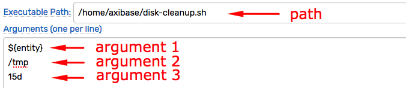
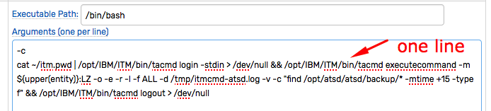
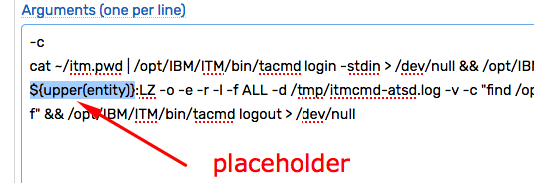
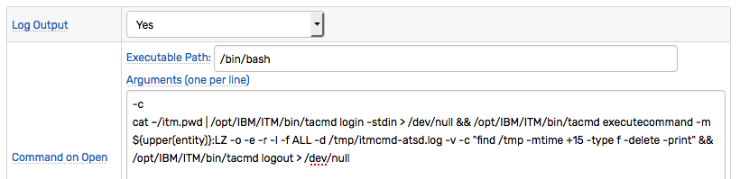
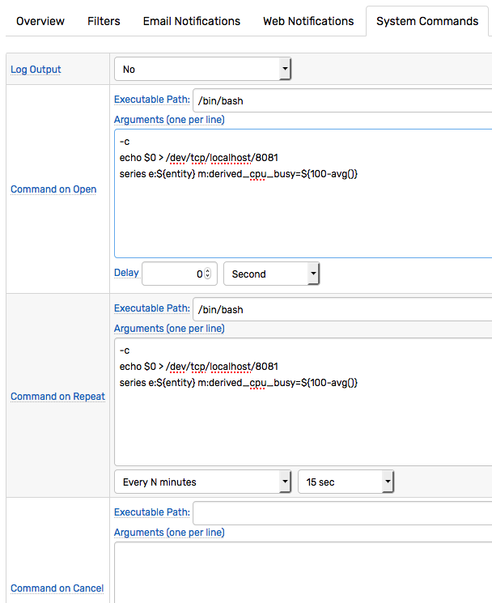

# Commands

## Overview

The command action allows executing system commands on the ATSD server in order to instantly react to incoming data by triggering advanced processing and integration tasks.

Such tasks may include running bash or Python scripts as well as integration with external systems using their native command line tools such as IBM ITM [`itmcmd`](https://www.ibm.com/support/knowledgecenter/en/SSTFXA_6.2.1/com.ibm.itm.doc_6.2.1/itm_cmdref113.htm)/[`tacmd`](https://www.ibm.com/support/knowledgecenter/en/SS3JRN_7.2.0/com.ibm.itm.doc_6.2.2fp2/tacmd.htm) or [AWS CLI](https://aws.amazon.com/cli/).

## Command Interpreter

When configuring a command action, you need to provide the executable path or system command name and optional command arguments.

### Path

Specify the command name or absolute path to the executable, for example:

```
/home/axibase/disk_cleanup.sh
```

It is recommended that the full path is specified even for built-in utilities such as `bash` or `find`. To lookup the command's path, execute `which {command}`, for example `which bash`:

```
$ which bash
/bin/bash
```

**Do not specify program arguments in the path field.**

### Arguments

Specify optional arguments to be passed to the executable, one argument per line.



Arguments that contains whitespace or quotes will be quoted automatically.

### Piping, Redirection, Shell Expansion

The command interpreter in ATSD doesn't support piping, I/O redirection or shell expansion. If the command includes these operations, delegate its interpretation and handling to a spawned process using `bash -c` flag.



### Placeholders

The arguments may include [placeholders](placeholders.md) using `${name}` syntax, for example `${entity}`. If the placeholder is not found, it is resolved to an empty string.



## Command Execution

The command can be configured to execute on `OPEN`, `CANCEL` and `REPEAT` status changes. To execute the command, enter a valid executable path for the selected status trigger.

If the executable path is empty, no command will be executed for this status trigger.

Only **one** command can be executed for each status change. If you need to execute multiple commands, create a wrapper script with multiple commands or launch a spawned shell process with `bash -c` and chain commands using `&&`.

```
/bin/bash
-c
docker restart prd_aer && docker exec -it -u axibase prd_aer /home/axibase/aer/start.sh
```

## Working Directory

The working directory is set in the `user.dir` setting on the **Settings > System Information** page.

Since the working directory path may change, use the absolute path in command arguments where appropriate.

## Security

The commands are executed under the `axibase` user.

Make sure that the `axibase` user has permissions to execute the command and that the script has the execution bit.

## Logging

When 'Log Output' option is enabled, both `system.out` and `system.err` outputs will be logged to the `atsd.log` file for each command execution.

The output is limited to 10240 characters.

```
2017-11-30 13:32:26,597;INFO;Exec Default Executor;com.axibase.tsd.service.rule.ExecutionAlertEndpoint;

KUIEXC001I: Content of the response file /tmp/itmcmd-atsd.log is:
------Command-------
find /opt/atsd/atsd/backup/* -mtime +15 -type f
------Command Result-------
0
------Standard Error-------
------Standard Output-------
/opt/atsd/atsd/backup/entities_20171111233000.xml
/opt/atsd/atsd/backup/entity-groups_20171111233000.xml
/opt/atsd/atsd/backup/entity-views_20171111233000.xml
...

KUIEXC000I: Executecommand request was performed successfully. The return value of the command run on the remote systems is 0

2017-11-30 13:32:26,597;INFO;Exec Default Executor;com.axibase.tsd.service.rule.ExecutionAlertEndpoint;Script successful: exit code = 0, cmd: '[/bin/bash, -c, cat ~/itm.pwd | /opt/IBM/ITM/bin/tacmd login -stdin > /dev/null && /opt/IBM/ITM/bin/tacmd executecommand -m NURSWGVML007:LZ -o -e -r -l -f ALL -d /tmp/itmcmd-atsd.log -v -c "find /opt/atsd/atsd/backup/* -mtime +15 -type f" && /opt/IBM/ITM/bin/tacmd logout > /dev/null]'
```

## Example. Clean up disk space on a remote system using IBM Tivoli `tacmd` command

### Description

If the disk space is low, the command reads user credentials from the `itm.pwd` file located in the `axibase` user home directory. After a successful login into the ITM hub server, [`tacmd executecommand`](https://www.ibm.com/support/knowledgecenter/en/SS3JRN_7.2.0/com.ibm.itm.doc_6.2.2fp2/tacmd.htm)) is launched on the remote server `${upper(entity)}:LZ` where it finds old files in `/tmp` directory (older than 15 days) and deletes them with logging. Finally, the process logs out from the ITM hub server.

By using the `${upper(entity)}` placeholder, the scripts executes the disk cleanup procedure on the system where the alerts for a disk space rule was raised to `OPEN` status.

A follow-up action, at the `REPEAT` status, can be further configured to cleanup other directories, in order to bring disk space usage down.



### Prerequisites

* Tivoli Enterprise Services User Interface Extensions installed on the ATSD server. To install the component, launch the `install.sh` script and select the `KUE` module from the list.

  ```
  ... installing "Tivoli Enterprise Services User Interface Extensions  V06.30.06.00 for Linux x86_64 R2.6, R3.0 (64 bit)"; please wait.
  => installed "Tivoli Enterprise Services User Interface Extensions  V06.30.06.00 for Linux x86_64 R2.6, R3.0 (64 bit)".
  ... Initializing component Tivoli Enterprise Services User Interface Extensions  V06.30.06.00 for Linux x86_64 R2.6, R3.0 (64 bit).
  ... Tivoli Enterprise Services User Interface Extensions  V06.30.06.00 for Linux x86_64 R2.6, R3.0 (64 bit) initialized.
  ```

* Modify the Hub TEMS configuration file `/opt/IBM/ITM/config/ms.config` and set the following parameter.

  ```
  KT1_TEMS_SECURE='YES'
  ```

  > Note that TEMS restart is required to activate this setting.

### Path

  ```
  /bin/bash
  ```

### Arguments

  ```
  -c
  cat ~/itm.pwd | /opt/IBM/ITM/bin/tacmd login -stdin > /dev/null && /opt/IBM/ITM/bin/tacmd executecommand -m ${upper(entity)}:LZ -o -e -r -l -f ALL -d /tmp/itmcmd-atsd.log -v -c "find /tmp -mtime +15 -type f -delete -print" && /opt/IBM/ITM/bin/tacmd logout > /dev/null
  ```

### Output Log

  ```
  2017-11-30 14:23:28,647;INFO;Exec Default Executor;com.axibase.tsd.service.rule.ExecutionAlertEndpoint;

  KUIEXC001I: Content of the response file /tmp/itmcmd-atsd.log is:
  ------Command-------
  find /tmp -mtime +15 -type f -delete -print
  ------Command Result-------
  0
  ------Standard Error-------
  ------Standard Output-------
  /tmp/hsperfdata_root/7640

  KUIEXC000I: Executecommand request was performed successfully. The return value of the command run on the remote systems is 0

  2017-11-30 14:23:28,647;INFO;Exec Default Executor;com.axibase.tsd.service.rule.ExecutionAlertEndpoint;Script successful: exit code = 0, cmd: '[/bin/bash, -c, cat ~/itm.pwd | /opt/IBM/ITM/bin/tacmd login -stdin > /dev/null && /opt/IBM/ITM/bin/tacmd executecommand -m NURSWGVML007:LZ -o -e -r -l -f ALL -d /tmp/itmcmd-atsd.log -v -c "find /tmp -mtime +15 -type f -delete -print" && /opt/IBM/ITM/bin/tacmd logout > /dev/null]'
  ```

## Example. Store Derived Metrics

### Description

The rule is configured to calculate a derived metric for the same entity. The derived value is calculated by subtracting the average of values in the window from 100. The new command is inserted back into ATSD under the metric name `derived_cpu_busy` using UNIX bash pseudo-file `/dev/tcp/localhost/8081` connected to the ATSD tcp port. The rule is configured to execute the command on `OPEN` status and `REPEAT` statuses with a `15 minute` frequency.

### Path

  ```
    /bin/bash
  ```

### Arguments

  ```sh
  -c
  echo $0 > /dev/tcp/localhost/8081
  series e:${entity} m:derived_cpu_busy=${100-avg()}
  ```

### Output Log

  ```
  2017-11-30 14:46:50,424;INFO;Exec Default Executor;com.axibase.tsd.service.rule.ExecutionAlertEndpoint;Script successful: exit code = 0, cmd: '[/bin/bash, -c, echo $0 > /dev/tcp/localhost/8081, series e:nurswgvml212 m:derived_cpu_busy=0.5433333317438761]'
  ```  


