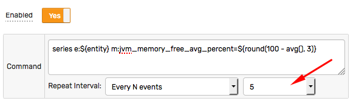
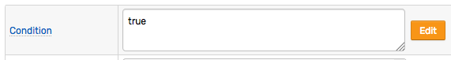

# Derived Commands

## Overview

The derived command action allows storing new calculated metrics in the database by creating and processing custom commands defined using the [Network API](../api/network/README.md#network-api) syntax.

## Command Template

When configuring a command action, you need to specify a template consisting of command name, command fields and command values.

### Supported commands:

* [series](../api/network/series.md)
* [property](../api/network/property.md)
* [message](../api/network/message.md)
* [entity](../api/network/entity.md)
* [metric](../api/network/metric.md)

### Fields

The template can include plain text and [placeholders](placeholders.md).

```ls
series e:${entity} m:jvm_memory_free_avg_percent=${round(100 - avg(), 3)}
```

The calculated metrics can reference other metrics using [`db_last`](functions-db.md#db_last-function) and [`db_statistic`](functions-db.md#db_statistic-function) functions.

```ls
series e:${entity} m:jvm_memory_used_bytes=${value * db_last('jvm_memory_total_bytes') / 100.0}
```

### Tags

A special placeholder `${commandTags}` is provided to print out all window tags in the [Network API](../api/network/series.md#syntax) syntax. It allows appending all tags to the command without knowing the tag names in advance.

```ls
series e:${entity} m:disk_free=${100 - value} ${commandTags}
```

Assuming the incoming command was `series e:test m:disk_used=25 t:mount_point=/ t:file_system=sda`:

```ls
series e:test m:disk_free=75 t:mount_point=/ t:file_system=sda
```

### Time

#### Current Server Time

In order to store derived commands with the current server time, omit the date/time fields (`ms`, `s`, `d`) from the derived command.

```ls
series e:${entity} m:disk_free=${100 - value} ${commandTags}
```

Alternatively, use the [`now`](window.md##time-fields) placeholder to access the current server time.

```ls
series e:${entity} m:disk_free=${100 - value} ${commandTags} ms:${now.getMillis()}
```

To store commands with seconds precision, round the current time using the [`floor`](functions.md#mathematical-functions) function and the seconds field `s:`:

```ls
series e:${entity} m:disk_free=${100 - value} ${commandTags} s:${floor(now.getMillis()/1000)}
```

#### Received Time

To store derived commands with exactly the same time as the incoming command, set the millisecond field `ms:` to the [`timestamp`](window.md##time-fields) field. The `timestamp` field represents the timestamp of the command that caused the window status event.

```ls
series e:${entity} m:disk_free=${100 - value} ${commandTags} ms:${timestamp}
```

> If 'Check On Exit' option is enabled for time-based window, some of the events will be caused by exiting commands and the `timestamp` field will return the time of the oldest command, rounded to seconds.

To round the input time to seconds, use the seconds field `s:` and the [`floor`](functions.md#mathematical-functions) function:

```ls
series e:${entity} m:disk_free=${100 - value} ${commandTags} s:${floor(timestamp/1000)}
```

## Frequency

The derived commands can be stored each time a command is received or removed from the window by setting the **Repeat** parameter to 'All'.

The frequency can be lowered by adjusting the repeat interval.



The produced commands are queued in memory and are persisted to the database once per second.

## Multiple Commands

Multiple commands, including commands of different type, can be specified at the same time. Each command must be specified on a separate line.

```ls
series e:${entity} m:jvm_memory_free_avg_percent=${round(100 - avg(), 3)}
series e:${entity} m:jvm_memory_free_min_percent=${round(100 - max(), 3)}
```

To create multiple metrics within the same command, use the `for` loop to iterate over a collection or an array.

```ls
series e:${entity} @{s = ""; for (stat : stats) {s = s + " m:" + stat.split(":")[0] + "=" + stat.split(":")[1];} return s;}
```

Assuming the `stats` collection is equal `['a:10', 'b:20', 'c:30']`, the produced command will look as follows:

```ls
series e:entity1 m:a=10 m:b=20 m:c=30
```

## Condition

If creating new data is the rule's only purpose, set the `Condition` field to a static `true` value to minimize the processing overhead.



## Examples

### Moving Average (Last N Count)

* Window type: count-based
* Window length: 10
* Condition: `true`
* Frequency: All
* Command Template:

```ls
	series e:${entity} m:${metric}_movavg=${avg()} ${commandTags}
```

### Moving Average (Last N Time)

* Window type: time-based
* Window length: 10 minute
* Condition: `true`
* Frequency: All or Every N Minutes = 1 minute
* Command Template:

```ls
	series e:${entity} m:${metric}_movavg=${avg()} ${commandTags}
```

### Rollup (all matching entities)

* Window type: time-based
* Window length: 1 minute
* Group by entity: `NO`
* Condition: `true`
* Frequency: Every N Minutes = 1 minute
* Command Template:

```ls
	series e:total m:${metric}_sum=${sum()}
```

### Reverse/Inverse Metric

* Window type: count-based
* Window length: 1
* Condition: `true`
* Frequency: All
* Command Template:

```ls
	series e:${entity} m:${metric}_rev=${100-value} ${commandTags}
```

```ls
	series e:${entity} m:${metric}_inv=${value = 0 ? 0 : 1/value} ${commandTags}
```

### Ratio / Percentage

* Window type: count-based
* Window length: 1
* Condition: `true`
* Frequency: All
* Command Template:

```ls
	series e:${entity} m:${metric}_percent=${100 * value/value('total')} ${commandTags}
```

### Message to Series

* Window type: count-based
* Window length: 1
* Condition: `true`
* Frequency: All
* Command Template:

```ls
	series e:${entity} m:job_execution_time=${tags.job_execution_time.replaceAll("[a-zA-Z]", "").trim()}
```
