# Email Action

The email action enables delivery of messages to one or multiple email subscribers on [window](window.md) status events.

The notification can be triggered when the window changes its status as well as at a scheduled interval while its status is `REPEAT`.

## Email Client

Messages generated by the rule engine are handled over to the built-in [mail client](../administration/setting-up-email-client.md) which is accessible on the **Settings > Mail Client** page.

The client settings apply to all outgoing messages.

## Configuring Notifications

To receive notifications from a given rule, open the `Email Notifications` tab in the rule editor.

Set status to `Enabled` and enter one or multiple email addresses, separated by comma, semi-colon or whitespace.

Click 'Enabled' for each trigger (`OPEN`, `REPEAT`, `CANCEL`) that you would like to subscribe to.

Uncheck *Same as 'On Open'* to customize the *Subject* and *Text* using [placeholders](placeholders.md).

For the `REPEAT` status, adjust the 'Repeat Interval' to the desired notification frequency, for example, 6 hours.

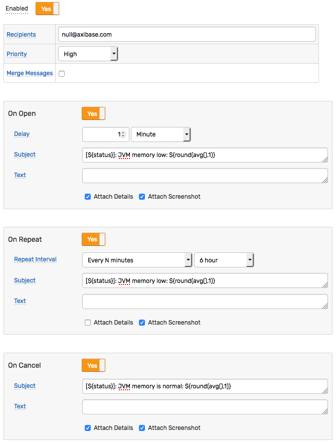

## Notification Settings

| Setting | Description |
| --- | --- |
| Enabled | Enable or disable the configuration. |
| Name | User-defined email configuration name. Each rule can have multiple configurations which are executed independently based on status changes. |
| Recipients | One or multiple email subscribers receiving the message. Use a comma or semi-colon to separate multiple addresses. |
| Priority | Message priority to classify messages in commonly used email clients: `Low`, `Normal`, `High`. |
| Merge Messages | Merge multiple notifications from different rules into one email for the same subscriber to prevent too many emails arriving within a short time span. Note that the message Subject is redefined for merged emails and reflects rule names, metric names, and the total number of merged notifications in the given message. For example: `Alerts(2)-cpu_busy: statistical-time, nmon_cpu`. |
| Minimum Notification Interval | Minimum interval between messages to prevent too many email messages generated by the rule. The rule engine will discard messages that are generated by the rule before the specified interval from the last sent message expires. |

## Trigger Settings

| Setting | Description |
| --- | --- |
| Delay on Open | Delay interval for sending notification for `OPEN` status. If the window changes to `CANCEL` status within the specified delay interval, no `OPEN` status email will be sent. Set this interval to prevent emails on short-lived spikes. |
| Repeat Interval | Interval for sending `REPEAT` status notifications. If the Repeat Interval is set in time units, the exact interval may vary because the `REPEAT` notifications are triggered by incoming data. In particular, `REPEAT` notifications will not be sent if the data stops flowing in. |
| Subject | Custom subject text for each status separately. List of supported placeholders is provided below. In addition to built-in placeholders you can use expressions containing built-in functions, for example: `${round(threshold_linear_time(99))/60}` or `${round(avg())}` |
| Text | Custom message text for each status separately. List of supported placeholders is provided below. In addition to built-in placeholders, you can use expressions containing built-in functions. For example: `${round(threshold_linear_time(99))/60}` or `${round(avg())}`. |
| Attach Details | Include a summary table with window statistics and action links. |
| Attach Portals | One or more portals attached to the notification message. If a portal is a template, placeholders such as entity, metric, tags will be resolved from the window fields.<br> *Series Chart* - attach a screenshot containing series monitored by this rule. |

## Grouping

The incoming data is [grouped](grouping.md) into windows by metric, entity, and command tags with each window generating emails separately from the others.

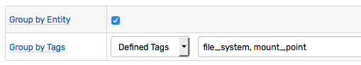

If the rule creates too many windows, restrict the rule [filter](filters.md) or add [`Override`](overrides.md) exceptions that disable alerting for particular series.

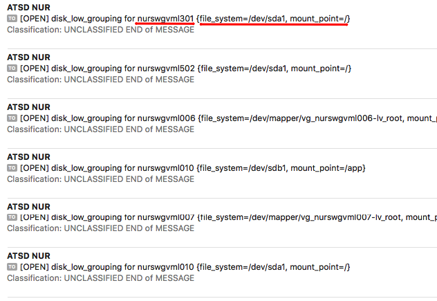

The override table below contains rules that will always return `false` for the matching series since the value cannot exceed 100%.

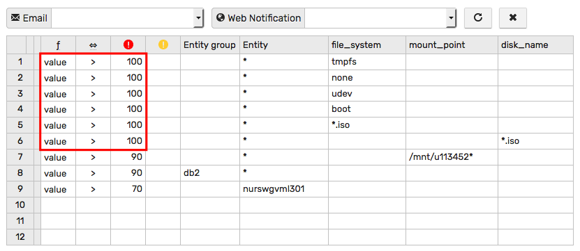

## Message Composition

* Subject
* Content
  - Header
  - Text
  - Detail Table
    - Entity tags
    - Alert fields
    - Command/Event tags
    - User variables
  - Portal Screenshots
  - Footer

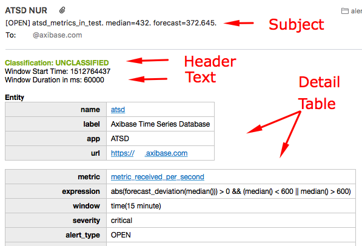  

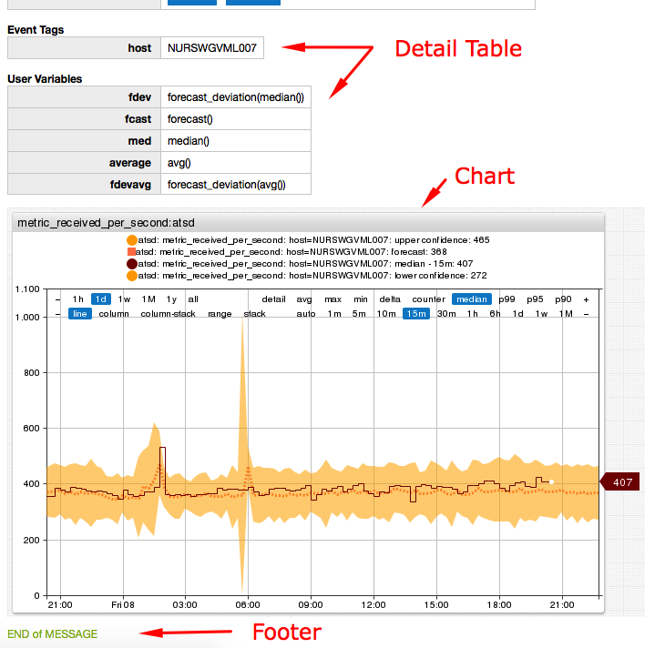

### Subject

The subject may include [placeholders](placeholders.md) with expressions substituted with actual values when the message is sent. If the placeholder is not found, it is replaced with an empty string.

Sample subject:

```css
  [${status}] Rule ${rule} for ${entity} ${tags}
```

When using placeholders that maybe replaced with text of arbitrary length, apply the `truncate()` function to limit the subject length.

```css
  [${status}] Rule ${rule} for ${entity}: ${truncate(message, 100)}
```

The subject can be customized using [control flow](control-flow.md) statements for conditional processing.

### Text

The message text (body) may include [placeholders](placeholders.md) as well.

Use the html tag `<br>` to split content into multiple lines.

```html
  Window Start Time: ${windowStartTime}<br>
  Window Duration in ms: ${(timestamp / 1000 - windowStartTime) * 1000}
```

Placeholders with [link](links.md) fields are automatically inlined.

The message text can include [control flow](control-flow.md) statements for conditional processing.

```javascript
[${upper(tags.status)}] ${entityLink} Ω ${getEntityLink(tags.docker-host)}
<span style='color: orange'>${marker}</span>
@if{is_launch}
  ${addTable(entity.tags, 'html')}
@end{}
```

### Header and Footer

The header and footer can be specified in both plain text and HTML format in the [email client](../administration/setting-up-email-client.md) settings and apply to all messages. 

The header and footer do **not** support any placeholders.

```html
<p style="color: #8db600; font-weight: bold; margin: 0px; padding: 0px;">Classification: UNCLASSIFIED</p>
```

```html
<p style="color: #8db600;">END of MESSAGE</p>
```


### Details Table

The details table is optional and is formatted with styles for enhanced readability in commonly used email client software.

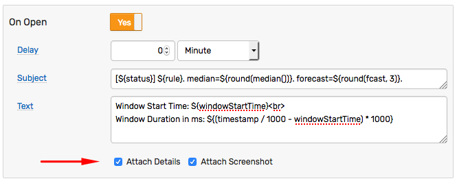

The table includes multiple parts which are compiled depending on the alert context.

At the end of the table, the links are provided to view extended alert information, open charts and export underlying data.

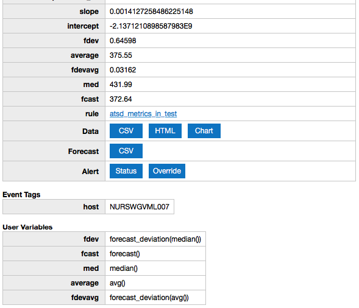

Decimal numbers are rounded to the 5 significant digits for readability.

### Portals 

In order to attach screenshots, a [web driver](notifications/web-driver.md) must be installed and configured. To attach default portal for the current metric, entity and tags to the outgoing message, check the `Series Chart` option.

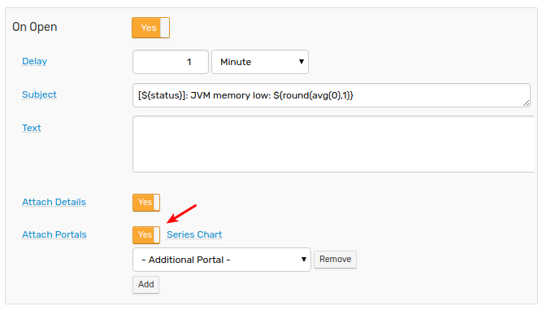

The chart may include multiple series depending on statistical functions referenced in the condition.

```javascript
  abs(forecast_deviation(median())) > 2 && (median() < 200 || median() > 600)
```

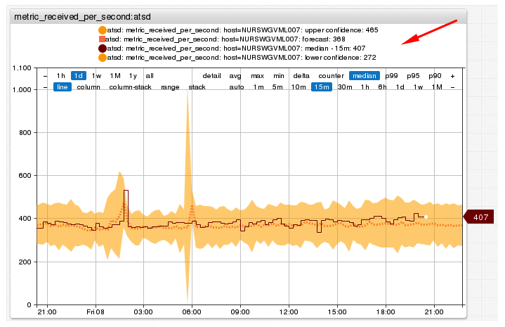

Similarly, if the rule correlates multiple metrics using [database functions](functions-db.md) or [rules functions](functions-rules.md) such metrics maybe included in the screenshot on the right axis.

```javascript
  avg() > 10 && db_last('memfree') < 500000
```

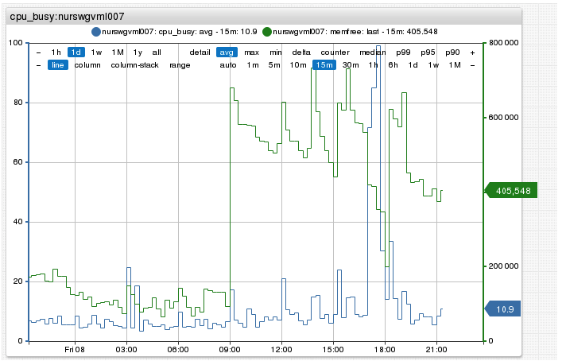

To attach additional portals, select them at the `Additional Portal` drop-down.

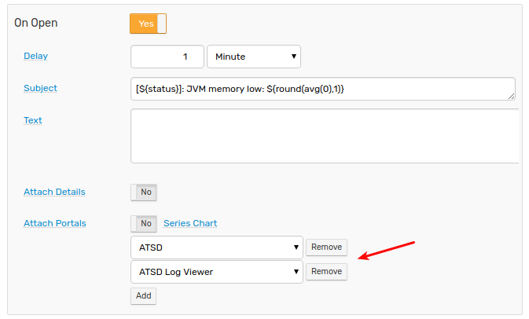

If a portal is a [template](../portals/portals-overview.md#template-portals), placeholders such as entity, metric, tags will be set based on the current window fields.

## Monitoring

The number of messages sent per minute can be monitored with the [`email_notifications_per_minute`](../administration/monitoring.md#rule-engine) metric collected by ATSD.

```elm
https://atsd_host:8443/portals/series?entity=atsd&metric=email_notifications_per_minute
```


