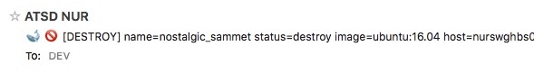

# Email Action

The email action delivers messages to email subscribers based on [window](window.md) status events.

Notifications can be triggered when the window changes its status as well as periodically while its status is `REPEAT`.

## Email Client

Messages generated by the rule engine are sent by the built-in [Mail Client](../administration/mail-client.md) which is configurable on the **Settings > Mail Client** page.

Custom Mail Client formatting options such as [header and footer](../administration/mail-client.md#header-and-footer) are applied to all outgoing messages.

## Enable Notifications

Open the `Email Notifications` tab in the rule editor.

Set status to `Enabled` and enter one or multiple email addresses, separated by comma, semi-colon or whitespace.

Click 'Enabled' for each trigger (`OPEN`, `REPEAT`, `CANCEL`) that you would like to be subscribed to.


For the `REPEAT` status, adjust the 'Repeat Interval' to the desired notification frequency, for example, every **6 hours** or every **10 events**.

If necessary, uncheck the **Same as 'On Open'** setting to adjust message content based on window status.

## Settings

| Name | Description |
| --- | --- |
| Enabled | Enable or disable email delivery. |
| Name | User-defined email configuration name. Each rule can have multiple configurations which are executed independently. |
| Recipients | One or multiple email subscribers to receive messages. Use a comma, semi-colon or whitespace to separate multiple addresses. |
| Priority | Message priority to classify messages in commonly used email clients: `Low`, `Normal`, `High`. |
| Merge Messages | Merge multiple notifications from different rules into one email message for the same subscriber to prevent too many emails arriving within a short time span. The Subject of merged messages is generated automatically and contains rule names, metric names, and the total number of merged notifications in the given message. For example: `Alerts(2)-cpu_busy: statistical-time, nmon_cpu`. |
| Minimum Notification Interval | Minimum interval between messages to prevent too many email messages generated by the rule. The rule engine will discard messages that are generated by the rule before the specified interval from the last sent message expires. |

## Configure Message Content

Fill out the message 'Subject' and 'Text' fields.

Both fields may include any text as well as [placeholders](placeholders.md) to customize outgoing messages based on alert details.

```bash
Warning! Rule ${rule} for server ${entity} is active.
```

The [placeholders](placeholders.md), escaped with `$` and wrapped in curly brackets such as `${expression}`, will be evaluated and replaced with actual values when the notification is sent.

```bash
Warning! Rule JVM Memory Low for server nurswgvml007 is active.
```

### Subject Field

The 'Subject' field may include plain text, HTML [entity characters](https://dev.w3.org/html5/html-author/charref), and [emoji](https://unicode.org/emoji/charts/full-emoji-list.html). HTML markup is **not** supported.



Note that the 'Subject' field is recommended to be limited to `78` characters according to [RFC 2822](https://www.ietf.org/rfc/rfc2822.txt), Section `2.1.1` and may be truncated or rejected by mail servers. The actual limit is often higher but is implementation-specific.

You can apply [`truncate`](functions-text.md#truncate) or [`abbreviate`](functions-text.md#abbreviate) functions to ensure that the subject length remains within the limit.

```bash
${entity} encountered error '${abbreviate(tags.error, 50)}'
```

### Text Field

The 'Text' field may include any text including [emoji](https://unicode.org/emoji/charts/full-emoji-list.html) and HTML [entity characters](https://dev.w3.org/html5/html-author/charref) as well as [placeholders](placeholders.md).

Unlike the 'Subject' field, 'Text' is not constrained by a length limit and supports HTML markup.

```bash
Database Error.
Code: <b>${tags.code}</b>
<pre>
${message}
</pre>
```

The message text can include output of scripts, SQL queries, and API calls formatted as HTML tables.

```bash
Top-10 running containers by CPU:
${addTable(executeSqlQuery(query), 'html', true)}
```

In addition, the 'Text' field may invoke [attachment](functions-portal.md#portal-functions) functions in order to include portal screenshots as inline images or CSV files as attachments.

```bash
${addPortal('AWS Route53 Health Check Detail', aws_entity)}
```

The 'Text' field supports [control flow](control-flow.md#control-flow) syntax which allows customizing the content based on alert details.

```bash
@if{tags.payload.type != 'cron'}
    ${detailsTable('html')}
@end{}
```

## Trigger Settings

| Setting | Description |
| --- | --- |
| Delay on Open | Delay interval for sending notification for `OPEN` status. If the window changes to `CANCEL` status within the specified delay interval, no `OPEN` status email will be sent. Set this interval to prevent emails on short-lived spikes. |
| Repeat Interval | Interval for sending `REPEAT` status notifications. If the Repeat Interval is set in time units, the exact interval may vary because the `REPEAT` notifications are triggered by incoming data. In particular, `REPEAT` notifications will not be sent if the data stops flowing in. |
| Subject | Custom subject text, specified for each status separately. The subject can include placeholders with built-in fields, functions, and expressions, for example: `${round(avg())}`. Note that the maximum allowed length of the subject is limited to several hundred characters in most email clients.|
| Text | Custom message text, specified for each status separately. The text can include placeholders with built-in fields, functions, and expressions, for example: `${round(avg())}`. |
| Attach Details | Include a [summary table](window-fields.md#details-tables) with window statistics and action links. |
| Attach Portals | One or more portal screenshots attached to the message as inline images. If a portal is a template, placeholders such as entity, metric, tags will be resolved from the window fields.<br> *Series Chart* - attach a screenshot containing series monitored by this rule. |

## Grouping

The incoming data is [grouped](grouping.md) into windows by metric, entity, and command tags with each window generating emails separately from the others.


If the rule creates too many windows, restrict the rule [filter](filters.md) or add [`Override`](overrides.md) exceptions that disable alerting for a particular series.


The override table below contains rules that will always return `false` for the matching series since the value cannot exceed 100%.


## Message Composition

* Subject
* Content
  * Header
  * Text
  * Detail Table
    * Entity tags
    * Alert fields
    * Command/Event tags
    * User variables
  * Portal Screenshots (inline images in png format)
  * Footer
  * Attachments
    * Files (CSV, Excel, PDF, etc)


### Subject

The subject may include [placeholders](placeholders.md) with expressions substituted with actual values when the message is sent. If the placeholder is not found, it is replaced with an empty string.

Sample subject:

```bash
  [${status}] Rule ${rule} for ${entity} ${tags}
```

When using placeholders that may be replaced with text of arbitrary length, apply the [`truncate`](functions-text.md#truncate) or [`abbreviate`](functions-text.md#abbreviate) functions to limit the subject length.

```bash
  [${status}] Rule ${rule} for ${entity}: ${truncate(tags.error, 100)}
```

### Text

The message text (body) may include [placeholders](placeholders.md) as well.

Use the HTML tag `<br>` to split content into multiple lines.

```bash
  Start Time: ${windowStartTime}<br>
  Duration: ${(timestamp / 1000 - windowStartTime) * 1000} ms
```

Placeholders with [link](links.md) fields are automatically inlined.

The message text can include [control flow](control-flow.md) statements for conditional processing.

```bash
[${upper(tags.status)}] ${entityLink} Ω ${getEntityLink(tags.docker-host)}
<span style='color: orange'>${marker}</span>
@if{is_launch}
  ${addTable(entity.tags, 'html')}
@end{}
```

### Header and Footer

A [header and footer](../administration/mail-client.md#header-and-footer) can be specified in both plain text and HTML format in the Email Client settings and applied to all messages.

The header and footer do **not** support any placeholders.

```html
<p style="color: #8db600; font-weight: bold; margin: 0px; padding: 0px;">Classification: UNCLASSIFIED</p>
```

```html
<p style="color: #8db600;">END of MESSAGE</p>
```


### Details Table

The details table is optional and is formatted with styles for enhanced readability in commonly used email client software.


The table includes multiple parts which are compiled depending on the alert context.

At the end of the table, the links are provided to view extended alert information, open charts and export underlying data.


Decimal numbers are rounded to 5 significant digits for readability.

### Portals

In order to attach screenshots, a [web driver](notifications/web-driver.md) must be installed and configured. To attach default portal for the current metric, entity and tags to the outgoing message, check the `Series Chart` option.


The chart may include multiple series depending on statistical functions referenced in the condition.

```javascript
  abs(forecast_deviation(median())) > 2 && (median() < 200 || median() > 600)
```


Similarly, if the rule correlates multiple metrics using [database functions](functions-db.md) or [rules functions](functions-rules.md) such metrics may be included in the screenshot on the right axis.

```javascript
  avg() > 10 && db_last('memfree') < 500000
```


To attach additional portals, select them from the `Additional Portal` drop-down.


If a portal is a [template](../portals/portals-overview.md#template-portals), placeholders such as entity, metric, tags will be set based on the current window fields.

## Monitoring

The number of messages sent per minute can be monitored with the [`email_notifications_per_minute`](../administration/monitoring.md#rule-engine) metric collected by ATSD.

```elm
https://atsd_hostname:8443/portals/series?entity=atsd&metric=email_notifications_per_minute
```


