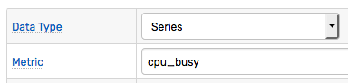

# Filters

## Overview

Filters determine which commands should be processed by a rule. Commands that satisfy all filters are allocated to the rule [windows](window.md) for further processing such as adding data and evaluating the alert condition.

### Built-in Filters

| **Name** | **Description** |
| --- | --- |
| Data Type | Checks that the command is of the specified type: `series`, `property`, `message`. |
| Metric | Checks that a metric is equal to the metric name specified in the rule. |



### User-Defined Filters

| **Name** | **Description** |
| --- | --- |
| Expression | Accepts commands for which the filter expression  returns `true`. |
| Entity | Accepts commands only for entities selected in the rule. |
| Entity Group | Accepts commands for entities that belong only to one of entity groups selected in the rule. |
| Time | Accepts commands with a timestamp that deviates by less than the specified interval from the current server time. |

## Data Type Filter

The filter ignores commands if their data type is different from what is specified in the rule.
For example, a `series` rule ignores `message` and `property` commands.

## Metric Filter

To match the rule, the incoming series command must have the same metric name as the one specified in the Rule Editor. This filter applies to `series` commands.

## Filter Expression

The filter matches commands for which the filter expression returns `true`.

The expression may consists of one or multiple boolean checks joined with [boolean operators](operators.md#boolean-operators) `AND`, `OR`, and `NOT`.

```javascript
entity != 'nurswgvml007'
```

```javascript
entity LIKE 'nurswgvml*' AND entity IN ('nurswgvml007', 'nurswgvml006')
```

The expression may include command fields listed below, literal values, and [functions](functions.md) except [statistical functions](functions-statistical.md).

Base command fields:

* entity
* tags.{tag-name}
* entity.tags.{tag-name}
* entity.field
* metric.tags.{tag-name}
* metric.field

`series` command fields:

* metric
* value

`message` command fields:

* type
* source
* severity
* message

`property` command fields:

* type
* keys
* properties


```javascript
tags.method == 'get' AND tags.site == 'OperationsManager2007WebConsole'
```

Tag values can be accessed using dot notation `tags.{tag-name}` or square brackets `tags['tag-name']`.

> Square brackets are required if the tag name contains special characters `(-,+,=, etc)`.

```javascript
tags['mount-point'] NOT LIKE '*u113452*'
```

```javascript
type == 'activemq_service' AND keys.service == 'health'
```

```javascript
entity.tags.environment != 'test' && message NOT IN collection('linux-ignore-commands')
```

## Entity Filter

The filter discards commands for an entity not equal to one of entities specified in the rule. The filter is applied only if the list of selected entities is not empty.


As a more flexible alternative, the entity condition can be encoded in the filter expression:

```javascript
entity != 'nurswgvml007'
```

```javascript
entity LIKE 'mib*'
```

```javascript
entity.tags.location = 'SVL'
```

## Entity Group Filter

The filter discards commands for entities that do not belong to one of the entity groups specified in the rule. The filter is applied only if the list of selected entity groups is not empty.


## Time Filter

If set to a positive value, the filter discards commands with a timestamp that deviates by more than specified 'grace' interval from the current server time. This filter is typically used to ignore historical data.


## Filter vs Condition

While the same condition such as `tags.mount_point = '/'` can be evaluated both in the filter expression and the alert condition, it is recommended that the checks that refer to command fields are specified in the filter expression whereas checks that require the [window](window.md) object are specified in the alert condition. This will minimize the number of windows maintained by the rule engine.

For example, `tags.mount_point = '/'` refers to the `tags` field which is present in the incoming command and therefore can be checked in the filter expression. As a result commands with other tag values (e.g. `mount_point` = `/dev`) will be discarded early in the process without causing extra windows to be created.

[Statistical functions](functions-statistical.md), on the other hand, operate on values stored in the window and therefore cannot be used during the filtering stage. Since the window is not available at the filtering stage, the statistical functions shall return `zero` if included in a filter expression.
