# Script Functions

## Overview

The `scriptOut` function provides a way to enrich notifications with extended information about the monitored object retrieved with a bash or Python script.

The function executes the named script with the specified parameters and returns the script's response (stdout/stderr). The parameters often include window [placeholders](placeholders.md) such as `entity` or `tags` so that the same rule can enrich alerts for different entities.

> Only scripts located in the `./atsd/conf/script/` directory can be executed.

## Common Use Cases

* Check the TCP availability of the remote host.
* Check that the remote host can be reached with ICMP ping.
* Check that an HTTP/s request to a URL returns code `200`.
* Execute a diagnostics command on the remote host.
* Retrieve configuration information from the remote device/host.

## Syntax

```java
scriptOut(string scriptFileName, collection arguments)
```

* [**required**] `scriptFileName` - Name of the script file located in the `./atsd/conf/script/` directory.
* [**required**] `arguments` - Collection of parameters passed to the script.

The parameters may include literal values or window [placeholders](placeholders.md) such as the `entity` or `tag` value.

```javascript
scriptOut('disk_size.sh', [entity, tags.file_system])
```

Literal string parameters must be enclosed in single quotes.

```javascript
scriptOut('ping.sh', ['axibase.com', 3])
```

If no parameters are expected by the script, an empty list `[]` must be passed as the second argument.

```javascript
scriptOut('check_service.sh', [])
```

The script must complete within the timeout value specified in **Settings > Server Properties** `system.commands.timeout.seconds`. The default timeout is 15 seconds.

If the script times out, its process is terminated with `SIGTERM` flag and the following text is appended to the output:

```
Script terminated on timeout: {current timeout value}
```

## Permissions

Only scripts in the  `./atsd/conf/script/` directory can be executed. The scripts should have the permission bit `+x` enabled.

```bash
chmod u=rwx,g=rx,o=r ./atsd/conf/script/*
```

These scripts are executed under the `axibase` user context.

## Formatting

The output of the `scriptOut` function can be formatted with backticks when using markdown (chat messages) or with `<pre>` tag when using HTML (email).

### Markdown Format

 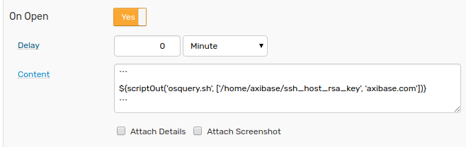  

### HTML Format

 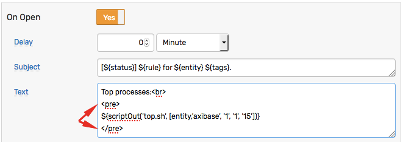  

 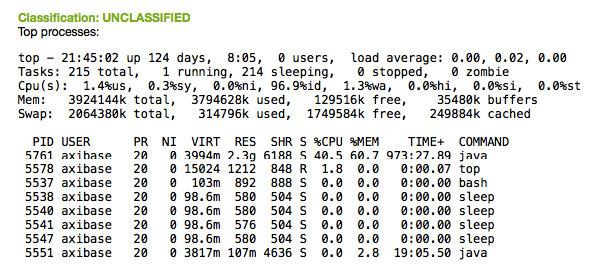  

## Examples

* [ping](#ping)
* [traceroute](#traceroute)
* [top](#top)
* [ps](#ps)
* [URL availability](#url-availability)
* [TCP availability](#tcp-availability)
* [osquery](#osquery)

### `ping`

[Script](https://raw.githubusercontent.com/axibase/atsd/master/rule-engine/resources/ping.sh) to ping host `n` times.

#### Script

```bash
#!/usr/bin/env bash

host=${1}
count=${2}

ping -c ${count} ${host}
```

#### Function

```javascript
Host ping report:

${scriptOut('ping.sh', ['axibase.com', '3'])}
```

#### Command

```
ping -c 3 axibase.com
```

#### Output

```bash
PING axibase.com (78.47.207.156) 56(84) bytes of data.
64 bytes from axibase.com (78.47.207.156): icmp_seq=1 ttl=52 time=45.5 ms
64 bytes from axibase.com (78.47.207.156): icmp_seq=2 ttl=52 time=40.0 ms
64 bytes from axibase.com (78.47.207.156): icmp_seq=3 ttl=52 time=43.9 ms

--- axibase.com ping statistics ---
3 packets transmitted, 3 received, 0% packet loss, time 2002ms
rtt min/avg/max/mdev = 40.078/43.189/45.588/2.305 ms
```

#### Notification

Telegram:

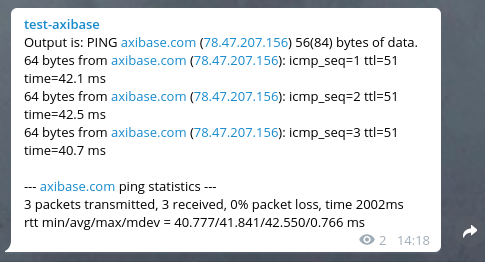

Discord:

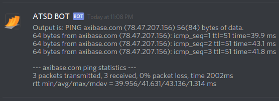

Slack:

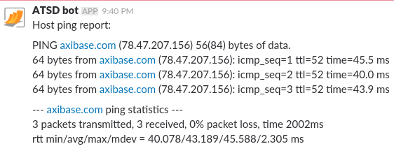


### `traceroute`

[Script](https://raw.githubusercontent.com/axibase/atsd/master/rule-engine/resources/traceroute.sh) to return traceroute to host.

#### Script

```bash
#!/usr/bin/env bash

kill_after=${1}
host=${2}
dir=$(dirname $(readlink -f $0))

timeout ${kill_after}s traceroute ${host} 2>${dir}/error

if [ $? != 0 ] && [ $(wc -c < ${dir}/error) == 0 ]; then
  echo -e "\nExceeded ${kill_after} seconds"
else
  cat ${dir}/error
fi

rm  ${dir}/error
```

#### Function

```javascript
Trace report:

${scriptOut('traceroute.sh', ['3', 'axibase.com'])}
```

#### Command

```bash
timeout 3 traceroute axibase.com
```

#### Output

```bash
traceroute to axibase.com (78.47.207.156), 30 hops max, 60 byte packets
 1  NURSWGVML102(10.102.0.1)  0.149 ms  0.059 ms  0.032 ms
 2  static.129.38.9.5.clients.your-server.de (5.9.38.129)  0.438 ms  0.430 ms  0.481 ms
 3  core23.fsn1.hetzner.com (213.239.229.233)  0.402 ms core24.fsn1.hetzner.com (213.239.229.237)  0.341 ms core23.fsn1.hetzner.com (213.239.229.233)  0.399 ms
 4  ex9k2.dc8.fsn1.hetzner.com (213.239.229.18)  0.442 ms  0.438 ms ex9k2.dc8.fsn1.hetzner.com (213.239.229.22)  0.416 ms
 5  cnode3.6.fsn1.your-cloud.host (136.243.180.196)  0.306 ms  0.297 ms  0.313 ms
 6  axibase.com (78.47.207.156)  0.348 ms  0.363 ms  0.308 ms
```

#### Notification

 Telegram:

 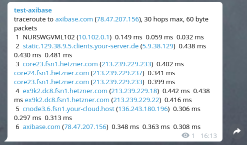

 Discord:

 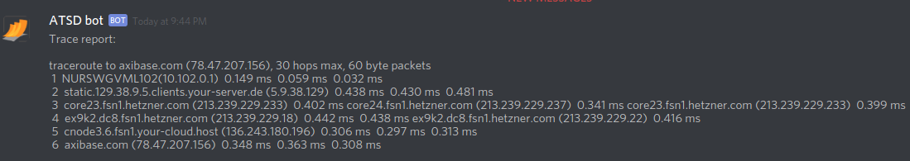

 Slack:

 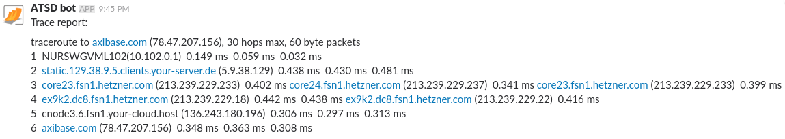

### `top`

[Script](https://raw.githubusercontent.com/axibase/atsd/master/rule-engine/resources/top.sh) that returns output of `top` in batch mode from a remote server (using ssh with key authentication, key stored in a pre-defined location).

#### Script

```bash
#!/usr/bin/env bash

host=${1}
user=${2}
count=${3}
delay=${4}
rows_n=${5}


ssh -i /home/axibase/.ssh/def.key ${host} top -u ${user} -b -n ${count} -d ${delay} | head -n ${rows_n}
```

#### Function

```javascript
${scriptOut('top.sh', ['nurswgvml006','www-data', '1', '1', '15'])}
```

#### Command

```bash
ssh -i /home/axibase/.ssh/def.key nurswgvml006 top -u www-data -b -n 1 -d 1 | head -n 15
```

#### Output

```bash
top - 13:01:25 up 96 days, 23:05,  1 user,  load average: 0.02, 0.04, 0.05
Tasks: 139 total,   1 running, 138 sleeping,   0 stopped,   0 zombie
%Cpu(s):  1.3 us,  0.6 sy,  0.0 ni, 97.8 id,  0.2 wa,  0.0 hi,  0.1 si,  0.0 st
KiB Mem:   2049052 total,  1951460 used,    97592 free,    25364 buffers
KiB Swap:        0 total,        0 used,        0 free.  1363820 cached Mem

  PID USER      PR  NI    VIRT    RES    SHR S  %CPU %MEM     TIME+ COMMAND
 8831 www-data  20   0  346044  67436  50140 S   0.0  3.3   0:05.49 php5-fpm
10145 www-data  20   0  341676  58756  45816 S   0.0  2.9   1:16.71 php5-fpm
21890 www-data  20   0  338204  54772  43288 S   0.0  2.7   0:14.65 php5-fpm
25001 www-data  20   0   94860   8576   2724 S   0.0  0.4  55:42.36 nginx
25002 www-data  20   0   93864   7488   2552 S   0.0  0.4  56:01.59 nginx
25003 www-data  20   0   93816   6408   1536 S   0.0  0.3  53:06.12 nginx
25005 www-data  20   0   96512   8184    696 S   0.0  0.4  54:38.85 nginx
28047 www-data  20   0  339860  57372  44236 S   0.0  2.8   0:02.34 php5-fpm
```

#### Notification

 Telegram:

 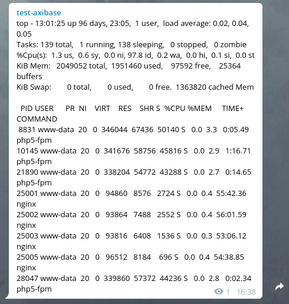

 Discord:

 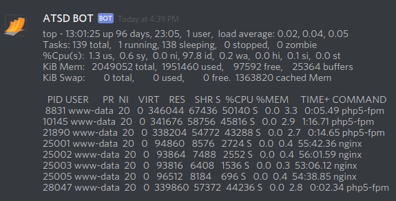

 Slack:

 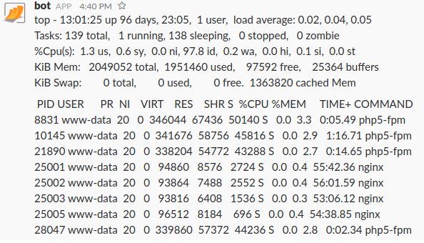

### `ps`

[Script](https://raw.githubusercontent.com/axibase/atsd/master/rule-engine/resources/ps.sh) that returns `ps` output for the specified grep pattern from a remote server.

#### Script

```bash
#!/usr/bin/env bash

host=${1}
pattern=${2}

ssh -i /home/axibase/.ssh/def.key ${host} ps aux | grep ${pattern}
```

#### Function

```javascript
Output is:
${scriptOut('ps.sh', ['axibase.com','bash'])}
```

#### Command

```bash
ssh -i /home/axibase/.ssh/def.key axibase.com ps aux | grep bash
```

#### Output

```bash
axibase      1  0.0  0.0  19712  3304 ?        Ss   11:07   0:00 /bin/bash /entrypoint.sh
axibase   2807  0.0  0.0  19828  3464 ?        S    11:09   0:00 bash /opt/atsd/hbase/bin/hbase-daemon.sh --config /opt/atsd/hbase/bin/../conf foreground_start master
```

#### Notification   

 Telegram:

 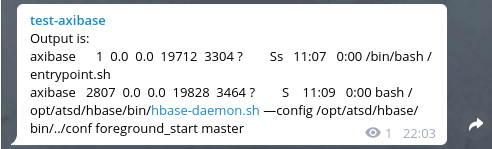

 Discord:

 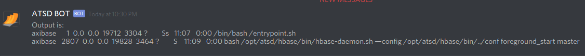

 Slack:

 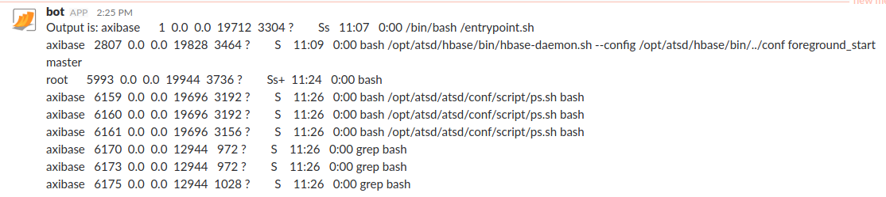

### URL availability

[Script](https://raw.githubusercontent.com/axibase/atsd/master/rule-engine/resources/url_avail.sh) that tests URL availability.

#### Script

```bash
#!/usr/bin/env bash

url=${1}
dir=$(dirname $(readlink -f $0))
status=$(curl -sS -L --insecure -X GET -m 10 -D ${dir}/headers -w "\nResponse Time: %{time_total}\n" "${url}" > ${dir}/response 2>&1)
if [[ $? == 0 ]] ; then
  code=$(head -n 1 ${dir}/headers | grep -oiE "[0-9]{3}[a-z ]*")
  echo "Status code: ${code}"
  echo "$(tail -n 1 ${dir}/response)" # Response Time
  length=$(head -n -1 ${dir}/response | wc -c)
  echo "Content Length: ${length} bytes"
  grep "Location:" ${dir}/headers
else
  head -n 1 ${dir}/response
fi

rm  ${dir}/response  ${dir}/headers
```

#### Function

```javascript
${scriptOut('url_avail.sh', ['https://axibase.com'])}
```

#### Command

```bash
curl -sS -L --insecure -X GET -m 10 -D ./atsd/conf/script/headers -w "\nResponse Time: %{time_total}\n" "https://axibase.com" > ./atsd/conf/script/response 2>&1
```

#### Output

```bash
Status code: 200 OK
Response Time: 0.618
Content Length: 35214 bytes
```

#### Notification  

 Telegram:

 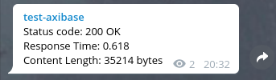

 Discord:

 

 Slack:

    


### TCP availability

[Script](https://raw.githubusercontent.com/axibase/atsd/master/rule-engine/resources/tcp.sh) that tests TCP availability.

#### Script

```bash
#!/usr/bin/env bash

kill_after=${1}
host=${2}
port=${3}

timeout ${kill_after} bash -c "</dev/tcp/${host}/${port}"

if [[ $? -eq 0 ]]; then
   echo "TCP port ${port} is available"
else
   echo "TCP port ${port} is unavailable"
fi
```

#### Function

```javascript
Output is: ${scriptOut('tcp.sh', ['2','axibase.com', '443'])}
```

#### Command

```bash
timeout 2 bash -c "</dev/tcp/axibase.com/443"
```

#### Output

```bash
TCP port 443 is available
```

#### Notification

 Telegram:

 

 Discord:

 

 Slack:

   


### `osquery`

[Script](https://raw.githubusercontent.com/axibase/atsd/master/rule-engine/resources/osquery.sh) that executes an [osquery](https://osquery.io/) request against a remote server.

#### Script

```bash

#!/usr/bin/env bash

host=${1}
query=${2}

ssh -i /home/axibase/.ssh/def.key ${host} "osqueryi \"${query}\""
```

#### Function

```javascript
${scriptOut('osquery.sh', ['axibase.com', "SELECT DISTINCT processes.name, listening_ports.port, processes.pid FROM listening_ports JOIN processes USING (pid) WHERE listening_ports.address = '0.0.0.0';"])}
```

#### Command

```bash
ssh -i /home/axibase/.ssh/def.key axibase.com 'osqueryi "SELECT DISTINCT processes.name, listening_ports.port, processes.pid FROM listening_ports JOIN processes USING (pid) WHERE listening_ports.address = '\''0.0.0.0'\'';"'
```

#### Output

```ls
+------+-------+------+
| name | port  | pid  |
+------+-------+------+
| java | 50010 | 9112 |
| java | 50075 | 9112 |
| java | 50020 | 9112 |
| java | 50090 | 9365 |
| java | 50070 | 8921 |
+------+-------+------+
```

#### Notification

 Telegram:

 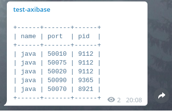

 Discord:

 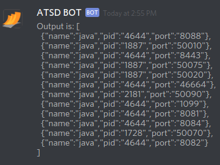

 Slack:

 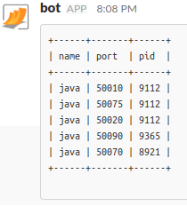    
