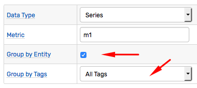
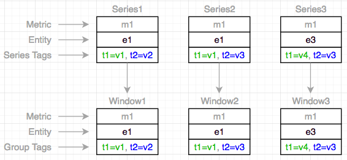
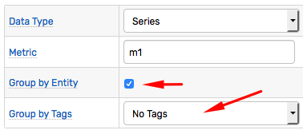
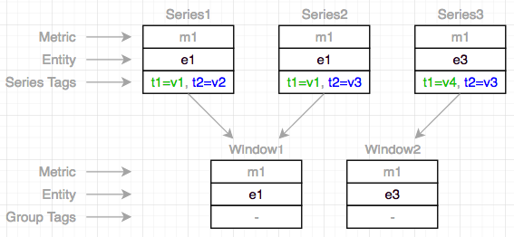
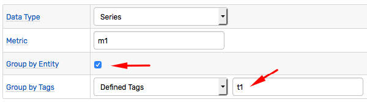
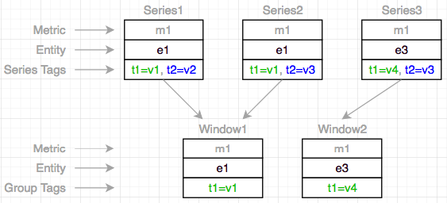
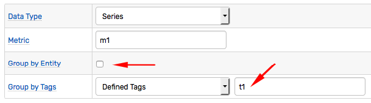
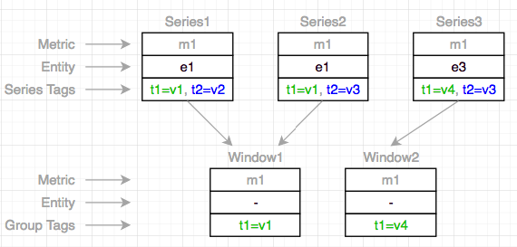
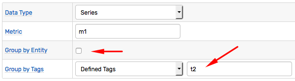
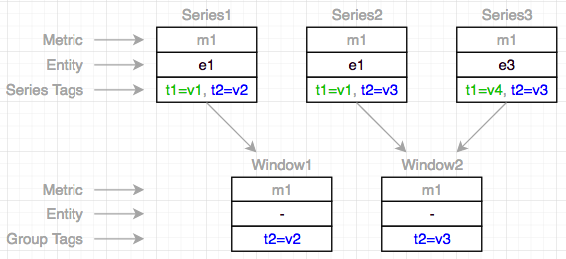

# Grouping

## Overview

Incoming commands are assigned to in-memory [windows](window.md) based on the grouping key which consists from the following field values:

* Data Type (`series`, `message`, or `property`)
* Metric Name
* Entity Name
* Command Tags

Commands with equal grouping key are assigned to the same window.

The `Data Type` and `Metric Name` fields are mandatory parts of the key whereas grouping by entity and tags is optional and is configured for each rule separately.

For `series` commands, the default grouping is set by entity and **all** tags.

For `message` and `property` commands, grouping by tags is disabled because these commands have many tags with unique values which would otherwise create too many windows in the application memory.

Entity grouping can be disabled when one needs to apply an aggregate function to data coming from multiple entities, for example, to calculate an average for all entities that matched filters.

## Examples

Assuming that incoming data is represented with the following 3 series commands, the examples below will illustrate the effect of rule settings on window formations.

| Data Type | Metric | Entity | Tags |
|---|---|---|:---|
| series | m1 | e1 | t1=v1 t2=v2 |
| series | m1 | e1 | t1=v1 t2=v3 |
| series | m1 | e3 | t1=v4 t2=v3 |

```ls
series e:e1 t:t1=v1 t:t2=v2 m:m1=80
series e:e1 t:t1=v1 t:t2=v3 m:m1=10
series e:e3 t:t1=v4 t:t2=v3 m:m1=50
```

### Example: Group By Entity and All Tags

* Group by `series` type, `m1` metric.
* Group by entity.
* Group by all tags (`t1`, `t2`).



| Data Type | Metric | Entity | Tags | Grouping Key |
|---|---|---|:---|:---|
| series | m1 | e1 | t1=v1 t2=v2 | series-m1-e1-t1=v1-t2=v2 |
| series | m1 | e1 | t1=v1 t2=v3 | series-m1-e1-t1=v1-t2=v3 |
| series | m1 | e3 | t1=v4 t2=v3 | series-m1-e3-t1=v4-t2=v3 |



### Example: Group By Entity

* Group by `series` type, `m1` metric.
* Group by entity.
* Do not group by any tags.



| Data Type | Metric | Entity | Tags | Grouping Key |
|---|---|---|:---|:---|
| series | m1 | e1 | t1=v1 t2=v2 | series-m1-e1 |
| series | m1 | e1 | t1=v1 t2=v3 | series-m1-e1 |
| series | m1 | e3 | t1=v4 t2=v3 | series-m1-e3 |



### Example: Group By Entity and Tag `t1`

* Group by `series` type, `m1` metric.
* Group by entity.
* Group by one of the tags (`t1`).



| Data Type | Metric | Entity | Tags | Grouping Key |
|---|---|---|:---|:---|
| series | m1 | e1 | t1=v1 t2=v2 | series-m1-e1-t1=v1 |
| series | m1 | e1 | t1=v1 t2=v3 | series-m1-e1-t1=v1 |
| series | m1 | e3 | t1=v4 t2=v3 | series-m1-e3-t1=v4 |



### Example: Group By Tag `t1`

* Group by `series` type, `m1` metric.
* Do not group by entity.
* Group by one of the tags (`t1`).



| Data Type | Metric | Entity | Tags | Grouping Key |
|---|---|---|:---|:---|
| series | m1 | e1 | t1=v1 t2=v2 | series-m1-t1=v1 |
| series | m1 | e1 | t1=v1 t2=v3 | series-m1-t1=v1 |
| series | m1 | e3 | t1=v4 t2=v3 | series-m1-t1=v4 |



### Example: Group By Tag `t2`

* Group by `series` type, `m1` metric.
* Do not group by entity.
* Group by one of the tags (`t2`).



| Data Type | Metric | Entity | Tags | Grouping Key |
|---|---|---|:---|:---|
| series | m1 | e1 | t1=v1 t2=v2 | series-m1-t2=v2 |
| series | m1 | e1 | t1=v1 t2=v3 | series-m1-t2=v3 |
| series | m1 | e3 | t1=v4 t2=v3 | series-m1-t2=v3 |


