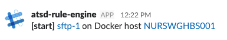

# Link Placeholders

## Overview

Link fields contain URLs to ATSD pages based on the current [window](window.md) context and the `server.url` property.

The link fields can be included in email and web notification messages using placeholders:

```css
[${tags.status}] ${entityLink} on Docker host ${getEntityLink(tags.docker-host)}
```



The URLs are automatically [inlined](#inline-links) in email notifications and in web notifications that support inline links.

## Reference

* [`serverLink`](#serverlink)
* [`ruleLink`](#rulelink)
* [`chartLink`](#chartlink)
* [`csvExportLink`](#csvexportlink)
* [`htmlExportLink`](#htmlexportlink)
* [`entityLink`](#entitylink)

### `serverLink`

```css
${serverLink}
```

Link to the ATSD server specified in `server.url` property on the **Settings > Server Properties > Other** page.

Example:

```elm
https://atsd_hostname:8443/
```

The `serverLink` field can be used to assemble custom links to various pages in the ATSD web interface:

```css
${serverLink}/metrics/metric.xhtml?metricName=${metric}
```

The field is **not** replaced in inline mode.

### `ruleLink`

```css
${ruleLink}
```

Link to the current rule.

Displayed as rule name in inline mode.

Example:

```elm
https://atsd_hostname:8443/rule/edit.xhtml?name=docker-container-lifecycle-restart
```

### `chartLink`

```css
${chartLink}
```

Link to the default portal for the current metric, entity, and tags.

Displayed as 'Default' link in inline mode.

> Available only in rules with `Series` data type.

Example:

```elm
https://atsd_hostname:8443/portals/series?metric=docker&entity=nurswgvml007&add%20params%3D%7B%22markers%22%3A%22false%22%2C%22timespan%22%3A%221%20HOUR%22%7D
```

### `csvExportLink`

```css
${csvExportLink}
```

Link to the **CSV** file with historical statistics for the current metric, entity, and tags.

Displayed as 'CSV Export' link in inline mode.

> Available only in rules with `Series` data type.

Example:

```elm
https://atsd_hostname:8443/export?settings=%7B%22m%22%3A%22docker%22%2C%22e%22%3A%22nurswgvml007%22%2C%22si%22%3A%221-DAY%22%2C%22t%22%3A%22HISTORY%22%2C%22v%22%3Afalse%7D
```

### `htmlExportLink`

```css
${htmlExportLink}
```

Link to the **Data > Export** page for the current metric, entity, and tags.

Displayed as an 'HTML Export' link in inline mode.

> Available only in rules with `Series` data type.

Example:

```elm
https://atsd_hostname:8443/export?settings=%7B%22m%22%3A%22docker%22%2C%22e%22%3A%22nurswgvml007%22%2C%22si%22%3A%221-HOUR%22%2C%22t%22%3A%22HISTORY%22%7D
```

### `entityLink`

```css
${entityLink}
```

Link to current entity that is initialized in the rule window. 

Displayed as an entity label in inline mode.

Example:

```elm
https://atsd_hostname:8443/entities/nurswgvml007
```

To retrieve the link for another entity, use the [`getEntityLink`](functions-link.md#getentitylink) function.

```css
${getEntityLink(tags.docker-host)}
```

---

## Inline Links

The inline link mode improves readability by replacing URLs with user-friendly link labels. URLs are converted to inline links in one of the following formats:

### `html`

* Base URL

```elm
  https://atsd_hostname:8443/rule/edit.xhtml?name=nmon_cpu
```

* Inline Link

```elm
  <a href="https://atsd_hostname:8443/rule/edit.xhtml?name=nmon_cpu">nmon_cpu</a>
```

* Link Label: `nmon_cpu`
* Enabled in Email message text, HipChat with **Message Format** be set to *html*.

### `markdown`

* Base URL

```elm
  https://atsd_hostname:8443/rule/edit.xhtml?name=nmon_cpu
```

* Inline Link

```elm
  [nmon_cpu](https://atsd_hostname:8443/rule/edit.xhtml?name=nmon_cpu)
```

* Link Label: `nmon_cpu`
* Enabled in Telegram

### `pipe`

* Base URL

```elm
  https://atsd_hostname:8443/rule/edit.xhtml?name=nmon_cpu
```

* Inline Link

```elm
  <https://atsd_hostname:8443/rule/edit.xhtml?name=nmon_cpu|nmon_cpu>
```

* Link Label: `nmon_cpu`
* Enabled in Slack with **Parse Mode** set to *Default* or `false`.
