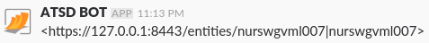

# Link Placeholders

## Overview

Link placeholders contain URLs to various pages based on the current [window](window.md) field values and the `server.url` property configured on the **Settings > Server Properties > Other** page.

## Reference

* [ruleLink](#rulelink)
* [chartLink](#chartlink)
* [csvExportLink](#csvexportlink)
* [htmlExportLink](#htmlexportlink)
* [serverLink](#serverlink)
* [entityLink](#entitylink)

### `ruleLink`

```bash
${ruleLink}
```
Link to the current rule. 

Example: 
   
```elm
https://atsd_host:8443/rule/edit.xhtml?name=docker-container-lifecycle-restart
```

### `chartLink`

```bash
${chartLink}
```
Link to the default portal for the current metric, entity, and tags. 

> Available only in rules with `Series` data type.

Example:

```elm
https://atsd_host:8443/portals/series?metric=docker&entity=nurswgvml007&add%20params%3D%7B%22markers%22%3A%22false%22%2C%22timespan%22%3A%221%20HOUR%22%7D
```

### `csvExportLink`

```bash
${csvExportLink}
```

Link to the **CSV** file with historical statistics for the current metric, entity, and tags. 

> Available only in rules with `Series` data type.

Example:

```elm
https://atsd_host:8443/export?settings=%7B%22m%22%3A%22docker%22%2C%22e%22%3A%22nurswgvml007%22%2C%22si%22%3A%221-DAY%22%2C%22t%22%3A%22HISTORY%22%2C%22v%22%3Afalse%7D
```

### `htmlExportLink`

```bash
${htmlExportLink}
```

Link to the **Data > Export** page for the current metric, entity, and tags. 

> Available only in rules with `Series` data type.

Example:

```elm
https://atsd_host:8443/export?settings=%7B%22m%22%3A%22docker%22%2C%22e%22%3A%22nurswgvml007%22%2C%22si%22%3A%221-HOUR%22%2C%22t%22%3A%22HISTORY%22%7D
```

### `serverLink`

```bash
${serverLink}
```

Link to the ATSD server specified in `server.url` property on the **Settings > Server Properties > Other** page.

Example:

```elm
https://atsd_host:8443/
```

### `entityLink`

```bash
${entityLink}
```

Link to current entity that is initialized in the rule window.

Example:

```elm
https://atsd_host:8443/entities/nurswgvml007
```

## Inline Links

To display the above links in inline mode (where label is displayed instead of URL), make sure the following settings are specified in the Web Notification editor:

* Slack
 
   **Parse Mode** must be set to *Default* or `false`.
   
   Inline entity link:
   
   
   
   Raw entity link:
      
   
   
* HipChat Data Center
 
   **Message Format** must be set to *html*.
   
|Placeholder|Raw Link|Inline Link|
|---|---|---|
|ruleLink|`<a href="https://atsd_host:8443/rule/edit.xhtml?name=nmon_cpu"> nmon_cpu </a>`|nmon_cpu|
|chartLink|`<a href="https://atsd_host:8443/portals/series?metric=docker&entity=nurswgvml007...."> Default </a>`|Default|
|csvExportLink|`<a href="https://atsd_host:8443/export?settings=%7B%22m%22%3A%22docker%22%2C%22e%22%3A%22nurswgvml007...."> CSV Export </a>`|CSV Export|
|htmlExportLink|`<a href="https://atsd_host:8443/export?settings=%7B%22m%22%3A%22docker%22%2C%22e%22%3A%22nurswgvml007...."> HTML Export </a>`|HTML Export|
|entityLink|`<a href="https://atsd_host:8443/entities/nurswgvml007"> nurswgvml007 </a>`|nurswgvml007|
