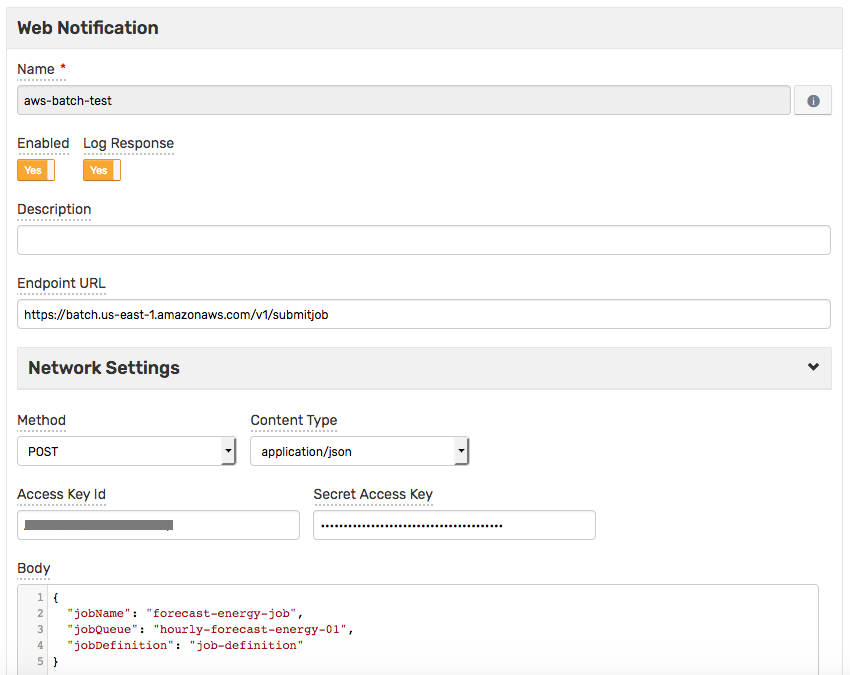
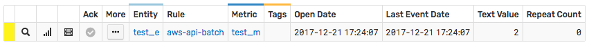
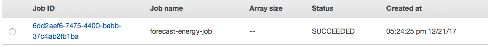

# Integration with AWS Batch

## Overview

The following example demonstrates how to start an [AWS Batch](https://aws.amazon.com/batch) job using a [`AWS API`](aws-api.md) web notification.

The request is automatically signed with **AWS Signature, v4**, implemented by this notification type, which allows submitting requests to **any** AWS endpoint that accepts **AWS Signature, v4**.

The example described below invokes the [AWS Batch API](http://docs.aws.amazon.com/batch/latest/APIReference/API_SubmitJob.html) `SubmitJob` action.

## Configuration

Create a new `AWS API` web notification or import the [template](resources/aws-api-batch-notification.xml) used in this example. To import the XML template file, open the **Alerts > Web Notifications** page, select **Import** in the multi-action button located below the table and follow the prompts.

To create a new notification, open the **Alerts > Web Notifications** page and click **Create**.

### Parameters

Enter a name and specify the following parameters:

| **Name** | **Value** |
| :--- | :--- |
| Endpoint URL | `https://batch.<AWS_REGION>.amazonaws.com/v1/submitjob` |
| Method | `POST` |
| Content Type | `application/json` |
| Access Key Id | `<AWS_ACCESS_KEY_ID>` |
| Secret Access Key | `<AWS_SECRET_ACCESS_KEY>` |
| Body | `<JSON_CONTENT>` |

Modify the `Endpoint URL` by replacing the `<AWS_REGION>` value with the target [region](http://docs.aws.amazon.com/general/latest/gr/rande.html#batch_region), for example:

```elm
https://batch.us-east-1.amazonaws.com/v1/submitjob
```

Enter the AWS key id into the `Access Key Id` field and the secret key into the `Secret Access Key` field.

Modify the `Body` by replacing the `<JSON_CONTENT>` value with actual values, for example:

```json
{
  "jobName": "forecast-energy-job",
  "jobQueue": "hourly-forecast-energy-01",
  "jobDefinition": "job-definition"
}
```



## Rule

Create a new rule or import the [rule template](resources/aws-api-batch-rule.xml) used in this example. To import the XML template file, open the **Alerts > Rules** page, select **Import** in the multi-action button located below the table and follow the prompts.

To create a new rule, open the **Alerts > Rules** page and click **Create**.

Specify the key settings on the **Overview** tab. 

| **Name** | **Value** |
| :-------- | :---- |
| Status | Enabled |
| Metric | test_m |
| Condition | `value > 1` |


Open the **Web Notifications** tab.

Set **Enabled** to **Yes** and choose the previously created web notification from the **Endpoint** drop-down.

Enable **Open** trigger.


## Test

In order to test the integration, submit sample data for the `test_m` metric into ATSD. For example, open the **Data > Data Entry** page and submit the following command:

```ls
  series e:test_e m:test_m=2
```


The value will cause the condition to evaluate to `true`, which in turn will trigger the notification.
To verify that an alert was raised, open **Alerts > Open Alerts** page and check that an alert for the `test_m` metric is present in the **Alerts** table.



Check the AWS Batch job status:


