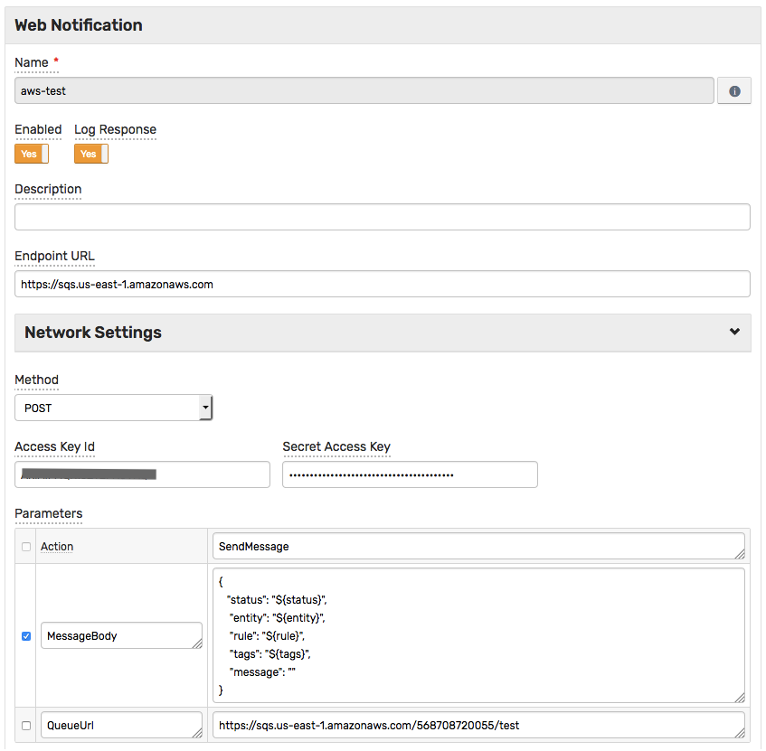
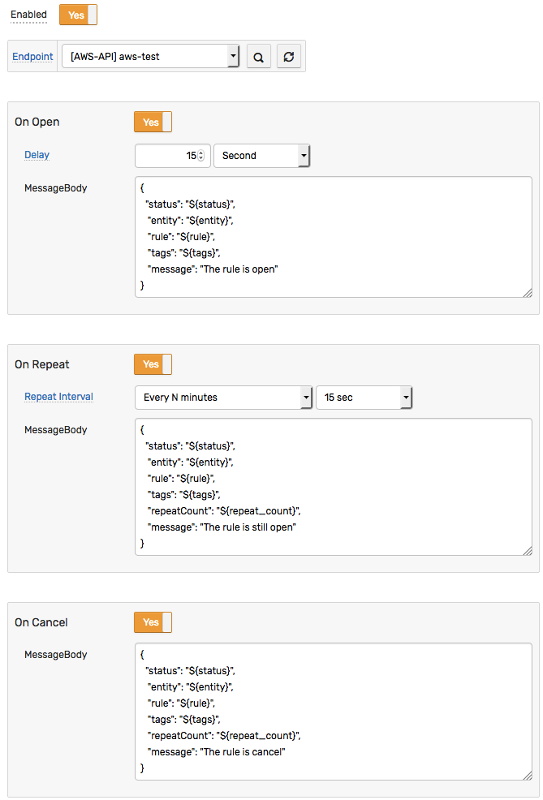
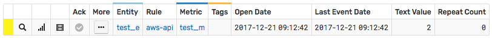
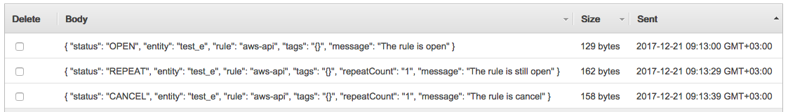

# Integration with Amazon SQS

## Overview

The following example demonstrates how to send a message to an [Amazon SQS](https://aws.amazon.com/documentation/sqs) queue using a [`AWS API`](aws-api.md) web notification.

The request is automatically signed with **AWS Signature, v4**, implemented by this notification type, which allows submitting requests to **any** AWS endpoint that accepts **AWS Signature, v4**.

The example invokes the [Amazon SQS API](http://docs.aws.amazon.com/AWSSimpleQueueService/latest/APIReference/API_SendMessage.html) `SendMessage` action.

## Configuration

Create a new `AWS API` web notification or import the [template](resources/aws-api-sqs-notification.xml) used in this example. To import the XML template file, open the **Alerts > Web Notifications** page, select **Import** in the multi-action button located below the table and follow the prompts.

To create a new notification, open the **Alerts > Web Notifications** page and click **Create**.

### Parameters

Enter a name and specify the following parameters:

| **Name** | **Value** |
| :--- | :--- |
| Endpoint URL | `https://sqs.<AWS_REGION>.amazonaws.com` |
| Method | `POST` |
| Content Type | `application/x-www-form-urlencoded` |
| Access Key Id | `<AWS_ACCESS_KEY_ID>` |
| Secret Access Key | `<AWS_SECRET_ACCESS_KEY>` |
| Action | `SendMessage`|

Modify the `Endpoint URL` by replacing the `<AWS_REGION>` value with your [Amazon SQS region](http://docs.aws.amazon.com/general/latest/gr/rande.html#sqs_region), for example:

```elm
https://sqs.us-east-1.amazonaws.com
```

Enter the AWS key id into the `Access Key Id` field and the secret key into the `Secret Access Key` field.

Add required parameters for `SendMessage` action:

| **Name** | **Value** |
| :--- | :--- |
| `MessageBody` | `<MESSAGE_TEXT>` |
| `QueueUrl` | `<AWS_SQS_QUEUE_URL>` |

Modify the `MessageBody` by replacing the `<MESSAGE_TEXT>` value with your text, for example:

```json
{
  "status": "${status}",
   "entity": "${entity}",
   "rule": "${rule}",
   "tags": "${tags}",
   "message": ""
}
```

The `MessageBody` text contains placeholders that will be substituted with actual values when the notification is triggered. The placeholders specified in the payload and the URL are visible as editable parameters in the rule editor.

Modify the `QueueUrl` by replacing the `<AWS_SQS_QUEUE_URL>` value with your url, for example:

```elm
https://sqs.us-east-1.amazonaws.com/568708720055/test
```



## Rule

Create a new rule or import the [rule template](resources/aws-api-sqs-rule.xml) used in this example. To import the XML template file, open the **Alerts > Rules** page, select **Import** in the multi-action button located below the table and follow the prompts.

To create a new rule, open the **Alerts > Rules** page and click **Create**.

Specify the key settings on the **Overview** tab.

| **Name** | **Value** |
| :-------- | :---- |
| Status | Enabled |
| Metric | test_m |
| Condition | `value > 1` |


Open the **Web Notifications** tab.

Set **Enabled** to **Yes** and choose the previously created web notification from the **Endpoint** drop-down.

Enable **Open**, **Repeat** and **Cancel** triggers.

Specify the message text into the `MessageBody` parameter for all triggers.



## Test

In order to test the integration, submit sample data for the `test_m` metric into ATSD. For example, open the **Data > Data Entry** page and submit the following command:

```ls
  series e:test_e m:test_m=2
```


The value will cause the condition to evaluate to `true`, which in turn will trigger the notification.
To verify that an alert was raised, open **Alerts > Open Alerts** page and check that an alert for the `test_m` metric is present in the **Alerts** table.



Check the Amazon SQS queue to make sure the new messages were received:


