## SNS JSON Message Format Example

Create a `AWS SNS` notification with `Message Format = SNS JSON`, for example:

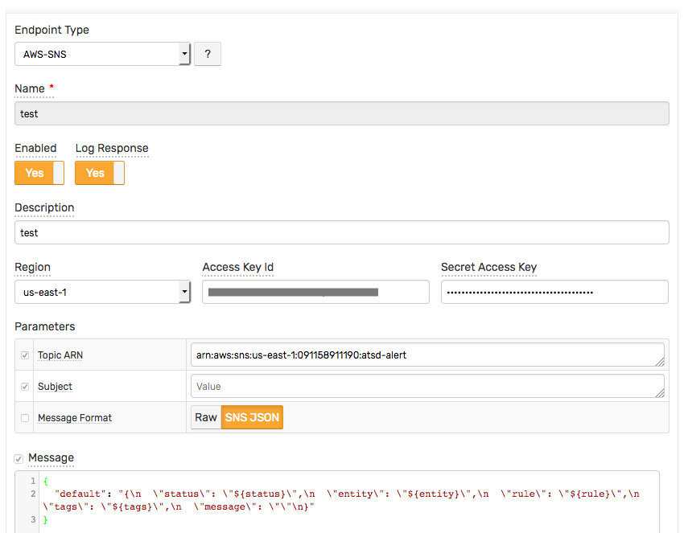

Create a new rule and open the **Web Notifications** tab.
* Select `[AWS-SNS] test` from the **Endpoint** drop-down.
* Enable the `OPEN`, `REPEAT`, and `CANCEL` triggers.
* Customize the alert messages using [placeholders](../placeholders.md) as necessary, for example:

  - OPEN:

```json
     {
        "default": "{\n  \"status\": \"${status}\",\n  \"entity\": \"${entity}\",\n  \"rule\": \"${rule}\",\n  \"tags\": \"${tags}\",\n  \"message\": \"The rule is open (default)\"\n}",
        "http": "{\n  \"status\": \"${status}\",\n  \"entity\": \"${entity}\",\n  \"rule\": \"${rule}\",\n  \"tags\": \"${tags}\",\n  \"message\": \"The rule is open (http)\"\n}"
     }
```

  - REPEAT:

```json
     {
        "default": "{\n  \"status\": \"${status}\",\n  \"entity\": \"${entity}\",\n  \"rule\": \"${rule}\",\n  \"tags\": \"${tags}\",\n  \"repeatCount\": \"${repeat_count}\",\n  \"message\": \"The rule is still open (default)\"\n}",
        "http": "{\n  \"status\": \"${status}\",\n  \"entity\": \"${entity}\",\n  \"rule\": \"${rule}\",\n  \"tags\": \"${tags}\",\n  \"repeatCount\": \"${repeat_count}\",\n  \"message\": \"The rule is still open (http)\"\n}"
     }
```

  - CANCEL:

```json
     {
        "default": "{\n  \"status\": \"${status}\",\n  \"entity\": \"${entity}\",\n  \"rule\": \"${rule}\",\n  \"tags\": \"${tags}\",\n  \"repeatCount\": \"${repeat_count}\",\n  \"message\": \"The rule is cancel (default)\"\n}",
        "http": "{\n  \"status\": \"${status}\",\n  \"entity\": \"${entity}\",\n  \"rule\": \"${rule}\",\n  \"tags\": \"${tags}\",\n  \"repeatCount\": \"${repeat_count}\",\n  \"message\": \"The rule is cancel (http)\"\n}"
     }
```

  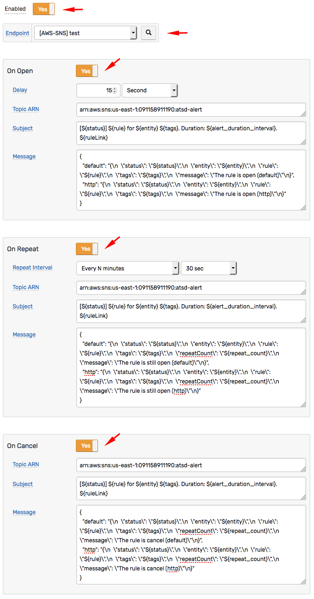

* Save the rule by clicking on the **Save** button.

* The rule will create new windows based on incoming data.
It may take a few seconds for the first commands to arrive and to trigger the notifications. You can open and refresh the **Alerts > Open Alerts** page to verify that an alert is open for your rule.

## Test

The AWS SNS Subscriptions:


## Notifications examples:

### Email protocol:

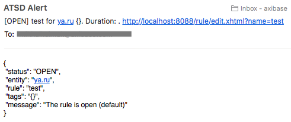

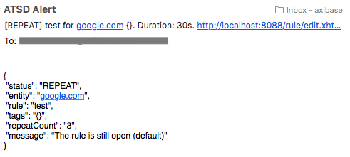

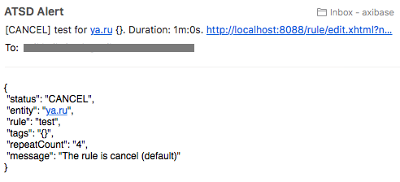

### Http protocol:

The `HTTP` subscription with parameter `raw message delivery = false`:

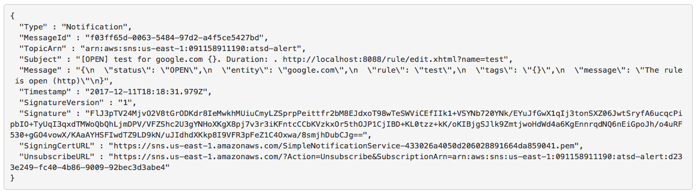

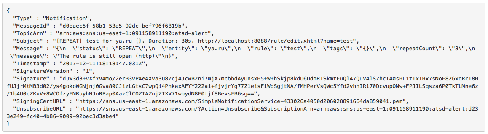

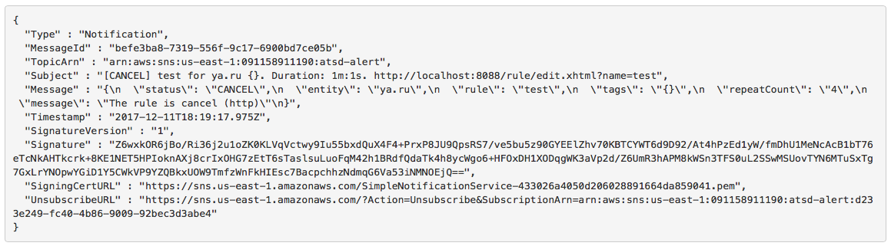

### Http protocol:

The `HTTP` subscription with parameter `raw message delivery = true`:

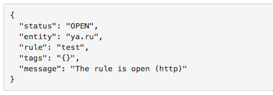

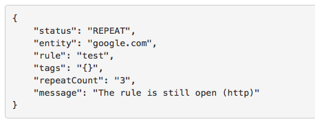

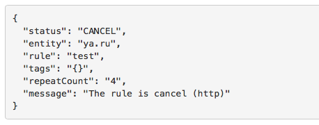
