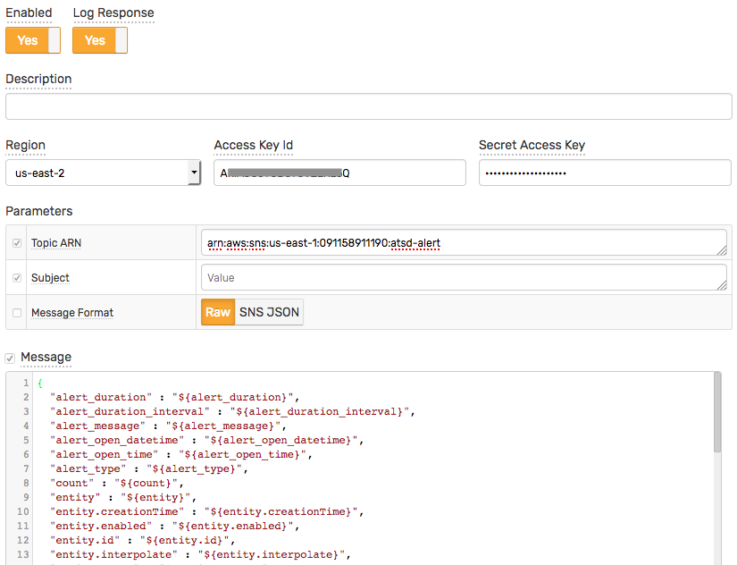
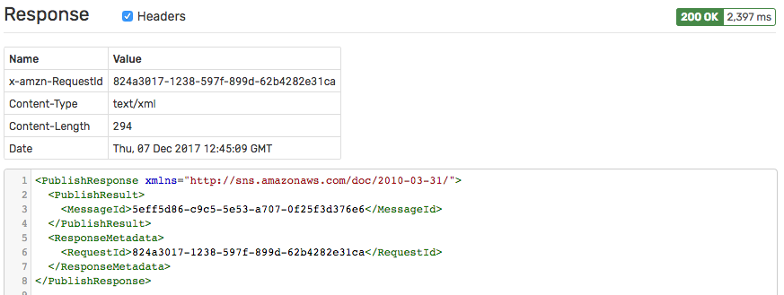

# Amazon SNS Notification

## Overview

The `AWS SNS` [notification](../web-notifications.md) provides a way to publish signed messages to an [Amazon SNS](http://docs.aws.amazon.com/sns/latest/api/API_Publish.html) topic on window status events.

## Notification Settings

|**Setting**|**Description**|
|---|---|
|Region|The [Amazon SNS Region](http://docs.aws.amazon.com/general/latest/gr/rande.html#sns_region).|
|Access Key Id|[Access Key Id](http://docs.aws.amazon.com/general/latest/gr/aws-sec-cred-types.html#access-keys-and-secret-access-keys)|
|Secret Access Key|[Secret Access Key](http://docs.aws.amazon.com/general/latest/gr/aws-sec-cred-types.html#access-keys-and-secret-access-keys)|
|Topic ARN|The topic you want to publish messages to.|
|Subject|The default subject of the message to be sent.|
|Message Format|The default format of the message to be sent.|
|Message|The default text of the message to be sent.|

## Message

Each window status event can produce only one AWS SNS message.

The message is submitted to the specified AWS SNS endpoint using the `POST` method with `application/x-www-form-urlencoded` content type. The request includes additional AWS headers (Authorization, X-Amz-Date) and is signed with [AWS Signature Version 4](http://docs.aws.amazon.com/general/latest/gr/signature-version-4.html).

The default message uses the JSON format and includes all fields, including entity and metric metadata.

#### Message Formats

|**Setting**|**Description**|
|---|---|
|`RAW`|Send message as plain text.|
|`SNS_JSON`|Send [a custom message for each protocol](http://docs.aws.amazon.com/sns/latest/api/API_Publish.html) ([example](http://docs.aws.amazon.com/sns/latest/dg/mobile-push-send-custommessage.html)).|

## Response

The response status code and response content is recorded in `atsd.log` if the `Log Response` setting is enabled.

## Configure AWS SNS Notification

* Open **Alerts > Web Notifications** page.
* Click the **Create** button and select the `AWS-SNS` type.
* Fill out the `Name`, `Region`, `Access Key Id`, and `Secret Access Key` fields.
* Enter the `Topic ARN`. The topic address is marked as an editable field so it can be later customized in the rule editor. This allows publishing messages to different topics using the same web notification. 

  

* Click **Test**.

   

   

* If tests are passing OK, check **Enable**, click **Save**.

In order to test the actual payload, create a sample rule, and enable the `AWS-SNS` notification on the `Web Notifications` tab.

## Examples

* [RAW Message Format](aws-sns-raw.md)
* [SNS JSON Message Format](aws-sns-json.md)
