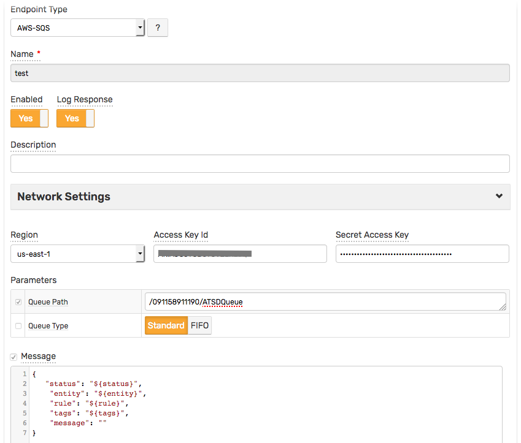
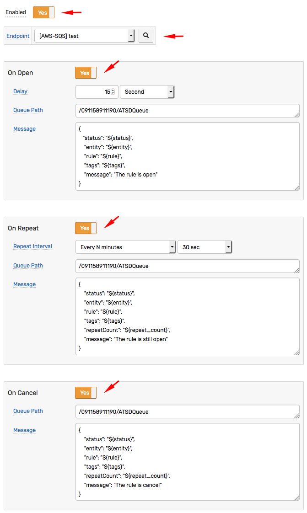
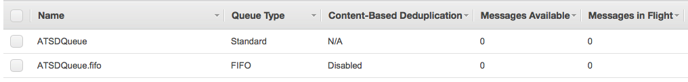
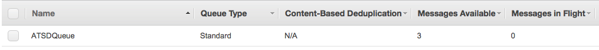
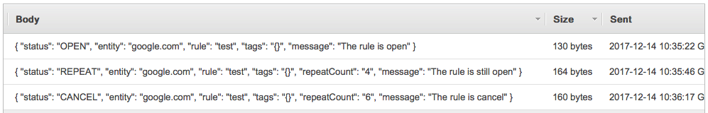

## Standard Queue Type Example

Create a `AWS SQS` notification with `Queue Type = Standard`, for example:



Create a new rule and open the **Web Notifications** tab.
* Select `[AWS-SQS] test` from the **Endpoint** drop-down.
* Enable the `OPEN`, `REPEAT`, and `CANCEL` triggers.
* Customize the alert messages using [placeholders](../placeholders.md) as necessary, for example:

   - OPEN:

       ```json
       {
          "status": "${status}",
           "entity": "${entity}",
           "rule": "${rule}",
           "tags": "${tags}",
           "message": "The rule is open"
       }
       ```

   - REPEAT:

       ```json
       {
           "status": "${status}",
           "entity": "${entity}",
           "rule": "${rule}",
           "tags": "${tags}",
           "repeatCount": "${repeat_count}",
           "message": "The rule is still open"
       }
       ```

   - CANCEL:

       ```json
       {
           "status": "${status}",
           "entity": "${entity}",
           "rule": "${rule}",
           "tags": "${tags}",
           "repeatCount": "${repeat_count}",
           "message": "The rule is cancel"
       }
       ```

  

* Save the rule by clicking on the **Save** button.

* The rule will create new windows based on incoming data.
It may take a few seconds for the first commands to arrive and to trigger the notifications. You can open and refresh the **Alerts > Open Alerts** page to verify that an alert is open for your rule.

## Test

The AWS SQS Queues:



## Notifications examples:

### Queue:



### Messages:


