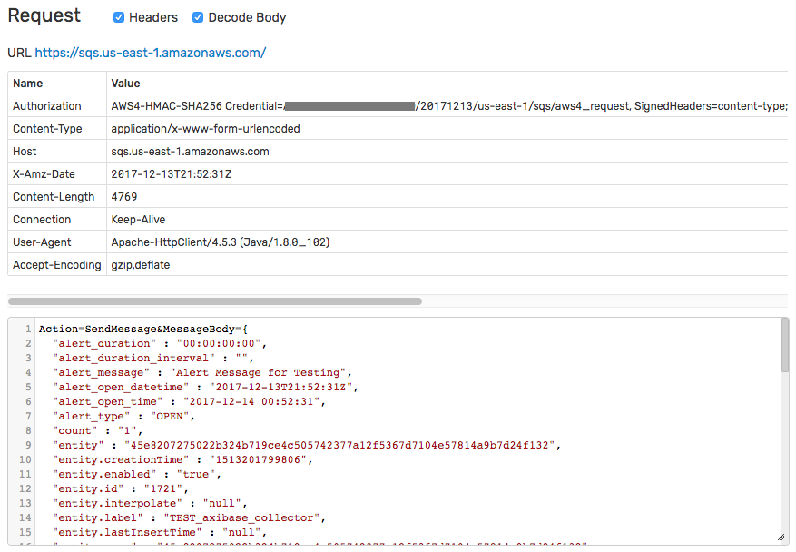
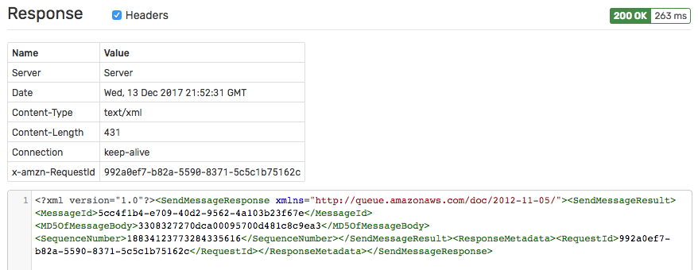

# Amazon SQS Notification

## Overview

`AWS SQS` [notifications](../web-notifications.md) send messages to an [Amazon SQS](https://docs.aws.amazon.com/AWSSimpleQueueService/latest/APIReference/API_SendMessage.html) queue upon window status events.

## Notification Settings

|**Setting**|**Description**|
|---|---|
|Region|The [Amazon SQS Region](https://docs.aws.amazon.com/general/latest/gr/rande.html#sqs_region).|
|Access Key Id|[Access Key Id](https://docs.aws.amazon.com/general/latest/gr/aws-sec-cred-types.html#access-keys-and-secret-access-keys)|
|Secret Access Key|[Secret Access Key](https://docs.aws.amazon.com/general/latest/gr/aws-sec-cred-types.html#access-keys-and-secret-access-keys)|
|Queue Path|The path of the receiving queue.|
|Queue Type|The type of the receiving queue.|
|Message Group Id|Optional tag that associates the messages with a specific message group.|
|Message|Default message text.|

### Queue Types

|**Setting**|**Description**|
|---|---|
|`Standard`|The **Standard** queue offers maximum throughput, best-effort ordering, and `at-least-once` delivery.|
|`FIFO`|The **FIFO** (first-in-first-out) queue guarantees that messages are processed `exactly once`, in the order that they are received, with reduced throughput.|

## Message

Each window status event can produce only one AWS SQS message.

The message is submitted to the specified AWS SQS endpoint using the `POST` method with `application/x-www-form-urlencoded` content type. The request includes additional AWS headers (`Authorization`, `X-Amz-Date`) and is signed with [AWS Signature Version 4](https://docs.aws.amazon.com/general/latest/gr/signature-version-4.html).

The default message template uses the JSON format and includes all fields, including entity and metric metadata.

## Response

The response status code and response content is recorded in `atsd.log` if the `Log Response` setting is enabled.

## Configure AWS SQS Notification

* Open **Alerts > Web Notifications** page.
* Click the **Create** button and select the `AWS-SQS` type.
* Fill out the `Name`, `Region`, `Access Key Id`, and `Secret Access Key` fields.
* Enter the `Queue Path`.

  

* Click **Test**.

   

   

* If tests are passing OK, check **Enable**, click **Save**.

In order to test the actual payload, create a sample rule, and enable the `AWS-SQS` notification on the `Web Notifications` tab.

## Examples

* [Standard Queue Type](aws-sqs-standard.md)
* [FIFO Queue Type](aws-sqs-fifo.md)
