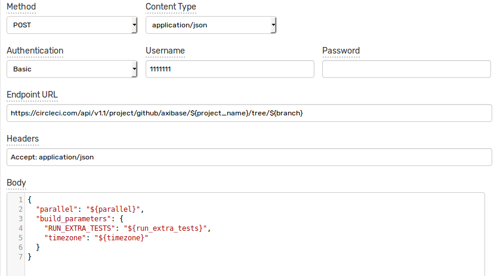
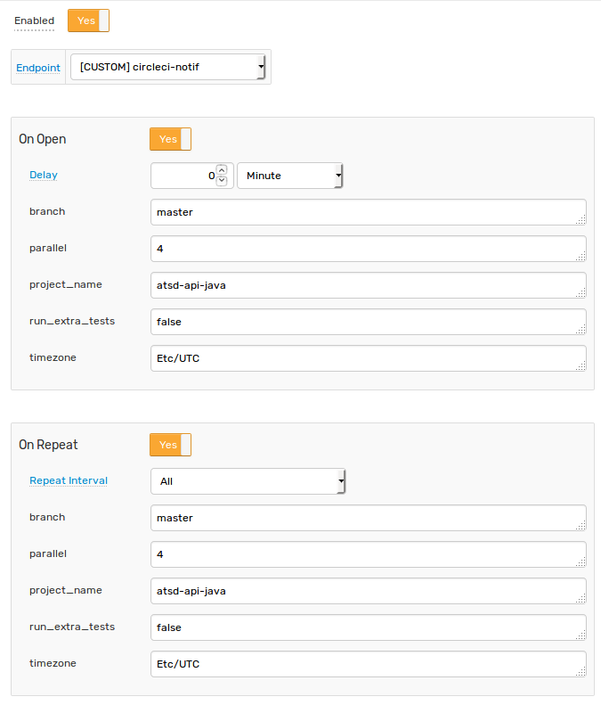
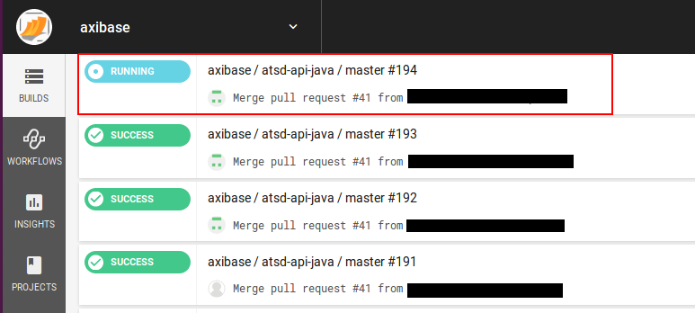

# CircleCI Integration

## Overview

The following example demonstrates how to trigger a [CircleCI](https://circleci.com) build for a github project using a [`CUSTOM`](../custom.md) web notification in the ATSD rule engine.

To integration relies on the [Circle CI API](https://circleci.com/docs/api/v1-reference/#new-build-branch) `new-build-branch` method for triggering a new build of the specified branch.

## Configuration

Create a new `CUSTOM` web notification from scratch or import the [template](resources/custom-circleci-notification.xml) used in this example. To import the XML template file, open the **Alerts > Web Notifications** page, select **Import** in the multi-action button located below the table and follow the prompts.

To create a new notification, open the **Alerts > Web Notifications** page and click **Create**.

### Parameters

Enter a name and specify the following parameters:

| **Name** | **Value** |
| :--- | :--- |
| Method | `POST`  |
| Content Type | `application/json` |
| Endpoint URL | `https://circleci.com/api/v1.1/project/github/<GITHUB_USER>/${project_name}/tree/${branch}?circle-token=<CIRCLE_USER_TOKEN>` |
| Headers | `Accept: application/json` |

Modify the `Endpoint URL` by replacing the `<GITHUB_USER>` field with your github user name and the `<CIRCLE_USER_TOKEN>` field with your CircleCI user token.

The `Endpoint URL` should look as follows: `https://circleci.com/api/v1.1/project/github/axibase/${project_name}/tree/${branch}?circle-token=1111111111`

The `${project_name}` and `${branch}` should remain in the URL as placeholders which you will be able to specify in the rule editor. This would allow re-using the same notification to trigger builds for different projects and branches.

### Payload

The web notification can be configured to send a JSON document to the Circle CI endpoint in order to control extended build parameters and the `Body` field can include the following text:

```
{
  "parallel": ${parallel},
  "build_parameters": { 
    "RUN_EXTRA_TESTS": ${run_extra_tests},
    "timezone": "${timezone}"
  }
}
```

Make sure that you enclose fields with double quotes, if necessary.

You can leave the `Body` field empty if you don't need to pass custom build parameters.



## Rule

Create a new rule or import the [rule template](resources/custom-circleci-rule.xml) used in this example. To import the XML template file, open the **Alerts > Rules** page, select **Import** in the multi-action button located below the table and follow the prompts.

To create a new rule, open the **Alerts > Rules** page and click **Create**.

Specify the key settings on the **Overview** tab. 

| **Name** | **Value** |
| :-------- | :---- |
| Status | Enabled |
| Metric | test_m |
| Condition | `value > 1` |


Open the **Web Notifications** tab.

Set **Enabled** to **Yes** and choose the previously created web notification from the **Endpoint** drop-down.

Enable **Open** and **Repeat** triggers. Set the **Repeat Interval** to **All**.

Specify the same settings for **Open** and **Repeat** triggers:

| **Name** | **Value** |
| :-------- | :---- |
| branch | master |
| parallel | 4 |
| project_name | atsd-api-java |
| run_extra_tests  | false |
| timezone  | Etc/UTC |



Note that these four parameters are visible in the rule editor because their placeholders were specified in the `Endpoint URL` and the JSON payload.

When the notification is executed, all placeholders in the request URL and the payload will be resolved as follows:

`https://circleci.com/api/v1.1/project/github/axibase/atsd-api-java/tree/master?circle-token=1111111111`

```json
{
  "parallel": 4,
  "build_parameters": { 
    "RUN_EXTRA_TESTS": false,
    "timezone": "Etc/UTC"
  }
}
```

If the placeholder is not found or its value is not set, it will be set to an empty string.

## Test

In order to test the integration, submit sample data for the `test_m` metric into ATSD. For example, open the **Data> Data Entry** page and submit the following command:

```
  series e:test_e m:test_m=2
```


The value will cause the condition to evaluate to `true`, which in turn will trigger the notification.
To verify that an alert was raised, open **Alerts > Open Alerts** page and check that an alert for the `test_m` metric is present in the **Alerts** table.


Check the CircleCI user interface to make sure the target build was triggered.


