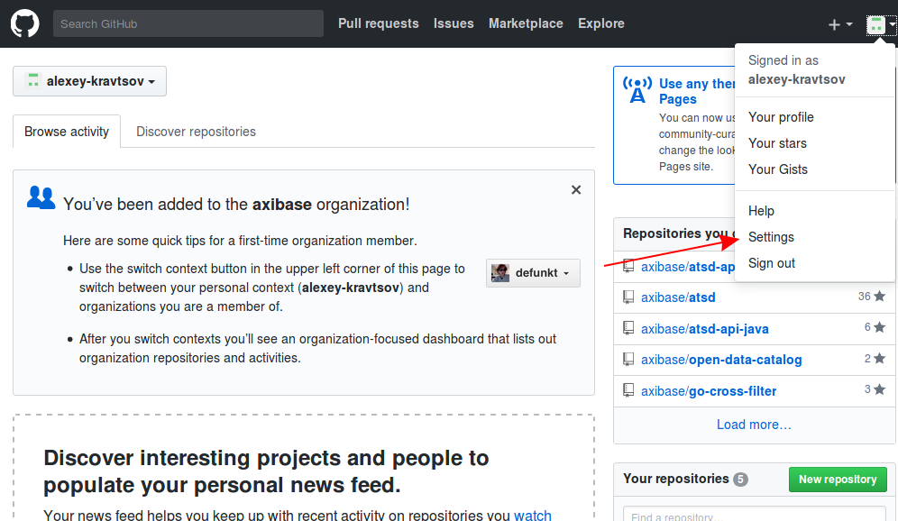
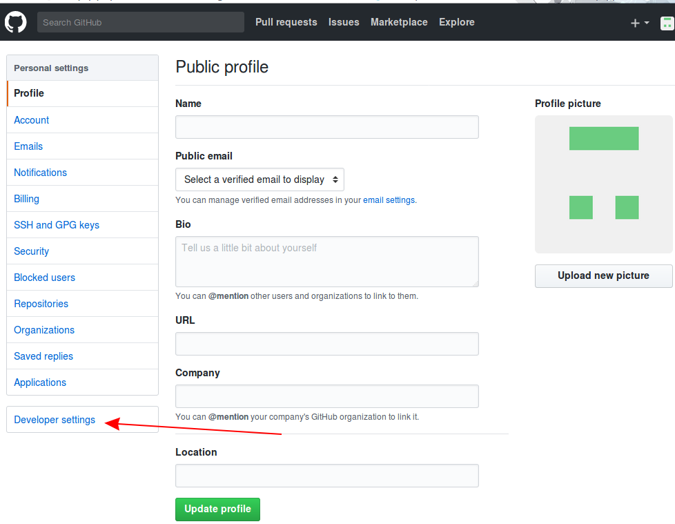
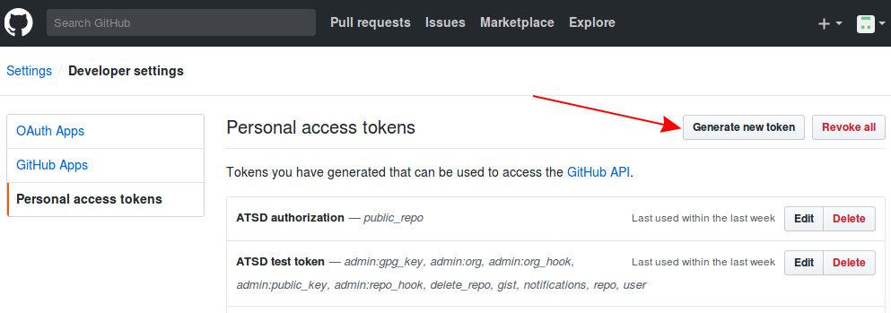
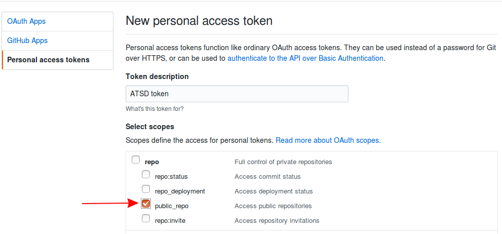
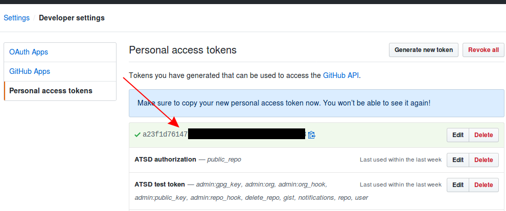
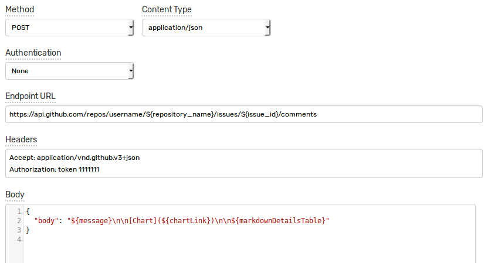
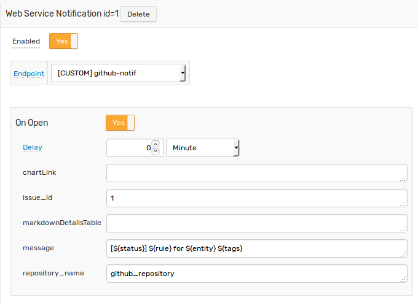
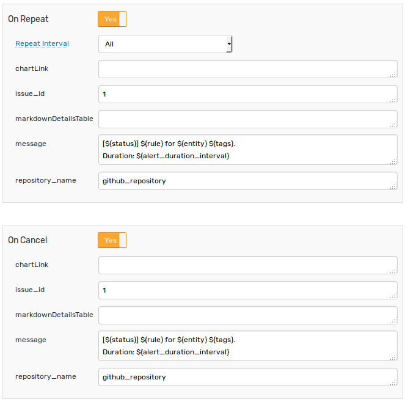
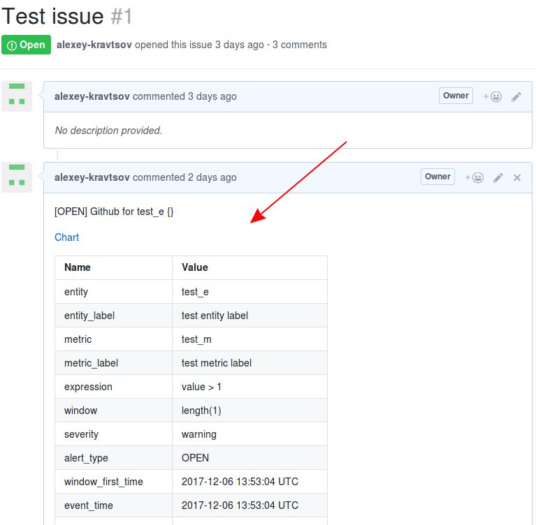

# GitHub Integration

## Overview

The following example demonstrates how to add a comment to an existing issue in [GitHub](https://github.com/) using a [`CUSTOM`](custom.md) web notification in the ATSD rule engine.

The integration relies on the [GitHub API](https://developer.github.com/v3/issues/comments/#create-a-comment) `create-a-comment` method.

## Configuration

Create a new `CUSTOM` web notification or import the [template](resources/custom-github-notification.xml) used in this example. To import the XML template file, open the **Alerts > Web Notifications** page, select **Import** in the multi-action button located below the table and follow the prompts.

To create a new notification, open the **Alerts > Web Notifications** page and click **Create**.

### Parameters

Enter a name and specify the following parameters:

| **Name** | **Value** |
| :--- | :--- |
| Method | `POST` |
| Content Type | `application/json` |
| Authentication | `None` |
| Endpoint URL | `https://api.github.com/repos/<GITHUB_USER>/${repository_name}/issues/${issue_id}/comments` |
| Headers | `Accept: application/vnd.github.v3+json`<br>`Authorization: token 11111111` |

Modify the `Endpoint URL` by replacing the `<GITHUB_USER>` field with your github user name.

The `Endpoint URL` should look as follows: `https://api.github.com/repos/axibase/${repository_name}/issues/${issue_id}/comments`

Keep the `${repository_name}` and `${issue_id}` placeholders in the URL so that may be customized in the rule editor. This  allows you to add comments to different issues re-using the same web notification configuration.

Enter an existing authorization token in `Authorization` header or create a new one.

#### Create Authorization Token with `curl`

Execute the [`Create a new authorization`](https://developer.github.com/v3/oauth_authorizations/#create-a-new-authorization) command. Replace the `<GITHUB_USER>` field with your github user name.

```sh
curl \
    -u <GITHUB_USER> \
    -H "Accept: application/vnd.github.v3+json" \
    -H "Content-Type: application/json" \
    -X POST https://api.github.com/authorizations \
    -d '{"note": "ATSD authorization", "scopes": ["public_repo"]}'
```

You will be asked to enter a user password.

If the operation succeeds, an authorization token will be present in the `token` field in the response:

```json
{
  "id": 141939406,
  "url": "https://api.github.com/authorizations/141939406",
  "app": {
    "name": "ATSD authorization",
    "url": "https://developer.github.com/v3/oauth_authorizations/",
    "client_id": "00000000000000000000"
  },
  "token": "11111111",
  "hashed_token": "...",
  "token_last_eight": "...",
  "note": "ATSD authorization",
  "note_url": null,
  "created_at": "2017-12-05T13:24:36Z",
  "updated_at": "2017-12-05T13:24:36Z",
  "scopes": [
    "public_repo"
  ],
  "fingerprint": null
}
```

#### Generate Authorization Token using UI

Go to user settings.



Open the Developer Settings tab.



Click **Generate new token** button



Enter a description, choose the `public_repo` scope and click **Generate token**.



Your new token will be available on the **Personal access tokens** page. Copy the token value for future reference.



### Payload

Enter the following text into the `Body` field:

```json
{
  "body": "${message}\n\n[Chart](${chartLink})\n\n${markdownDetailsTable}"
}
```

The `body` text contains placeholders that will be substituted with actual values when the notification is triggered. 

The placeholders specified in the payload and the URL are visible as editable parameters in the rule editor.



## Rule

Create a new rule or import the [rule template](resources/custom-github-rule.xml) used in this example. To import the XML template file, open the **Alerts > Rules** page, select **Import** in the multi-action button located below the table and follow the prompts.

To create a new rule, open the **Alerts > Rules** page and click **Create**.

Specify the key settings on the **Overview** tab. 

| **Name** | **Value** |
| :-------- | :---- |
| Status | Enabled |
| Metric | test_m |
| Condition | `value > 1` |


Open the **Web Notifications** tab.

Set **Enabled** to **Yes** and choose the previously created web notification from the **Endpoint** drop-down.

Enable **Open**, **Repeat** and **Cancel** triggers. Set the **Repeat Interval** to **All**. Leave `chartLink` and `markdownDetailsTable` empty.

Specify the following settings for **Open** trigger:

| **Name** | **Value** |
| :-------- | :---- |
| issue_id | `1` |
| message | `[${status}] ${rule} for ${entity} ${tags}` |
| repository_name | `github_repository` |



For **Repeat** and **Cancel** triggers:

| **Name** | **Value** |
| :-------- | :---- |
| issue_id | `1` |
| message | `[${status}] ${rule} for ${entity} ${tags}`<br>`Duration: ${alert_duration_interval}` |
| repository_name | `github_repository` |



Note that these parameters are visible in the rule editor because their placeholders are present in the `Endpoint URL` and the JSON payload.

When the notification is executed, all placeholders in the request URL will be resolved as follows:

`https://api.github.com/repos/username/github_repository/issues/1/comments`

```json
{
  "body": "[OPEN] Github for test_e {}\n\n[Chart](chart link)\n\n| **Name** | **Value**|..."
}
```

## Test

In order to test the integration, submit sample data for the `test_m` metric into ATSD. For example, open the **Data > Data Entry** page and submit the following command:

```ls
  series e:test_e m:test_m=2
```


The value will cause the condition to evaluate to `true`, which in turn will trigger the notification.
To verify that an alert was raised, open **Alerts > Open Alerts** page and check that an alert for the `test_m` metric is present in the **Alerts** table.


Check the issue on Github to make sure the new comment was added.


