# IFTTT Integration

## Overview

The following example demonstrates how to trigger an action in [IFTTT](https://ifttt.com/) using a [`CUSTOM`](custom.md) web notification in the ATSD rule engine.

This type of integration relies on the [IFTTT Webhook](https://ifttt.com/maker_webhooks) trigger.

## Create IFTTT Applet

Log in to [ifttt.com](https://ifttt.com) and go to **My Applets**.


Click **New Applet**.

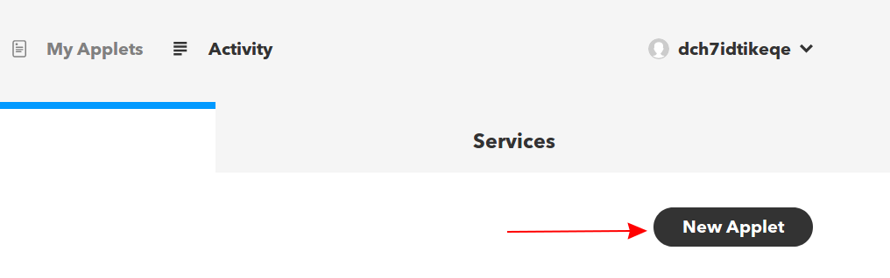

Click **(+) this** to create a trigger.

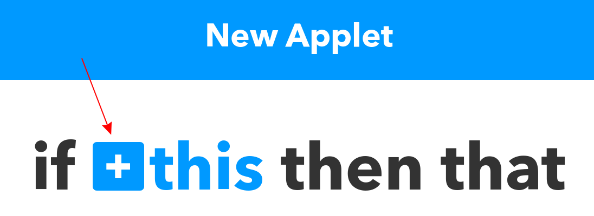

Search for **Webhooks** and select it.

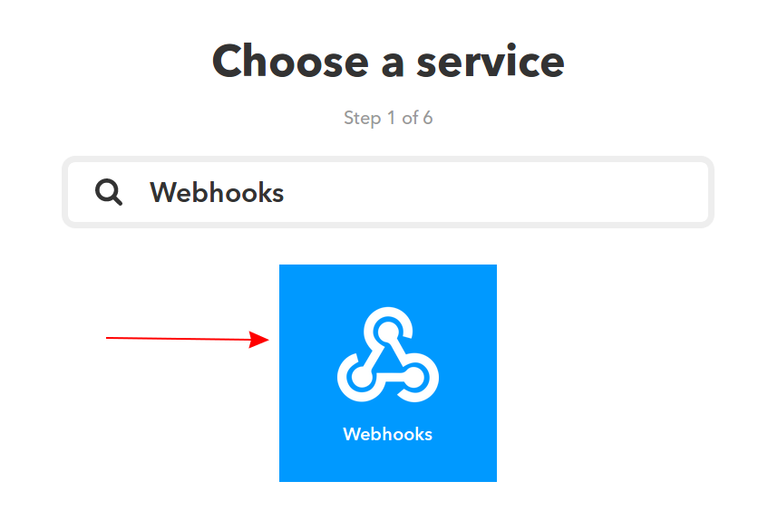

Click **Connect** to set up a webhook trigger.

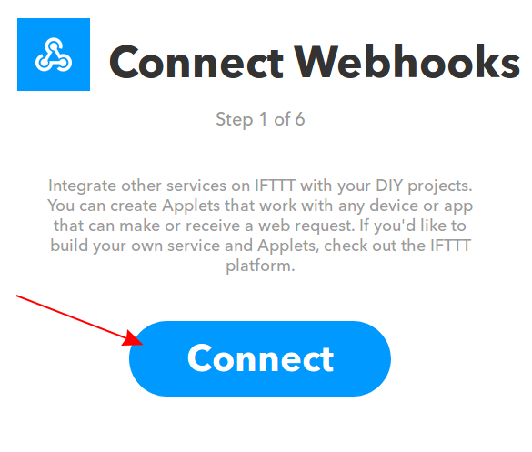

Choose **Receive a web request**.

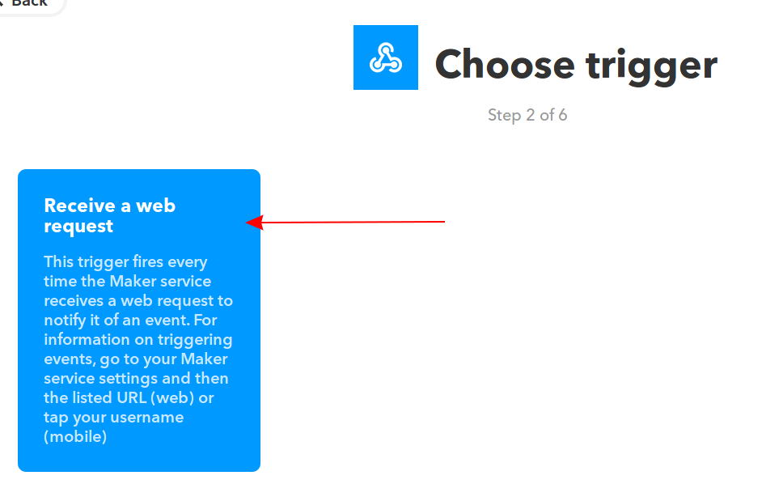

Enter an event name such as **atsd_custom_trigger** and click **Create trigger**.

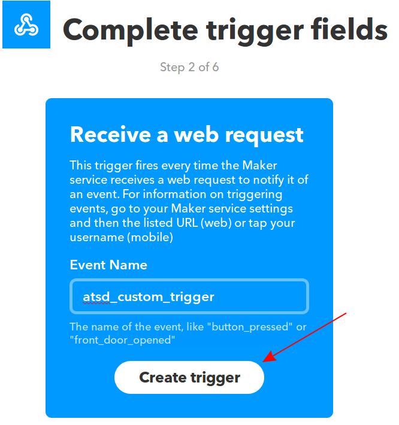

Click **(+) that** to create a event.

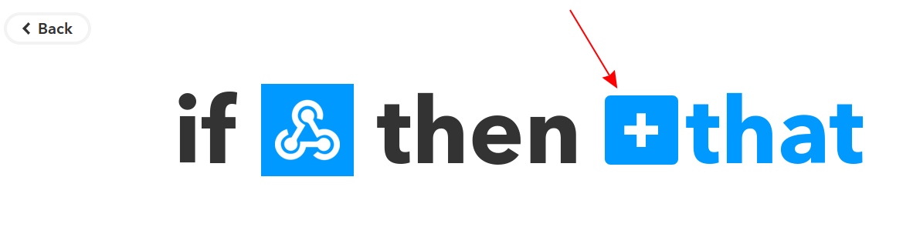

Search for **SMS** and select it.

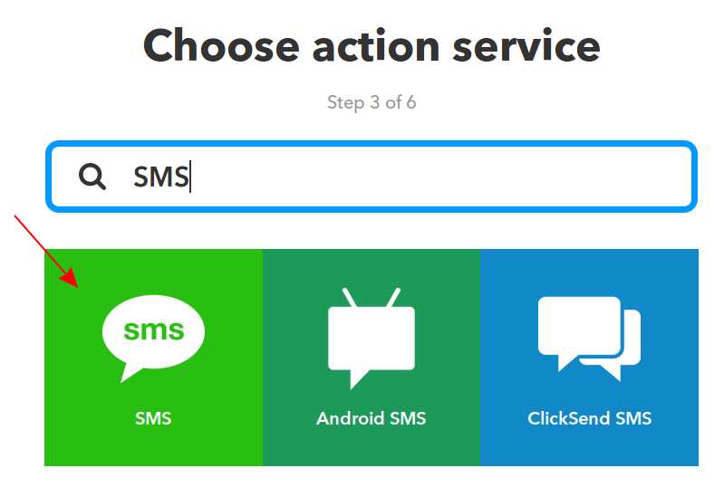

Click **Connect** to setup event.

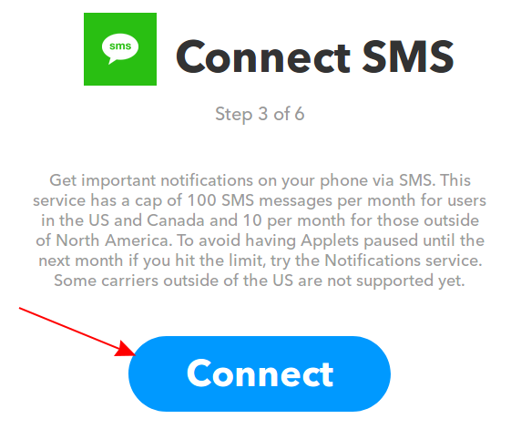

Enter a phone number to receive messages from ATSD and click **Send PIN**. Check your device and enter the PIN you've received. Click **Connect**.

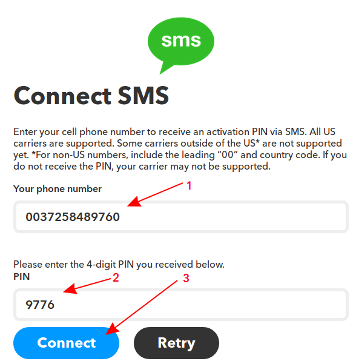

Choose **Send me an SMS**.

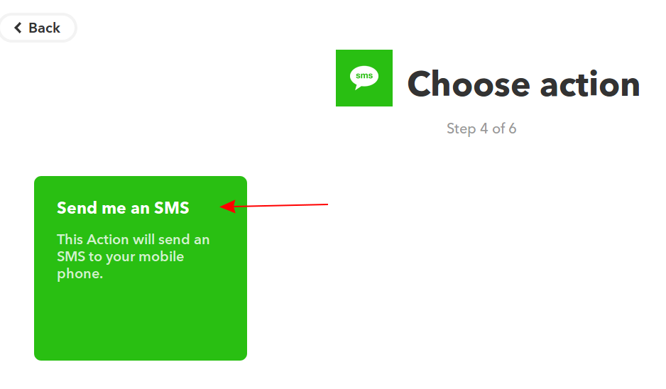

Enter following text into **Message** field and click **Create action**.

```ls
[{{Value1}}] {{Value2}} for {{Value3}}
```

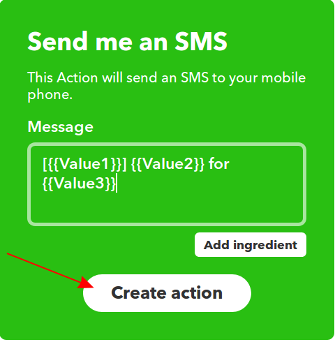

Review changes and click **Finish**.

## Configuration

Create a new `CUSTOM` web notification or import the [template](resources/custom-ifttt-notification.xml) used in this example. To import the XML template file, open the **Alerts > Web Notifications** page, select **Import** in the multi-action button located below the table and follow the prompts.

To create a new notification, open the **Alerts > Web Notifications** page and click **Create**.

### Parameters

Enter a name and specify the following parameters:

| **Name** | **Value** |
| :--- | :--- |
| Method | `POST` |
| Content Type | `application/json` |
| Authentication | `None` |
| Endpoint URL | `https://maker.ifttt.com/trigger/${webhook_name}/with/key/<IFTTT_KEY>` |

Modify the `Endpoint URL` by replacing the `<IFTTT_KEY>` field with the IFTTT webhook token.

The `Endpoint URL` should look like this: `https://maker.ifttt.com/trigger/${webhook_name}/with/key/111111`

You can find your IFTTT token in the `Webhooks` examples. Go to [Webhooks](https://ifttt.com/maker_webhooks) and select **Documentation**.

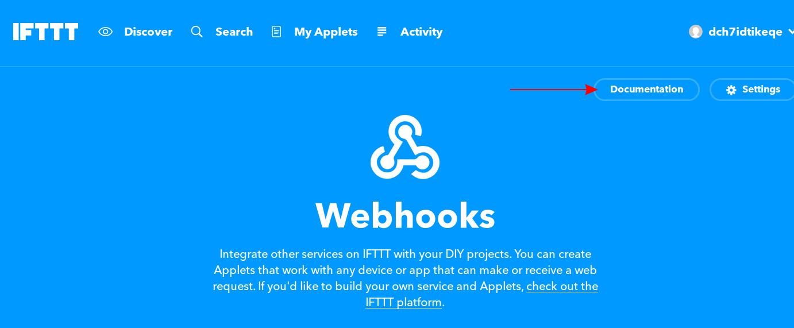

Copy the key.

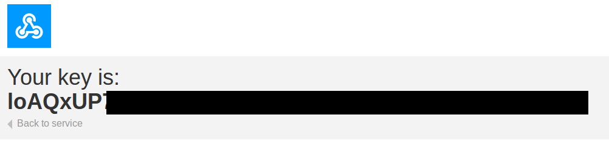

Keep the `${webhook_name}` placeholder in the URL path so that it can be customized in the rule editor. This will allow you to send SMS messages from different applets using the same web notification.

### Payload

Enter the following text into the `Body` field:

```json
{
  "value1": "${status}",
  "value2": "${rule}",
  "value3": "${entity}"
}
```

The `body` text contains placeholders that will be substituted with actual values when the notification is triggered.

Only `valueN` naming convention for JSON fields is supported by the IFTTT platform.

The placeholders specified in the payload and the URL are visible as editable parameters in the rule editor.

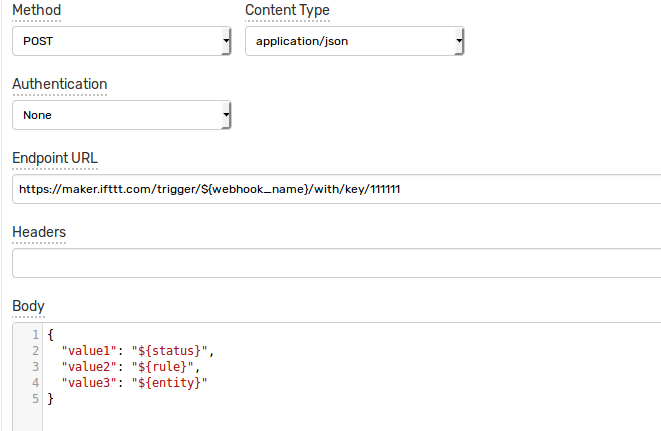

## Rule

Create a new rule or import the [rule template](resources/custom-ifttt-rule.xml) used in this example. To import the XML template file, open the **Alerts > Rules** page, select **Import** in the multi-action button located below the table and follow the prompts.

To create a new rule, open the **Alerts > Rules** page and click **Create**.

Specify the key settings on the **Overview** tab.

| **Name** | **Value** |
| :-------- | :---- |
| Status | Enabled |
| Metric | test_m |
| Condition | `value > 1` |


Open the **Web Notifications** tab.

Set **Enabled** to **Yes** and choose the previously created web notification from the **Endpoint** drop-down.

Enable **Open**, **Repeat** and **Cancel** triggers. Set the **Repeat Interval** to **All**.

Specify the webhook identifier `atsd_custom_webhook` in the `webhook_name` parameter for all triggers.

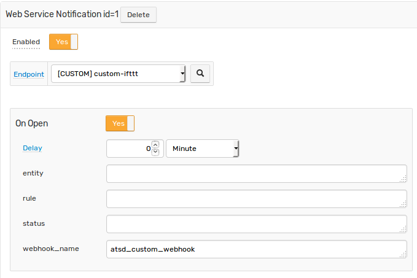

The `webhook_name` placeholder in the request URL as well as payload placeholders will be automatically resolved when the notification is triggered:

`https://maker.ifttt.com/trigger/atsd_custom_trigger/with/key/111111`

```json
{
  "value1": "OPEN",
  "value2": "IFTTT",
  "value3": "test_e"
}
```

## Test

Test the integration by submitting a sample `series` command on the **Data > Data Entry** page.

```ls
  series e:test_e m:test_m=2
```


The value will cause the condition to evaluate to `true`, which in turn will trigger the notification.
To verify that an alert was raised, open **Alerts > Open Alerts** page and check that an alert for the `test_m` metric is present in the **Alerts** table.

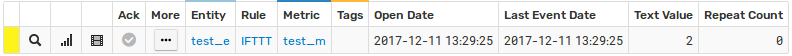

Check your device to make sure the SMS was received.
