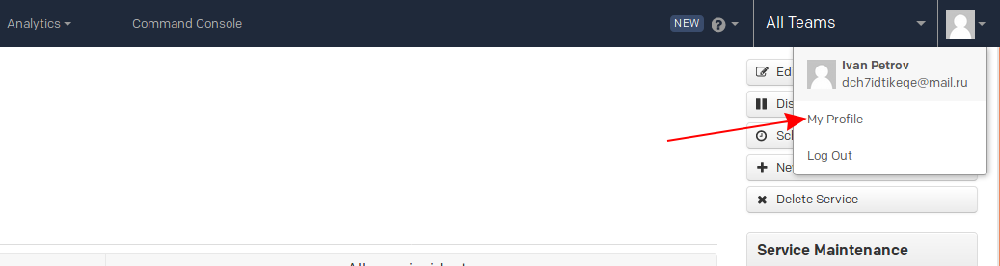
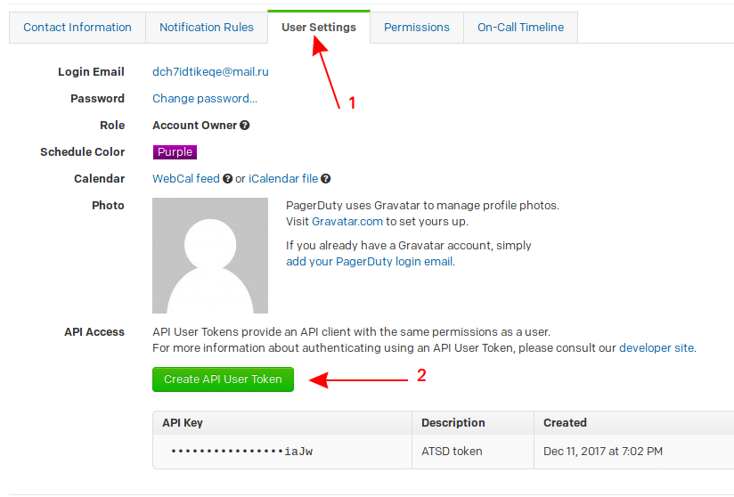
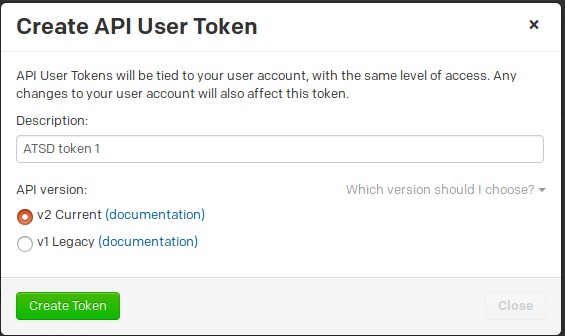
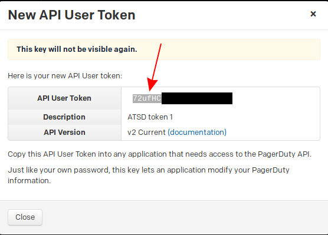
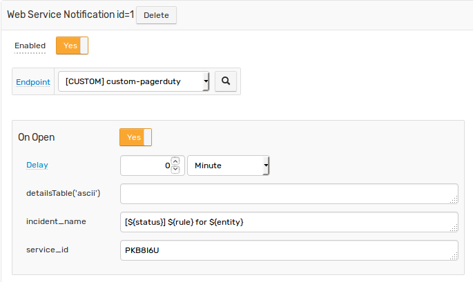
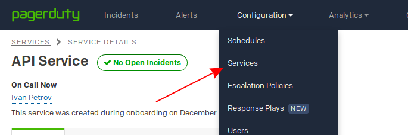
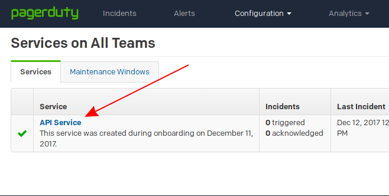
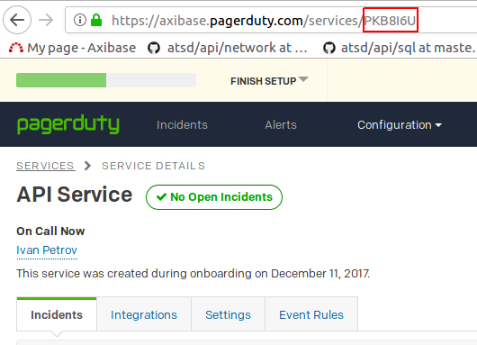
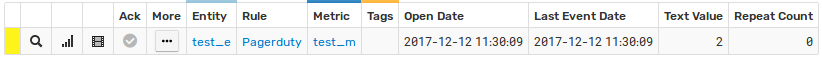
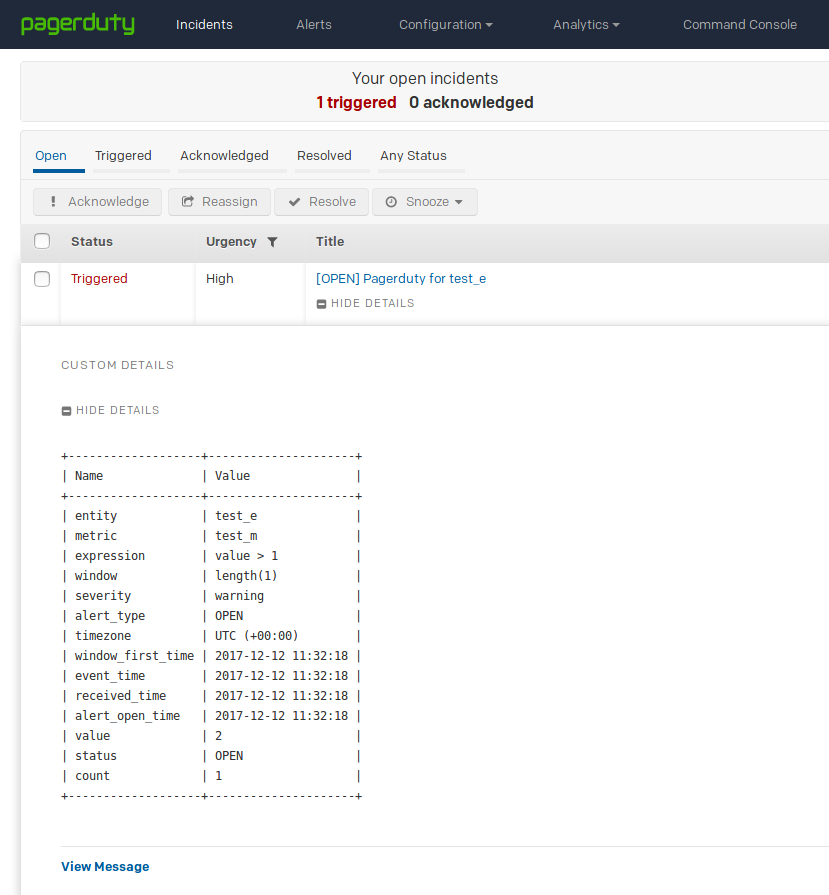

# PagerDuty Integration

## Overview

The following example demonstrates how to register an incident in [PagerDuty](https://www.pagerduty.com/) using a [`CUSTOM`](custom.md) web notification in the ATSD rule engine.

The integration relies on the [PagerDuty API](https://v2.developer.pagerduty.com/v2/page/api-reference#!/Incidents/post_incidents) `create-an-incident` method.

## Configuration

Create a new `CUSTOM` web notification or import the [template](resources/custom-pagerduty-notification.xml) used in this example. To import the XML template file, open the **Alerts > Web Notifications** page, select **Import** in the multi-action button located below the table and follow the prompts.

To create a new notification, open the **Alerts > Web Notifications** page and click **Create**.

### Parameters

Enter a name and specify the following parameters:

| **Name** | **Value** |
| :--- | :--- |
| Method | `POST` |
| Content Type | `application/json` |
| Authentication | `None` |
| Endpoint URL | `https://api.pagerduty.com/incidents` |
| Headers | `Accept: application/vnd.pagerduty+json;version=2`<br/>`Authorization: Token token=1111111` |

You can generate an authorization token on the user profile page.



Open the **User settings** tab and click **Create API User Token**.



Enter a token description, choose **v2 Current** API version and click **Create Token**.



Copy the token.



### Payload

Enter the following text into the `Body` field:

```
{
  "incident": {
    "type": "incident",
    "title": "${incident_name}",
    "service": {
      "id": "${service_id}",
      "type": "service_reference"
    },
    "body": {
      "type": "incident_body",
      "details": "${detailsTable('ascii')}"
    }
  }
}
```

The `body` text contains placeholders that will be substituted with actual values when the notification is triggered. 

The placeholders specified in the payload are visible as editable parameters in the rule editor.


## Rule

Create a new rule or import the [rule template](resources/custom-pagerduty-rule.xml) used in this example. To import the XML template file, open the **Alerts > Rules** page, select **Import** in the multi-action button located below the table and follow the prompts.

To create a new rule, open the **Alerts > Rules** page and click **Create**.

Specify the key settings on the **Overview** tab. 

| **Name** | **Value** |
| :-------- | :---- |
| Status | Enabled |
| Metric | test_m |
| Condition | `value > 1` |


Open the **Web Notifications** tab.

Set **Enabled** to **Yes** and choose the previously created web notification from the **Endpoint** drop-down.

Enable **Open**, **Repeat** and **Cancel** triggers. Set the **Repeat Interval** to **All**. Leave **detailsTable('ascii')** empty.

Specify the following settings for the **Open** trigger:

| **Name** | **Value** |
| :-------- | :---- |
| service_id | `<SERVICE_ID>` |
| incident_name | `[${status}] ${rule} for ${entity} ${tags}` |



The `service_id` parameter indicates which service is affected by the incident. You can obtain the service ID on the PagerDuty **Services** page. 

Click **Configuration > Services**.



Choose your service.



Get an ID from url.



Payload placeholders will automatically be resolved when the notification is triggered:

```
{
  "incident": {
    "type": "incident",
    "title": "[OPEN] Pagerduty for test_e",
    "service": {
      "id": "PKB8I6U",
      "type": "service_reference"
    },
    "body": {
      "type": "incident_body",
      "details": "ascii details table..."
    }
  }
}
```

## Test

In order to test the integration, submit sample data for the `test_m` metric into ATSD. For example, open the **Data > Data Entry** page and submit the following command:

```ls
  series e:test_e m:test_m=2
```


The value will cause the condition to evaluate to `true`, which in turn will trigger the notification.

To verify that an alert was raised, open **Alerts > Open Alerts** page and check that an alert for the `test_m` metric is present in the **Alerts** table.



Check PagerDuty [incidents](https://axibase.pagerduty.com/incidents) page to make sure the incident was triggered.


