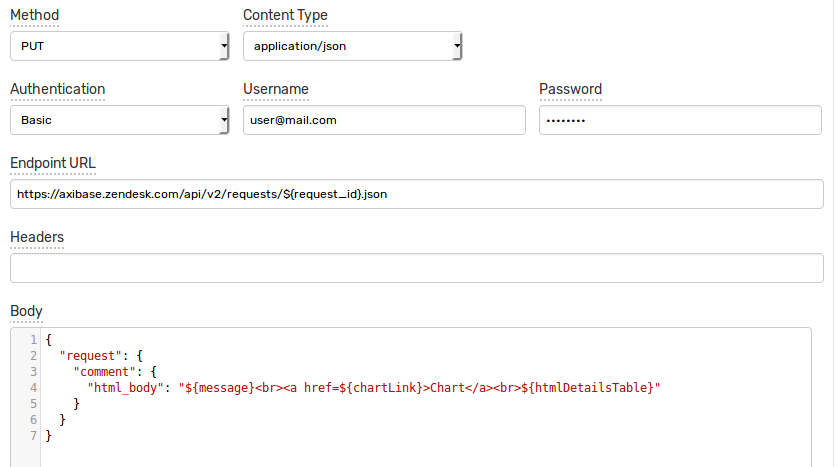
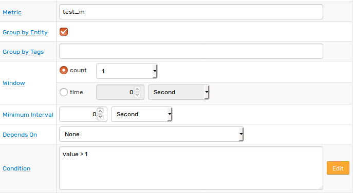
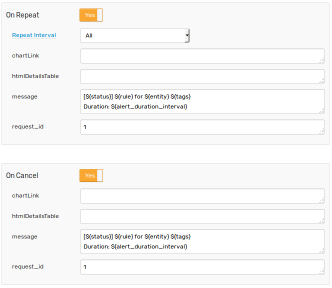
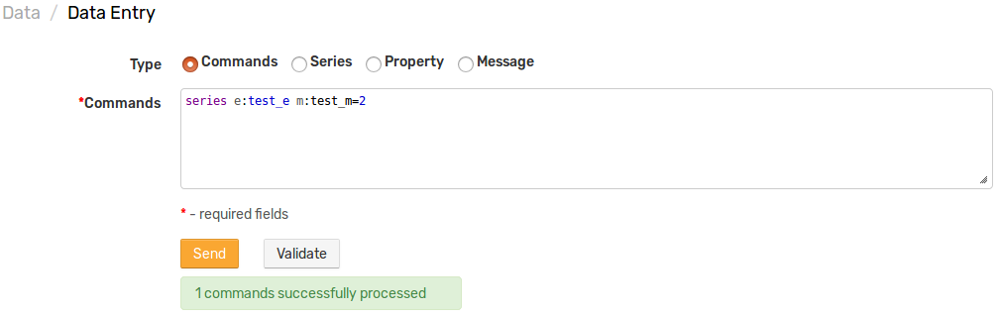
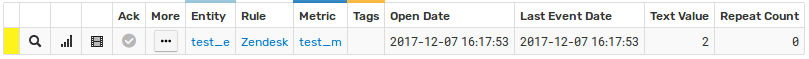
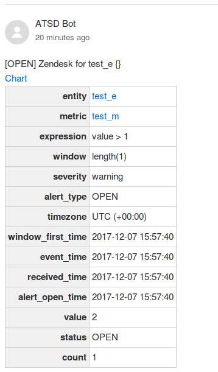

# Zendesk Integration

## Overview

The following example demonstrates how to add a comment to an existing request / ticket in [Zendesk](https://www.zendesk.com/) using a [`CUSTOM`](custom.md) web notification in the ATSD rule engine.

This integration relies on the [Zendesk API](https://developer.zendesk.com/rest_api/docs/core/requests#update-request) `update-request` method.

## Configuration

Create a new `CUSTOM` web notification or import the [template](resources/custom-zendesk-notification.xml) used in this example. To import an XML template file, open the **Alerts > Web Notifications** page, select **Import** in the multi-action button located below the table and follow the prompts.

To create a new notification, open the **Alerts > Web Notifications** page and click **Create**.

### Parameters

Enter a name and specify the following parameters:

| **Name** | **Value** |
| :--- | :--- |
| Method | `PUT` |
| Content Type | `application/json` |
| Authentication | `Basic` |
| Username | `<ZENDESK_USER>` |
| Password | `<ZENDESK_PASSWORD>` |
| Endpoint URL | `https://<COMPANY_NAME>.zendesk.com/api/v2/requests/${request_id}.json` |

Modify the `Endpoint URL` by replacing the `<COMPANY_NAME>` field with your Zendesk subdomain.

The `Endpoint URL` should look as follows: `https://axibase.zendesk.com/api/v2/requests/${request_id}.json`

Keep the `${request_id}` placeholder in the URL path so that it can be customized in the rule editor. This would allow you to add comments to different requests using the same web notification.

Enter the Zendesk user name into the `Username` field and the password into the `Password` field.

### Payload

Enter the following text into the `Body` field:

```json
{
  "request": {
    "comment": {
      "html_body": "${message}<br><a href=${chartLink}>Chart</a><br>${htmlDetailsTable}"
    }
  }
}
```

The `html_body` text contains placeholders that will be substituted with actual values when the notification is triggered. 

Placeholders specified in the payload and the URL are visible as editable parameters in the rule editor.



## Rule

Create a new rule or import the [rule template](resources/custom-zendesk-rule.xml) used in this example. To import the XML template file, open the **Alerts > Rules** page, select **Import** in the multi-action button located below the table and follow the prompts.

To create a new rule, open the **Alerts > Rules** page and click **Create**.

Specify the key settings on the **Overview** tab. 

| **Name** | **Value** |
| :-------- | :---- |
| Status | Enabled |
| Metric | test_m |
| Condition | `value > 1` |



Open the **Web Notifications** tab.

Set **Enabled** to **Yes** and choose the previously created web notification from the **Endpoint** drop-down.

Enable **Open**, **Repeat** and **Cancel** triggers. Set the **Repeat Interval** to **All**.

Specify the Zendesk request identifier into the `request_id` parameter for all triggers. The request must already exist in the Zendesk system for the entry to be valid.

To override the default `message` parameter which is set to  `[${status}] ${rule} for ${entity} ${tags}`, enter a new value, for example `[${status}] ${rule} for ${entity} ${tags}`<br>`Duration: ${alert_duration_interval}`.



The request ID placeholder in the request URL as well as payload placeholders will be automatically resolved when the notification is triggered:

`https://axibase.zendesk.com/api/v2/requests/1.json`

```json
{
  "request": {
    "comment": {
      "html_body": "[OPEN] Zendesk for test_e {}<br><a href="chart link">Chart</a><br><table>... alert table</table>"
    }
  }
}
```

## Test

Test the integration by submitting a sample `series` command on the **Data > Data Entry** page.

```ls
  series e:test_e m:test_m=2
```



The value will cause the condition to evaluate to `true`, which in turn will trigger the notification.
To verify that an alert was raised, open **Alerts > Open Alerts** and check that an alert for the `test_m` metric is present in the **Alerts** table.



Check the Zendesk request to make sure the new comment was added.


