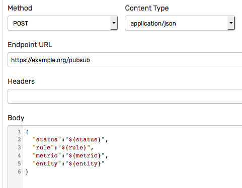

# Custom Notification

## Overview

The **custom** notification type provides a flexible way to integrate the ATSD rule engine with external HTTP services. The integration enables sending HTTP requests with customized content to the specified HTTP endpoint on window status events.

## Supported HTTP Methods

| Method | Payload Allowed |
|---|---|
| GET | No |
| HEAD | No |
| POST | Yes |
| PUT | Yes |
| PATCH | Yes |
| DELETE | No |

## Supported Content Types

* `application/json`
* `application/x-www-form-urlencoded`

If the selected HTTP method such as `GET` doesn't allow payload, the request parameters specified in the Parameters section are appended to the Endpoint URL a a query string.

## Placeholders

The [placeholders](../placeholders.md) are supported in the Endpoint URL, request parameter names and values, request headers, and the payload content.

The placeholders are substituted with actual field values when the request is initiated.

If the placeholder doesn't exist, it is substituted with an empty string.

Placeholder values are automatically URL-encoded if they're included in the request URL.

## Example

