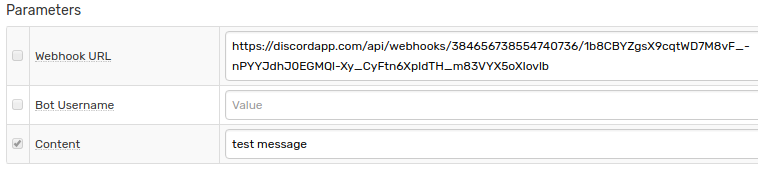

# Discord

https://discordapp.com/

## Prerequisites

Install a [Web Driver binary](README.md#install-web-driver)

## Create server

 * Click on the big plus at the left panel

     

 * Click on **Create a Server**

     

 * Fill in the field **Server Name**, click **Create**

     

 * Invite members to receive notifications from ATSD (you can do it later), click **Done**

## Create channel

 * Click on **Create Channel**

     

 * Fill in the **Channel name** field, check (enable) **Text Channel**, click **Create Channel**

     

 * Click **Edit channel**

     

 * Go to **Permissions** tab and review settings

     

> At the **Invite** tab you can create invite link and send it to users.  To join server created for notifications user should click **Create new server**, select **Join** and paste received invite.

## Create webhook

 * Go to **Webhook** tab, click **Create Webhook**, specify name, select channel

      

 * Copy Webhook URL, click **Save**

## Configure Web Notifications

* Log in to ATSD web UI
* Go to **Admin > Web Notifications > Discord**
* Specify `Webhook URL`
* Fill in the `Content` field

    

* Click **Test**

   

* Select **Test Portal**

      

* Click **Send Screenshot**

   

The following parameters are supported:

|**Parameter**|**Description**|
|---|---|
|Webhook URL|Webhook URL generated at **Webhook** tab at the channel settings.|
|Content|Text of the message to be sent.|
|Bot Username|Overwrite your bot's user name.|

If tests are ok, check **Enable**, click **Save**   

## Configure Rule

* Download the file [rules.xml](resources/rules.xml)
* Open **Alerts > Rules > Import**
* Check (enable) **Auto-enable New Rules**, click on **Choose File**, select the downloaded XML file, click **Import**
* Open the imported rule, go to the **Email Notifications** tab, replace **Recipients** field
* Go to the **Web Notifications** tab, select Discord from **Endpoint** drop-down
* Save the rule by clicking on the **Save** button

## Test

* Wait a little, check the channel

    

    Content of _atsd.jvm.low_memory_atsd_open_20171127_1408043.txt_:

    
