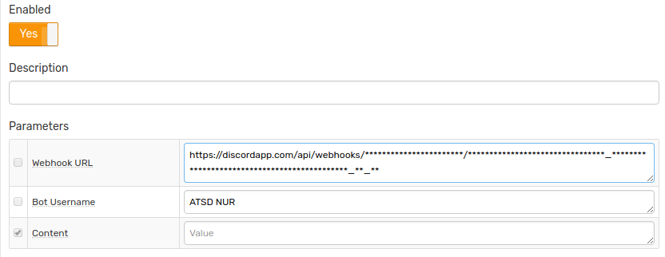

# Discord Notifications

## Overview

The `DISCORD` notification type provides a built-in capability to send alert messages, alert detail tables, and charts into Discord channels. The integration is based on the [Discord Webhook API](https://discordapp.com/developers/docs/resources/webhook).

## Prerequisites

Install and configure the [Web Driver](README.md#install-web-driver) in order to enable sending chart screenshots into Discord.

## Create server

If necessary, create a new server.

 * Click on the big plus at the left panel

     

 * Click on **Create a Server**

     

 * Fill in the field **Server Name**, click **Create**

     

 * Invite members to receive notifications from ATSD (you can do it later), click **Done**

## Create channel

 * Click on **Create Channel**

     

 * Fill in the **Channel name** field, check (enable) **Text Channel**, click **Create Channel**

     

 * Click **Edit channel**

     

 * Go to **Permissions** tab and review settings

     

> At the **Invite** tab you can create invite link and send it to users.  To join server created for notifications user should click **Create new server**, select **Join** and paste received invite.

## Create webhook

 * Open the **Webhook** tab, click **Create Webhook**, specify name, select channel

      

 * Copy Webhook URL, click **Save**

## Create Discord Notification in ATSD

* Open **Alerts > Web Notifications** page.
* Click on an existing `DISCORD` template, or click the **Create** button below and switch the form to `SLACK` type.
* Specify `Webhook URL` parameter. See parameter descriptions below.

    

* Click **Test**

   

* Select **Test Portal**

      

* Click **Send Screenshot**

   

The following parameters are supported:

|**Parameter**|**Description**|
|---|---|
|Webhook URL|Webhook URL generated at **Webhook** tab at the channel settings.|
|Content|Text of the message to be sent.|
|Bot Username|Overwrite your bot's user name.|

If tests are ok, check **Enable**, click **Save**   

## Testing Notification Rule

### Create/import rule

* Create a new rule or import an existing rule for a built-in metric as described below.
* Download the file [rules.xml](resources/rules.xml).
* Open the **Alerts > Rules > Import** page.
* Check (enable) **Auto-enable New Rules**, attach the `rules.xml` file, click **Import**.

### Configure notification

* Open **Alerts > Rules** page and select a rule.
* Open the **Web Notifications** tab.
* Select Discord from the **Endpoint** drop-down.
* Enable the `OPEN`, `REPEAT`, and `CANCEL` triggers.
* Customize the alert message using [placeholders](../placeholders.md) as necessary, for example:

```ls
    OPEN = [${status}] ${rule} for ${entity} ${tags}. ${ruleLink}
    REPEAT = [${status}] ${rule} for ${entity} ${tags}. Duration: ${alert_duration_interval}. ${ruleLink}
    CANCEL = [${status}] ${rule} for ${entity} ${tags}. Duration: ${alert_duration_interval}. ${ruleLink}
```

* Save the rule by clicking on the **Save** button.

    
    
* The rule will create new windows based on incoming data. It may take a few seconds for the first commands to arrive and to trigger the notifications. You can open and refresh the **Alerts > Open Alerts** page to verify that an alert is open for your rule.

## Example

   

   Content of _atsd.jvm.low_memory_atsd_open_20171127_1408043.txt_:

   
