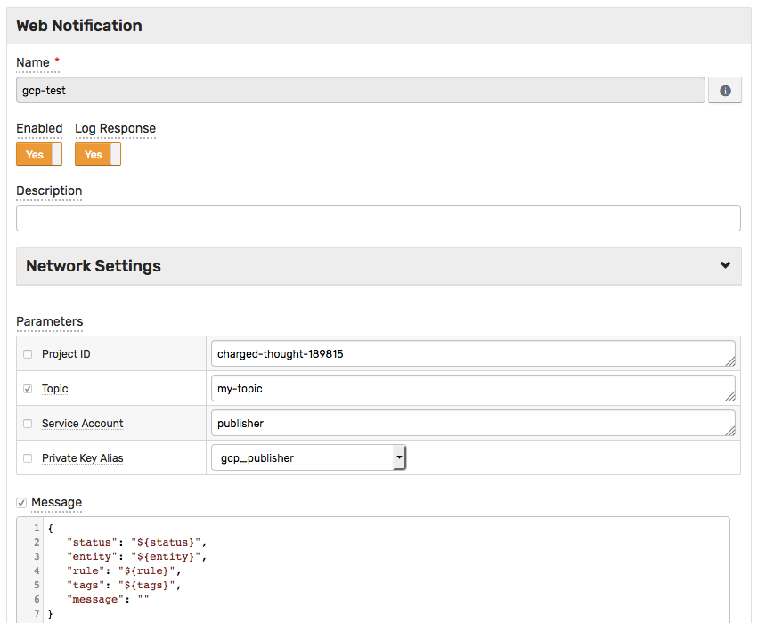
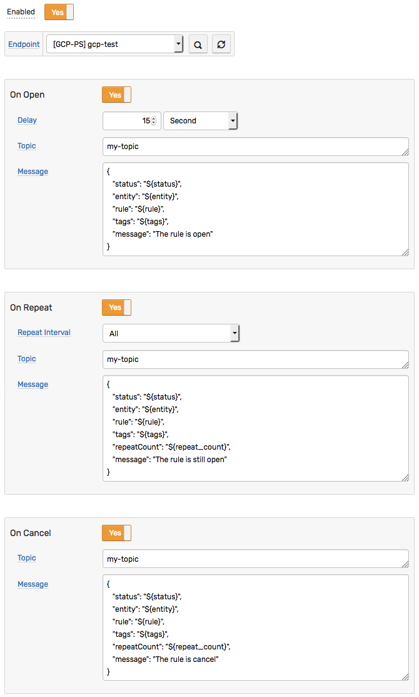
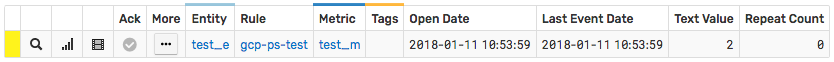
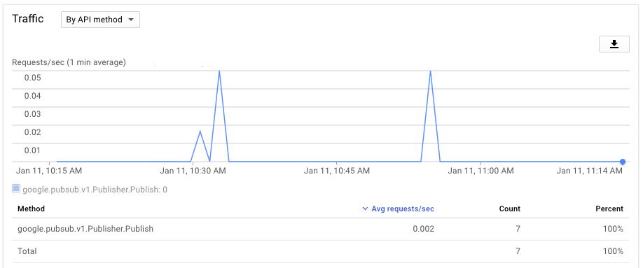

## Google Cloud Pub/Sub Send Message Example

## Overview

The following example demonstrates how to send a message to a [Google Cloud Pub/Sub](https://cloud.google.com/pubsub/docs/reference/rest/v1/projects.topics/publish) topic using a [`GCP PS`](gcp-ps.md) web notification.

The example invokes the [Google Cloud Pub/Sub API](https://cloud.google.com/pubsub/docs/reference/rest/v1/projects.topics/publish) `projects.topics.publish` method.

## Configuration

Create a new `GCP PS` web notification or import the [template](resources/gcp-ps-notification.xml) used in this example. To import the XML template file, open the **Alerts > Web Notifications** page, select **Import** in the multi-action button located below the table and follow the prompts.

To create a new notification, open the **Alerts > Web Notifications** page and click **Create**.

### Parameters

Enter a name and specify the following parameters:

| **Name** | **Value** |
| :--- | :--- |
| Project ID | `<PROJECT_ID>` |
| Topic | `<TOPIC>` |
| Service Account | `<SERVICE_ACCOUNT>` |
| Private Key Alias | `<PRIVATE_KEY_ALIAS>` |
| Message | `<MESSAGE_TEXT>`|

Modify the `Project ID` by replacing the `<PROJECT_ID>` value with your project ID, for example:

```txt
charged-thought-189815
```

Modify the `Topic` by replacing the `<TOPIC>` value with your topic name, for example:

```txt
my-topic
```

Modify the `Service Account` by replacing the `<SERVICE_ACCOUNT>` value with your [service account](gcp-service-account-key.md#create-service-account), for example:

```txt
publisher
```

Modify the `Private Key Alias` by selecting the alias for [imported account's private key](gcp-service-account-key.md#import-accounts-private-key), for example:

```txt
gcp_publisher
```

Modify the `Message` by replacing the `<MESSAGE_TEXT>` value with your text, for example:

```json
{
   "status": "${status}",
   "entity": "${entity}",
   "rule": "${rule}",
   "tags": "${tags}",
   "message": ""
}
```

The `Message` text contains placeholders that will be substituted with actual values when the notification is triggered. The placeholders specified in the message are visible as editable parameters in the rule editor.



## Rule

Create a new rule or import the [rule template](resources/azure-sb-message-rule.xml) used in this example. To import the XML template file, open the **Alerts > Rules** page, select **Import** in the multi-action button located below the table and follow the prompts.

To create a new rule, open the **Alerts > Rules** page and click **Create**.

Specify the key settings on the **Overview** tab.

| **Name** | **Value** |
| :-------- | :---- |
| Status | Enabled |
| Metric | test_m |
| Condition | `value > 1` |


Open the **Web Notifications** tab.

Set **Enabled** to **Yes** and choose the previously created web notification from the **Endpoint** drop-down.

Enable **Open**, **Repeat** and **Cancel** triggers.

Specify the message text into the `Message` parameter for all triggers.



## Test

In order to test the integration, submit sample data for the `test_m` metric into ATSD. For example, open the **Data > Data Entry** page and submit the following command:

```ls
  series e:test_e m:test_m=2
```


The value will cause the condition to evaluate to `true`, which in turn will trigger the notification.
To verify that an alert was raised, open **Alerts > Open Alerts** page and check that an alert for the `test_m` metric is present in the **Alerts** table.



Check the Google Cloud Pub/Sub topic statistics to make sure the new messages were received:


