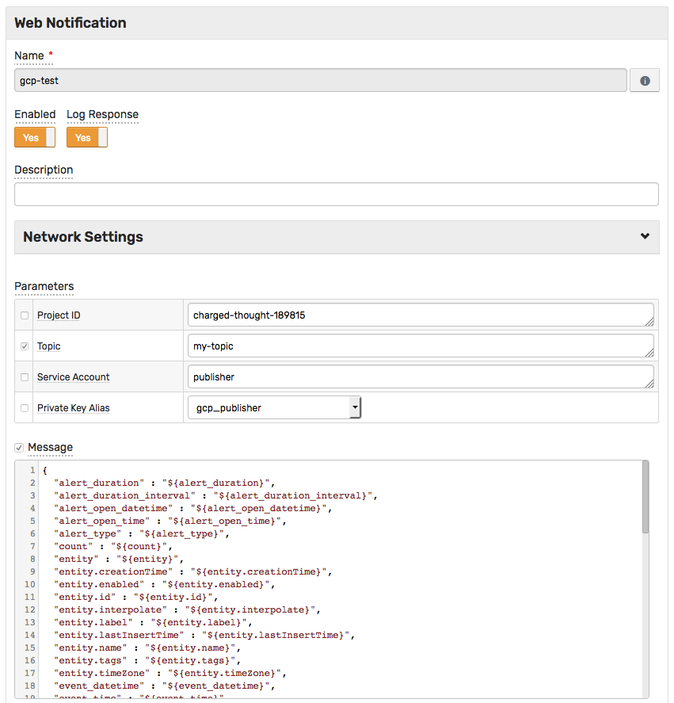
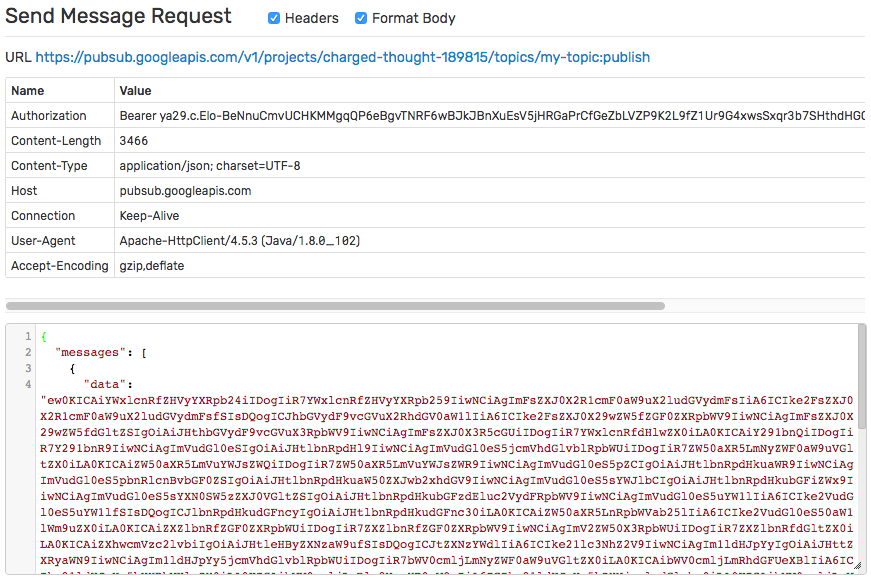
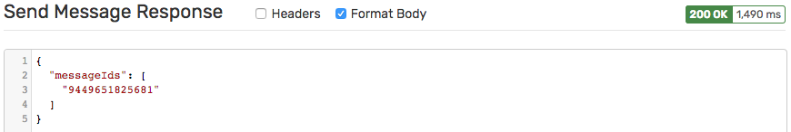

# Google Cloud Pub/Sub Notification

## Overview

The `GCP PS` [notification](../web-notifications.md) provides a way to send messages to a [Google Cloud Pub/Sub](https://cloud.google.com/pubsub/docs/reference/rest/v1/projects.topics/publish) topic on window status events.

## Notification Settings

|**Setting**|**Description**|
|---|---|
|Project ID|The ID of the project.|
|Topic|The name of the receiving topic.|
|Service Account|The account that belongs to the application instead of to an individual end user. Create account as described [here](gcp-service-account-key.md#create-service-account)|
|Private Key Alias|The alias of the account's private key which was imported as described [here](gcp-service-account-key.md#import-accounts-private-key)|
|Message|The default message text.|

## Message

Each window status event can produce only one message.

The message is submitted to the specified Google Cloud Pub/Sub endpoint using the `POST` method with `application/json` content type. The request uses [AOuth 2.0 authorization](https://developers.google.com/identity/protocols/OAuth2ServiceAccount).

The default message includes all fields, including entity and metric metadata.

## Response

The response status code and response content is recorded in `atsd.log` if the `Log Response` setting is enabled.

## Configure GCP PS Notification

* Open **Alerts > Web Notifications** page.
* Click the **Create** button and select the `GCP-PS` type.
* Fill out the `Name` field.
* Enter the `Project ID`, `Topic`, `Service Account` and select `Private Key Alias`.

  

* Click **Test**.

   

   

* If tests are passing OK, check **Enable**, click **Save**.

In order to test the actual payload, create a sample rule, and enable the `GCP-PS` notification on the `Web Notifications` tab.

## Examples

* [Send a message to the topic](gcp-ps-message.md)
