# HipChat Data Center Notifications

## Overview

The `HIPCHAT` [notification](../web-notifications.md) allows sending alert messages, alert detail tables, and charts into [HipChat Data Center](https://www.atlassian.com/software/hipchat/enterprise/data-center) channels. The integration is based on the [HipChat API v2](https://www.hipchat.com/docs/apiv2).

## Prerequisites

* Install and configure the [Web Driver](web-driver.md) in order to enable sending chart screenshots into HipChat.

## Create Bot

* Login into HipChat as an administrator.
* Click on **System**.

    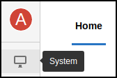

* Open **Team Info**.
* Navigate to the invitation URL, click **Enable**.

    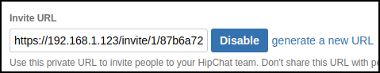

* Copy the link.
* Sign out.

    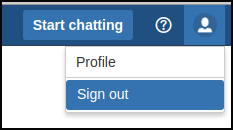

* Paste the above link into the browser address bar, press **Enter**.
* Fill in the fields, click **Sign Up**.

    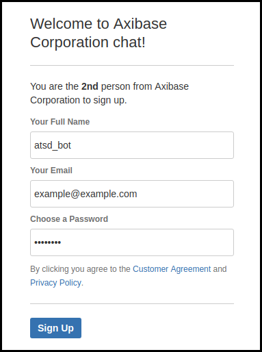

## Generate Tokens

* Click on the bot icon in the upper right corner.

    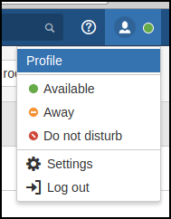

* Click on **Profile**.
* Open **API tokens**. Make sure you are using API **v2**: otherwise you'll see warning.

* Choose the **Send Message** and the **Send Notification** options from the **Scopes** field.
* Fill in the **Label** field.
* Click **Create**.

    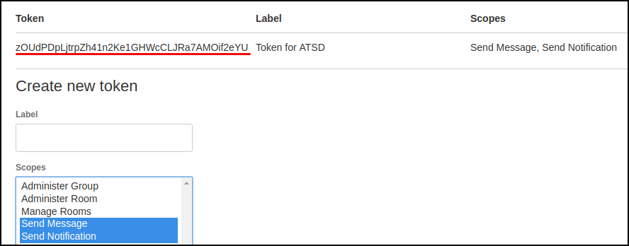

* Copy the token for future reference.
* Log out.

## Create Room

* Login into HipChat again as an administrator.
* Click **Start chatting**.
* Click **Create a room**.

    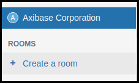

* Fill in the fields, check **Private room**, click **Create room**.

    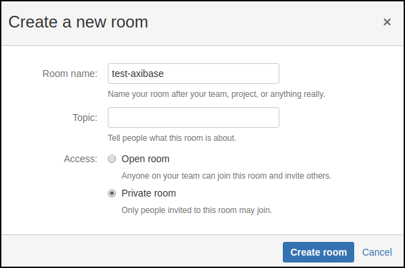

* Specify members that will receive notifications from ATSD, including the above bot user, click **Invite people**.

    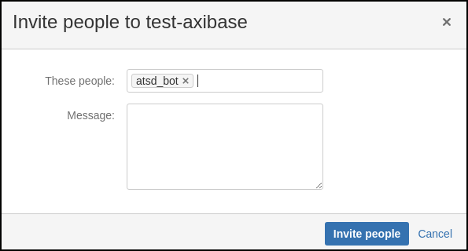

## Lookup Room Id

* Click on the team name.

    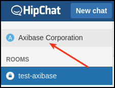

* Click on the recently created room.

    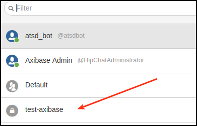

* Check the URL. The last number is the room Id.

    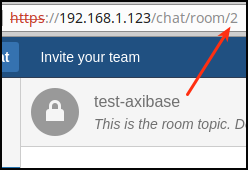

In addition to roomId, you can use room name, for example `test-axibase`, when sending messages.

## Create HipChat Notification in ATSD

* Open the **Alerts > Web Notifications** page.
* Click on an existing `HIPCHAT` template, or click the **Create** button and switch the type to `HIPCHAT`.
* Copy the `Token` from the HipChat Data Center client into the `Auth Token` field in the configuration form.
* Copy the room Id or room name from the HipChat Data Center client into the `Room ID` field in the configuration form.

    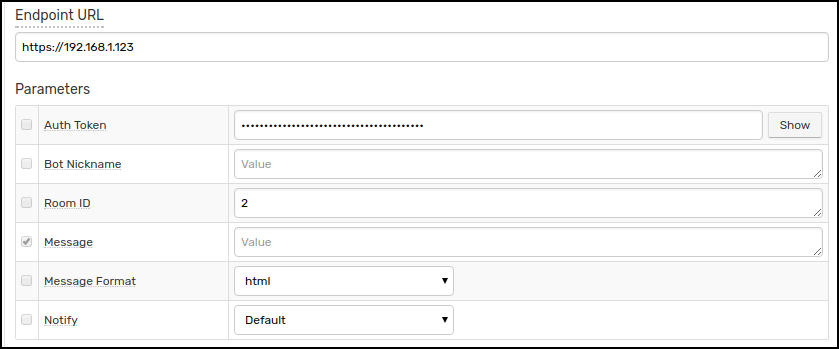

* Click **Test**.

   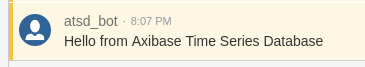

* Select **Test Portal** to test the screenshot.

      

* Click **Send Screenshot**.

   

* If tests are OK, set the status to **Enabled** and click **Save**.  

## Proxy Settings

If the HipChat API server is not directly accessible from the ATSD server, open the **Network Settings** and specify [proxy parameters](../web-notifications.md#network-settings).

## Notification Parameters

|**Parameter**|**Description**|
|---|---|
|Auth Token|Auth Token bearing 'message' and 'notifications' scopes.|
|Bot Nickname|Append a phrase to your bot's username.|
|Room ID|ID or name of the room.|
|Message|Message text to be sent. This field should be left blank so it can be customized in the rule editor.|
|Message Format|Change how messages are formatted. See [message_format](https://www.hipchat.com/docs/apiv2/method/send_room_notification).|
|Notify|Notify users when bot sends a message.|

## Testing Notification

### Create/import Rule

* Create a new rule or import an existing rule for a built-in metric as described below.
* Download the file [rules.xml](resources/rules.xml).
* Open the **Alerts > Rules > Import** page.
* Check (enable) **Auto-enable New Rules**, attach the `rules.xml` file, click **Import**.

### Configure Notification

* Open **Alerts > Rules** page and select a rule.
* Open the **Web Notifications** tab.
* Select HipChat from the **Endpoint** drop-down.
* Enable the `OPEN`, `REPEAT`, and `CANCEL` triggers.
* Customize the alert message using [placeholders](../placeholders.md) as necessary, for example:

```ls
    OPEN = [${status}] ${rule} for ${entity} ${tags}. ${ruleLink}
    REPEAT = [${status}] ${rule} for ${entity} ${tags}. Duration: ${alert_duration_interval}. ${ruleLink}
    CANCEL = [${status}] ${rule} for ${entity} ${tags}. Duration: ${alert_duration_interval}. ${ruleLink}
```

* Save the rule by clicking on the **Save** button.

    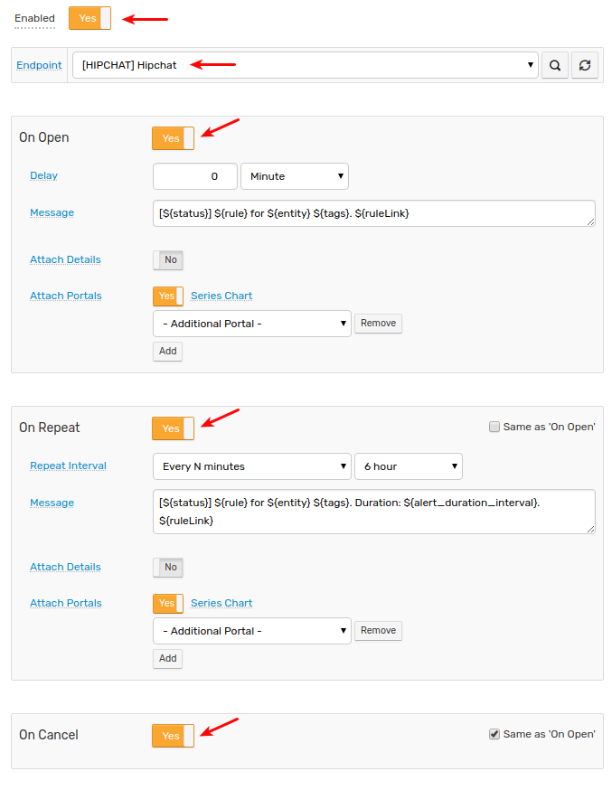

* The rule will create new windows based on incoming data. It may take a few seconds for the first commands to arrive and to trigger the notifications. You can open and refresh the **Alerts > Open Alerts** page to verify that an alert is open for your rule.

## Example

> Note that the alert color depends on the severity level specified in the **Logging** tab.

* Warning alert:

   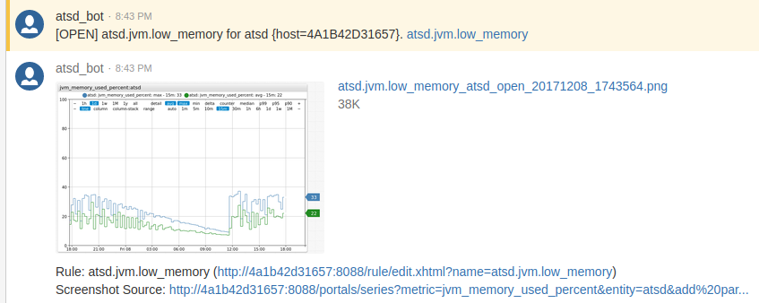

* Critital alert:

   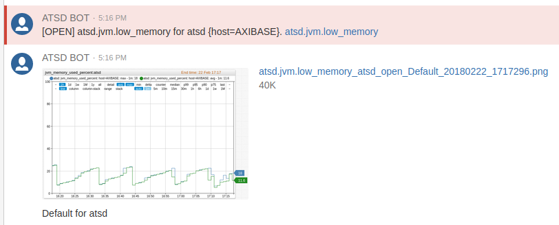
