# Mattermost Notifications

## Overview

The `MATTERMOST` [notification](../web-notifications.md) allows sending alert messages, alert detail tables, and charts into Mattermost channels. The integration is based on the [Mattermost API v4.0.0](https://api.mattermost.com/).

## Prerequisites

* Install and configure the [Web Driver](web-driver.md) in order to enable sending chart screenshots into Mattermost.

## Create Team

If necessary, create new team.
 
 * Click on **Main Menu**.
 * Click on **Create a New Team**.
 
    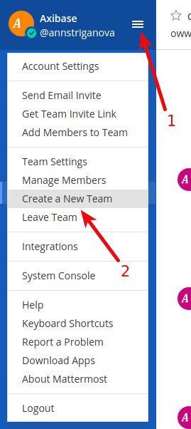
 
 * Fill in the **Team Name** filed, click **Next**.
 
    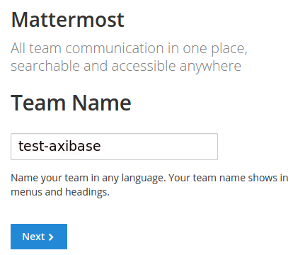
    
 * Paste **Team URL**, click **Finish**.
 
    
 
## Create Channel

* Click on **Create new private channel**.

    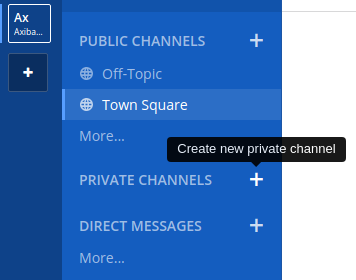
    
* Fill in the **Name** field, click **Create New Channel**.

    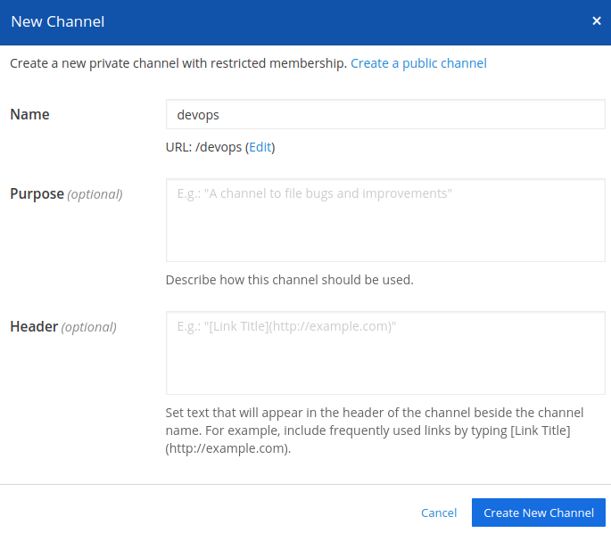
    
## Create Bot User

* Enable personal access tokens:

    * go to **Main Menu > System Console > Integrations > Custom Integration**
    * check (enable) **true** at **Enable Personal Access Tokens** property, click **Save**
 
        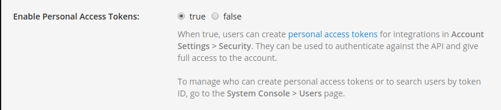

* Switch back to team.

    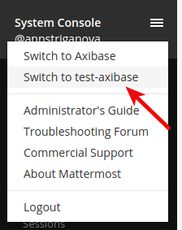

* Get Team invite link:

    * go to **Main Menu > Get Team Invite Link**

       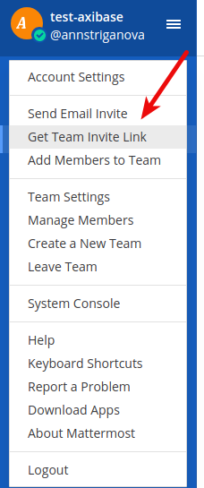
       
    * copy the link, click **Close**
    
        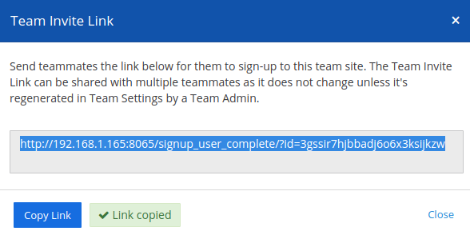
           
* Log out.

    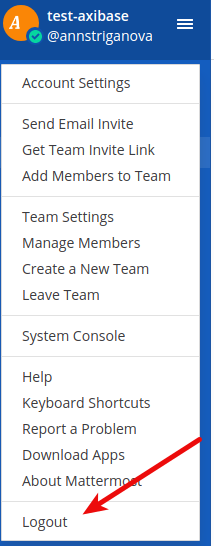
    
* Go to invite link.
* Fill in the registration's fields, click on **Create Account**.

    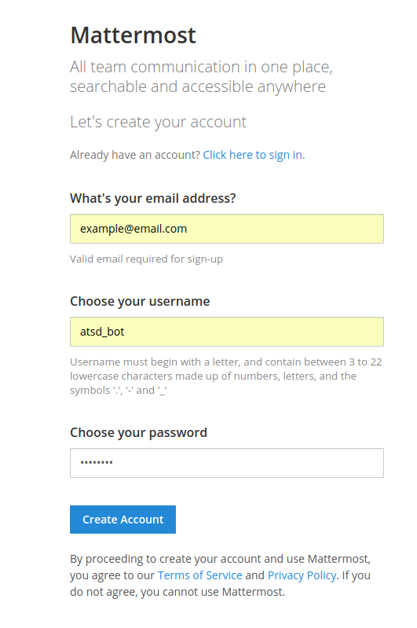

* Log out.

## Enable Access Tokens

* Log in as team administrator.
* Go to **Main Menu > System Console > Users**.
* Click on **Member** drop-down according to bot user, select **Manage Roles**.

    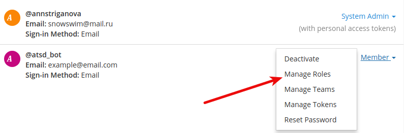
    
* Check (enable) **Allow this account to generate personal access tokens**.
* Check (enable) **post:all**, click **Save**.

    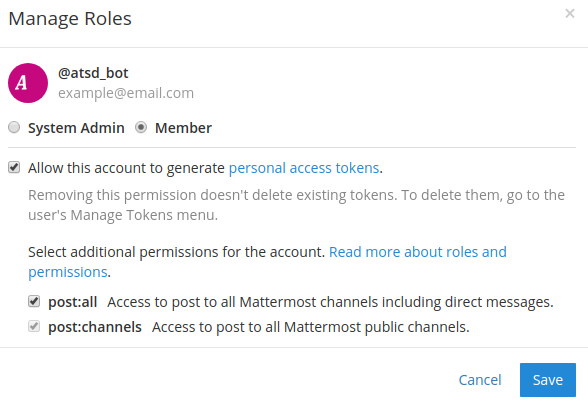

* Switch back to team.
* Go to created channel, click on **Invite others to this private channel**.

    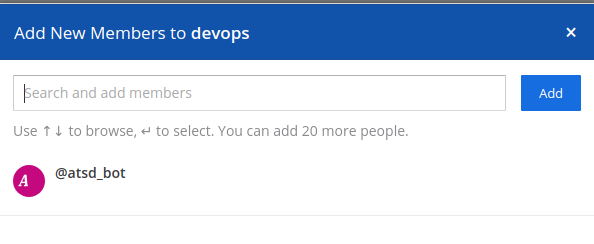  

* Select bot user, click **Add**.
* Log out.

## Generate Token

* Log in as bot user.
* Go to **Main Menu > Account Settings > Security > Personal Access Tokens**.

    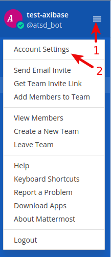
    
    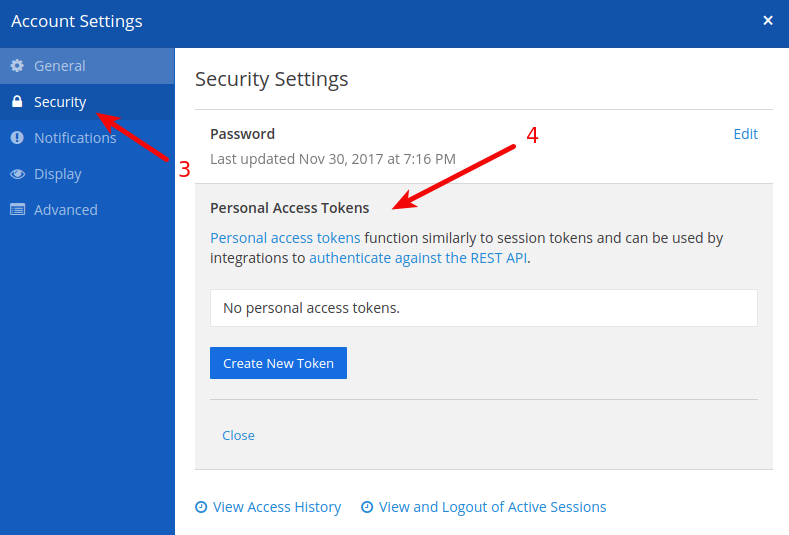  

* Click on **Create New Token**.
* Fill in the **Token Description** field, click **Save**.

    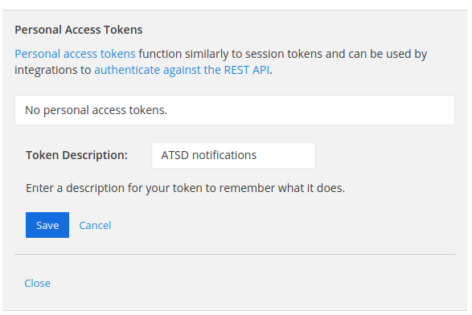 
    
* Copy the access token for future reference.

    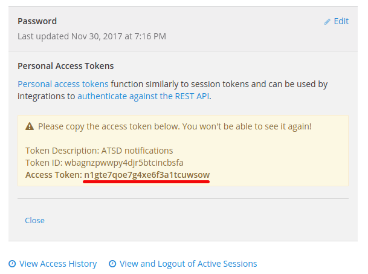
    
* Close **Account Settings** window.

## Get Channel Id

* Click on channel for notifications from ATSD.
* Click on drop-down near the channel's header.
* Click on **View Info**.

    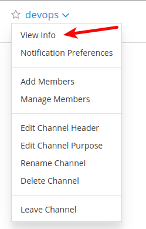
    
* Copy the **ID** for future reference.

    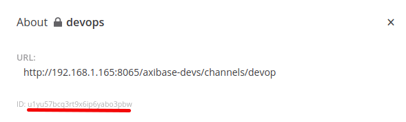
    
## Create Mattermost Notification in ATSD

* Open the **Alerts > Web Notifications** page.
* Click on an existing `MATTERMOST` template, or click the **Create** button and switch the type to `MATTERMOST`.
* Copy the channel `ID` from the Mattermost client into the `Channel Id` field in the configuration form. 
* Copy the `Access Token` from the Mattermost client into the `Access Token` field in the configuration form. 

    

* Click **Test**.

   

* Select **Test Portal** to test the screenshot.

      

* Click **Send Screenshot**.

   
   
* If tests are OK, set the status **Enabled** and click **Save**.  

## Notification Parameters

|**Parameter**|**Description**|
|---|---|
|Channel Id||
|Access Token||
|Message|Message text to be sent. This field should be left blank so it can be customized in the rule editor.|

## Testing Notification

### Create/import rule

* Create a new rule or import an existing rule for a built-in metric as described below.
* Download the file [rules.xml](resources/rules.xml).
* Open the **Alerts > Rules > Import** page.
* Check (enable) **Auto-enable New Rules**, attach the `rules.xml` file, click **Import**.

### Configure notification

* Open **Alerts > Rules** page and select a rule.
* Open the **Web Notifications** tab.
* Select Mattermost from the **Endpoint** drop-down.
* Enable the `OPEN`, `REPEAT`, and `CANCEL` triggers.
* Customize the alert message using [placeholders](../placeholders.md) as necessary, for example:

```ls
    OPEN = [${status}] ${rule} for ${entity} ${tags}. ${ruleLink}
    REPEAT = [${status}] ${rule} for ${entity} ${tags}. Duration: ${alert_duration_interval}. ${ruleLink}
    CANCEL = [${status}] ${rule} for ${entity} ${tags}. Duration: ${alert_duration_interval}. ${ruleLink}
```

* Save the rule by clicking on the **Save** button.

    
    
* The rule will create new windows based on incoming data. It may take a few seconds for the first commands to arrive and to trigger the notifications. You can open and refresh the **Alerts > Open Alerts** page to verify that an alert is open for your rule.

## Example

   

   
