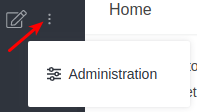
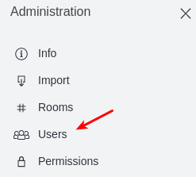
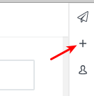
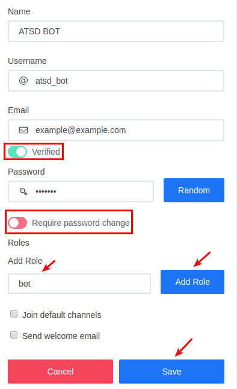
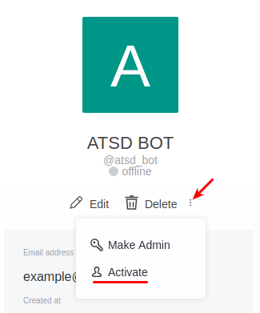
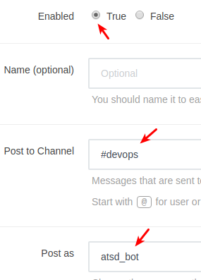
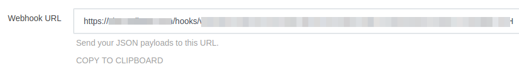

# Rocket.Chat Notifications

## Overview

`ROCKET.CHAT` [notifications](../web-notifications.md) provides a built-in capability to send alert messages, alert detail tables, and charts directly to Rocket.Chat groups and channels. The integration is based on the [Rocket.Chat Integrations](https://rocket.chat/docs/administrator-guides/integrations/).

## Reference

 * [Prerequisites](#prerequisites)
 * [Create Bot](#create-bot)
 * [Incoming WebHook Integration](#incoming-webhook-integration)
 * [Configure Web Notification in ATSD](#configure-web-notification-in-atsd)
 * [Proxy Settings](#proxy-settings)
 * [Notification Settings](#notification-settings)
 * [Reacting to Bot Messages](#reacting-to-bot-messages)
 * [Testing Notification Rule](#testing-notification-rule)

## Prerequisites

Install and configure the [Web Driver](web-driver.md) in order to send chart screenshots into Rocket.Chat.

## Create Bot

* Log in to the Rocket.Chat Server as admin.
* Navigate to the **Administration > Users**.

   

   

* Click on **Add User**.

    

* Fill in the fields, configure the settings:
   
   * check **Verified** 
   * _uncheck_ **Require password change**
   * add **bot** role

    Save the changes.

  

* On the **Users** page click on recently created bot and activate the bot user.

  

> Optionally, login as bot user and disable email notifications in the **My Account > Preferences** settings.

## Incoming WebHook Integration

* Navigate to the **Administration > Integrations**.

* Click on **New Integration**, select **Incoming WebHook**.

* Fill in the fields:

    * check **Enabled**
    * specify **Post to Channel** (it could be override in ATSD [configuration](#configure-web-notification-in-atsd))
    * set **Post as** to bot name, for example, `atsd_bot`

      

* Click on **Save Changes**.

* Copy the **Webhook URL** for future reference.

  

## Configure Web Notification in ATSD

* Open **Alerts > Web Notifications** page.
* Click on an existing `ROCKET.CHAT` template, or click the **Create** button below and select the `ROCKET.CHAT` type.
* Specify the unique `Name` of the notification.

  

* Copy the `Webhook URL` from the Rocket.Chat client into the `Webhook URL` field in the configuration form.
* The  `Webhook Token` will be filled automatically when you finish editing the `Webhook URL` field.
* Select **Test Portal** to test the screenshot.

    

* Click **Test**.

   

* If test is passed, set the status **Enabled** and click **Save**,  `Webhook URL` field will be cleared.

## Proxy Settings

If the Rocket.Chat server is not directly accessible from the ATSD server, open the **Network Settings** and specify [proxy parameters](../web-notifications.md#network-settings).

## Notification Settings

|**Parameter**|**Description**|
|---|---|
|Webhook URL|Webhook URL generated on **Webhook** tab in integration settings. Will be cleared on configuration save.|
|Webhook Token|The secure token of the webhook. Automatically resolved from Webhook URL.|
|Bot Username|Overwrite your bot's user name.|
|Test|Message text to be sent. This field should be left blank so it can be customized in the rule editor.|

## Reacting to Bot Messages

The bot account can be used both to deliver notifications to end users, as well as to react to messages addressed to the bot itself.

In order to receive incoming messages, configure an [outgoing webhook](outgoing-webhook-rocket.chat.md).

## Testing Notification Rule

### Create/import rule

* Create a new rule or import an existing rule for a built-in metric as described below.
* Download the file [rules.xml](resources/rules.xml).
* Open the **Alerts > Rules > Import** page.
* Check (enable) **Auto-enable New Rules**, attach the `rules.xml` file, click **Import**.

### Configure notification

* Open **Alerts > Rules** page and select a rule.
* Open the **Web Notifications** tab.
* Select Telegram from the **Endpoint** drop-down.
* Enable the `OPEN`, `REPEAT`, and `CANCEL` triggers.
* Customize the alert message using [placeholders](../placeholders.md) as necessary, for example:

```ls
  *[${status}]* ${ruleLink} for ${entity} ${tags}
```

* Save the rule by clicking on the **Save** button.

  

* The rule will create new windows based on incoming data.
It may take a few seconds for the first commands to arrive and to trigger the notifications. You can open and refresh the **Alerts > Open Alerts** page to verify that an alert is open for your rule.

### Test

* Check channel messages.


Sample alert table file.


