# Slack Notifications

## Overview

`SLACK` [notifications](../web-notifications.md) provide a built-in capability to send alert messages, alert detail tables, and charts into Slack channels. The integration is based on the [Slack Bot API](https://api.slack.com/bot-users).

## Reference

 * [Prerequisites](#prerequisites)
 * [Create Workspace](#create-workspace)
 * [Create Channel](#create-channel)
 * [Create ATSD Slack Bot](#create-atsd-slack-bot)
 * [Add Bot to Channel](#add-bot-to-channel)
 * [Get Channel Id](#get-channel-id)
 * [Configure Web Notification in ATSD](#configure-web-notification-in-atsd)
 * [Proxy Settings](#proxy-settings)
 * [Notification Settings](#notification-settings)
 * [Reacting to Bot Messages](#reacting-to-bot-messages)
 * [Testing Notification Rule](#testing-notification-rule)
 * [Notifications Examples](#notifications-examples)

## Prerequisites

Install and configure the [Web Driver](web-driver.md) in order to send chart screenshots into Slack.

## Create Workspace

If necessary, go to https://slack.com/create and follow the prompts to create a new workspace.

## Create Channel

If necessary, create new channel as described [here](https://get.slack.help/hc/en-us/articles/201402297-Create-a-channel).

## Create ATSD Slack Bot

Slack Bot is a special account created specifically for automation purposes.

* Open https://api.slack.com/apps/

   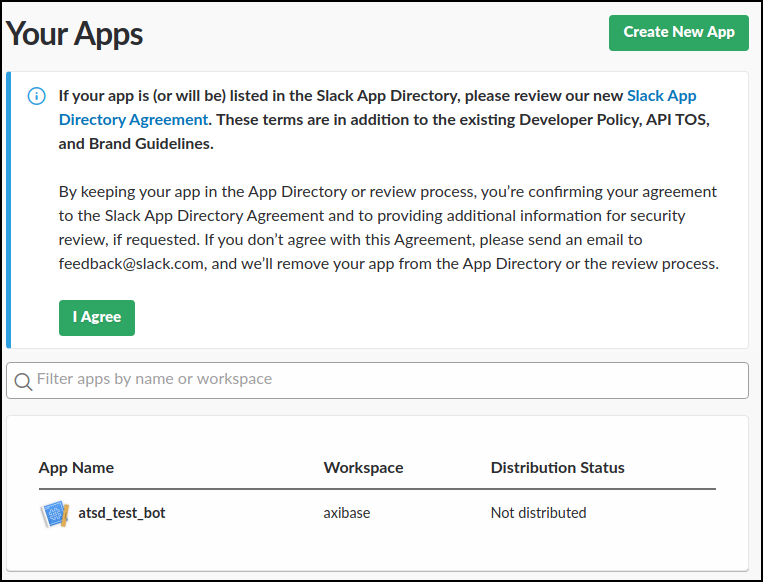

* Select an existing app or create a new one.

* Create a bot user.

    * Click on **Bot Users**.

        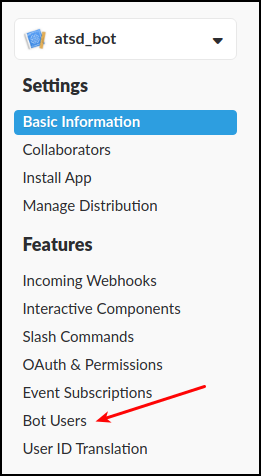

    * Click on **Add a Bot User**.

       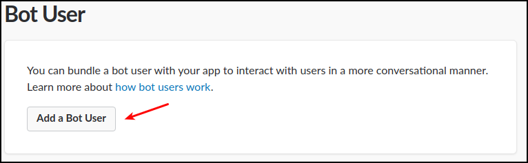

    * Review Settings, click on **Add Bot User**.

        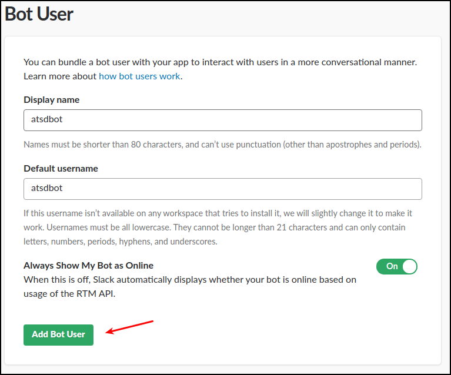

    * Click on **Save Changes**.
    
## Add Bot to Channel

* Click on **Install App**.

    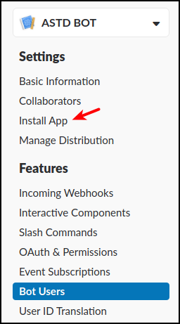
    
* Click on **Install App to Workspace**.

   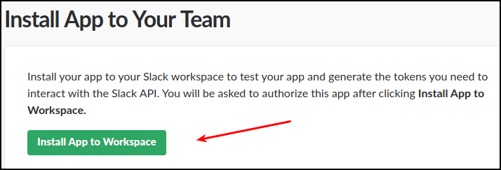
   
* Review permissions, click **Authorize**.

   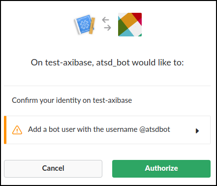
   
* Copy the **Bot User OAuth Access Token** for future reference.

   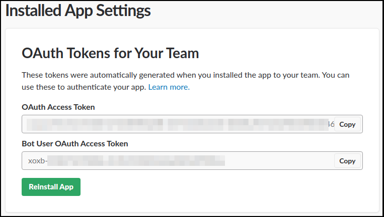
   
* Go to Slack workspace https://my.slack.com/, click on bot name in the **Apps** section.

   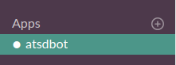

* Click on **Conversation Settings**  and **Add this app to a channel ...**.

    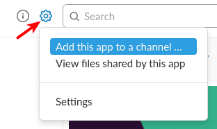

* Select the channel, click on **Add**.

    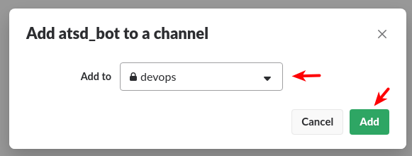
    
## Get Channel Id

 * Click on the target IM/public/private channel to display the channel URL, for example `messages/D822261LK/team/U81D8UY64/`.

     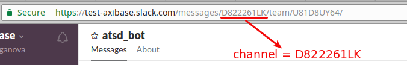

 * Copy the channel ID, which is specified between the `messages/` and `/team` parts, for example `D822261LK`.

When sending messages to either a public or private channel you can just use the name of the channel instead of its ID, for example `devops` or `general`.

## Configure Web Notification in ATSD

* Open **Alerts > Web Notifications** page.
* Click on an existing `SLACK` template, or click the **Create** button below and select the `SLACK` type.
* Specify the unique `Name` of the notification.

    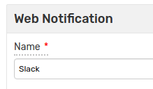 

* Specify the `Auth Token` and `Channels` parameters. See parameter descriptions below.
* Select **Test Portal** to verify screenshot delivery.

    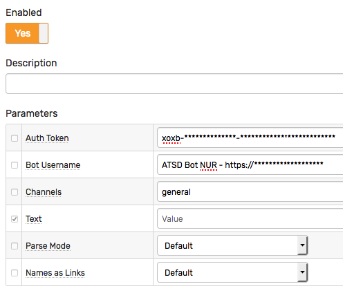   

* Click **Test**

   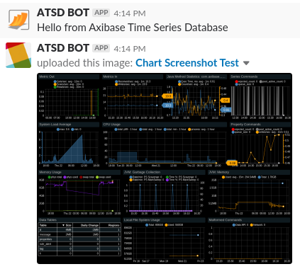

* If test is passed, check **Enable**, then click **Save**.

## Proxy Settings

If the Slack API server is not directly accessible from the ATSD server, open the **Network Settings** and specify [proxy parameters](../web-notifications.md#network-settings).

NGINX API Gateway Path for Slack:

```ls
  location /api/chat.postMessage {
      proxy_pass https://slack.com/api/chat.postMessage;
  }
  location /api/files.upload {
      proxy_pass https://slack.com/api/files.upload;
  }
```

## Notification Settings

|**Setting**|**Description**|
|---|---|
|`Auth Token`|Bot API authentication token (see above).|
|`Bot Username`|Set your bot user name.|
|`Channels`|Comma-separated list of channels, private groups, or IM channels to send message to. Each entry can be a name or an encoded ID.|
|`Text`|Message text to be sent. This field should be left blank so it can be customized in the rule editor.|
|`Parse Mode`|Change how messages are formatted. See [Basic message formatting](https://api.slack.com/docs/message-formatting) for more information.|
|`Names as Links`|Find and link channel names and usernames.|

## Reacting to Bot Messages

The bot account can be used both to deliver notifications to end users, as well as to react to messages received by the bot itself. 

In order to receive incoming messages, configure an [outgoing webhook](outgoing-webhook-slack.md). The [webhook](outgoing-webhook-slack.md) integration requires ATSD server to be reachable from Slack API servers.

## Testing Notification Rule

### Create/import rule

* Create a new rule or import an existing rule for a built-in metric as described below.
* Download the file [rules.xml](resources/rules.xml).
* Open the **Alerts > Rules > Import** page.
* Check (enable) **Auto-enable New Rules**, attach the `rules.xml` file, click **Import**.

### Configure notification

* Open **Alerts > Rules** page and select a rule.
* Open the **Web Notifications** tab.
* Select Slack from the **Endpoint** drop-down.
* Enable the `OPEN`, `REPEAT`, and `CANCEL` triggers.
* Customize the alert message using [placeholders](../placeholders.md) as necessary, for example:

```ls
  [${status}] ${rule} for ${entity} ${tags}. ${ruleLink}
```

* Save the rule by clicking on the **Save** button.

  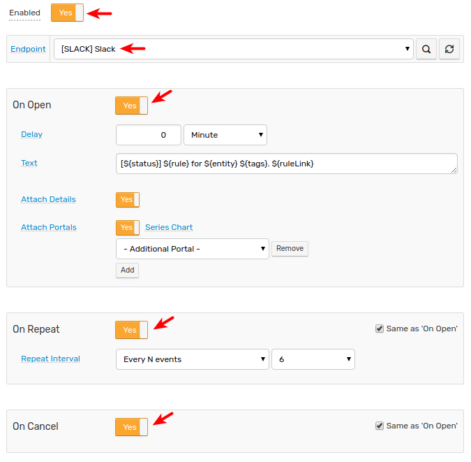

* The rule will create new windows based on incoming data.
It may take a few seconds for the first commands to arrive and trigger notifications. You can open and refresh the **Alerts > Open Alerts** page to verify that an alert is open for your rule.

## Example

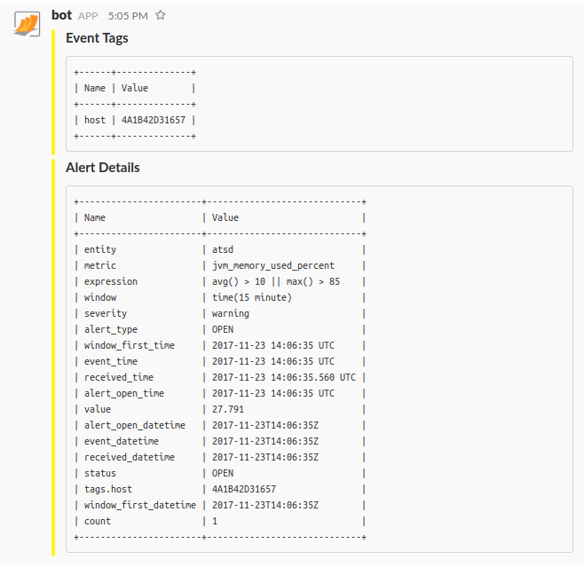

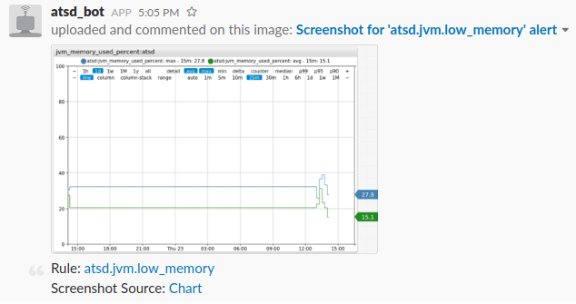
