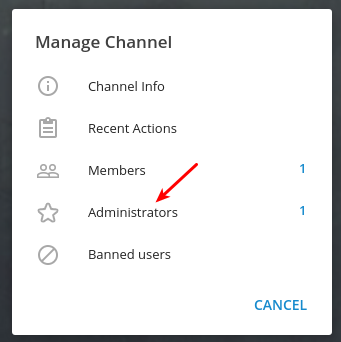
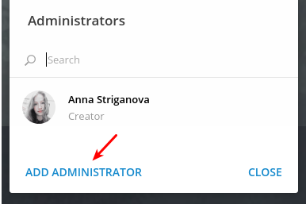
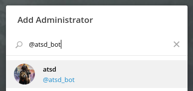
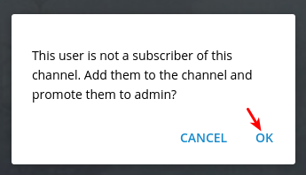
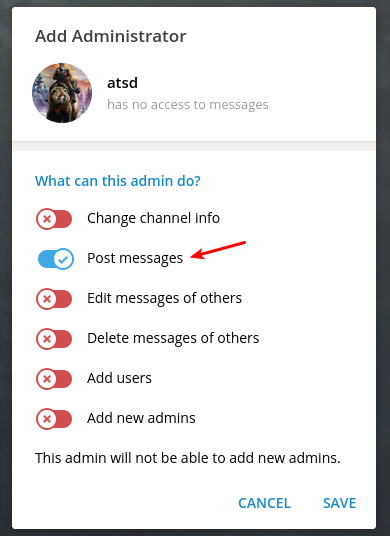

# Add Bot to Telegram Channel

* Click on **Channel Settings > Manage Channel**.

   

* At the **Manage Channel** window click on **Administrators**.

   

* At the **Administrators** window click on **ADD ADMINISTRATOR**.

   

* Specify the name of the newly created bot, for example, `@atsd_bot`.

   

* Click on the bot name and confirm.

   

* Review the settings, make sure _Post messages_ is enabled and click on **Save** > **Close** > **Cancel**.

   