# Telegram Notifications

## Overview

The `TELEGRAM` [notification](../web-notifications.md) provides a built-in capability to send alert messages, alert detail tables, and charts into Telegram groups and channels. The integration is based on the [Telegram Bot API](https://core.telegram.org/bots/api).

## Prerequisites

Install and configure the [Web Driver](web-driver.md) in order to enable sending chart screenshots into Telegram.

## Create Bot

* Search for the `BotFather` user in the Telegram client.
* Start a conversation with the [BotFather](https://telegram.me/botfather) user.

    

* Send the `/newbot` command and follow the prompts to create a bot user and obtain its token.
* Send the `/mybots` command to the BotFather](https://telegram.me/botfather).
* Select the current bot.

  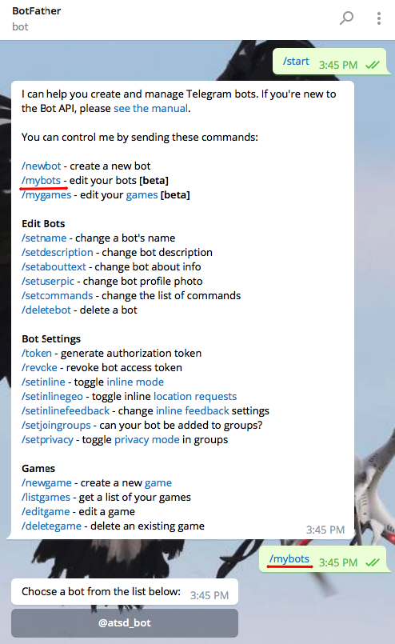

* Click on **Bot Settings > Allow Groups? > Turn groups on** to enable group notifications for this bot.

  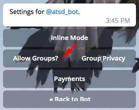

## Create Group or Channel

### Create Group

* Open profile settings > **New Group**.

   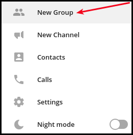

* Enter the group name, click **Next**.
* Add the previously created bot as a member of this group, for example, `@atsd_bot`

   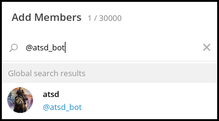

* Add other members to receive notifications from ATSD.
* Click **Create**.

### Create Channel

* Open profile settings **New Channel**.

   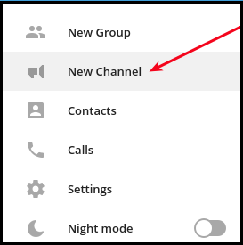

* Enter the channel name. Click **Create**.
* Select the channel type and click the **Invite link** field if necessary.
* Click **Save**.

   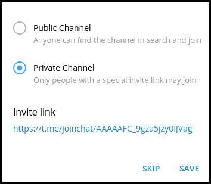

* Add members to receive notifications from ATSD > **Invite**.
* Click on **Channel Settings > View channel info**

          

   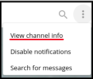

* **N administrators > Add administrator** > enter bot name to the search field, for example `@atsd_bot`

   

   Click on bot and confirm **OK**.

   

   Review the settings and click **Save > Close**.

   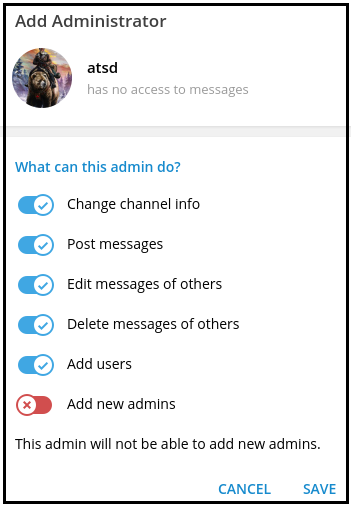

## Get Chat Id

The easiest way to locate the `chat id` for the group or channel is to log into [Telegram Web](https://web.telegram.org). The chart id is required for the Telegram notification to function properly.

Lookup the chat id as described below and copy the chat id for future reference.

### For Group  

* Click on the group name and check its URL, for example `/#/im?p=g306974066`.

  

* Substitute the `g` character with the minus sign, so that the number is like `-306974066`.

### For Private Channel

  * Click on the channel name and check its URL:

   `/#/im?p=c1354757644_16698643680908793939`

    

  * Copy numbers before underscore and replace `c` with `-100`, so that the chat id looks like `-1001354757644`.

#### For Public Channel

  * Click on the channel name and check its URL: `/#/im?p=@atsd_notifications`

         

  * Copy symbols after `=`, so the chat id looks like `@atsd_notifications`

### For Direct Message Chat

  * Go to `https://t.me/BOT_NAME`, for example https://t.me/atsd_bot
  * Click **Open in Web**.
  * Click **Start**.
  * Send a message to bot.
  * Go to https://api.telegram.org/botBOT_TOKEN/getUpdates (replace BOT_TOKEN with the actual value).
  * Review the `Chat Object`

    

## Configure Web Notification in ATSD

* Open **Alerts > Web Notifications** page.
* Click on an existing `TELEGRAM` template, or click the **Create** button below and switch the form to `TELEGRAM` type.
* Enter the `BOT_TOKEN` value into the `bot_id` field.
* Enter the chat id into the `chat_id` field.

  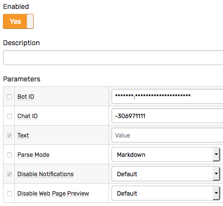

* Click **Test**.

   

* Select **Test Portal** to verify screenshot delivery.

   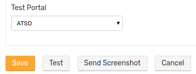   

* Click **Send Screenshot**.

   

* If tests are passing OK, check **Enable**, click **Save**.

## Notification Settings

|**Setting**|**Description**|
|---|---|
|Bot ID|Each bot is given a unique authentication token when it is created.|
|Chat ID|Unique identifier for the target chat or the target channel.|
|Text|Message text to be sent. This field should be left blank so it can be customized in the rule editor.|
|Parse Mode|Send [Markdown](https://core.telegram.org/bots/api#markdown-style) or [HTML](https://core.telegram.org/bots/api#html-style) if you want show bold, italic, fixed-width text or inline URLs in your message.|
|Disable Notifications|Sends the message silently. Users will receive a notification with no sound.|
|Disable Web Page Preview|Disables link previews for links in this message.|

## Testing Notification Rule

### Create/import rule

* Create a new rule or import an existing rule for a built-in metric as described below.
* Download the file [rules.xml](resources/rules.xml).
* Open the **Alerts > Rules > Import** page.
* Check (enable) **Auto-enable New Rules**, attach the `rules.xml` file, click **Import**.

### Configure notification

* Open **Alerts > Rules** page and select a rule.
* Open the **Web Notifications** tab.
* Select Telegram from the **Endpoint** drop-down.
* Enable the `OPEN`, `REPEAT`, and `CANCEL` triggers.
* Customize the alert message using [placeholders](../placeholders.md) as necessary, for example:

```ls
    OPEN = [${status}] ${rule} for ${entity} ${tags}. ${ruleLink}
    REPEAT = [${status}] ${rule} for ${entity} ${tags}. Duration: ${alert_duration_interval}. ${ruleLink}
    CANCEL = [${status}] ${rule} for ${entity} ${tags}. Duration: ${alert_duration_interval}. ${ruleLink}
```

* Save the rule by clicking on the **Save** button.

  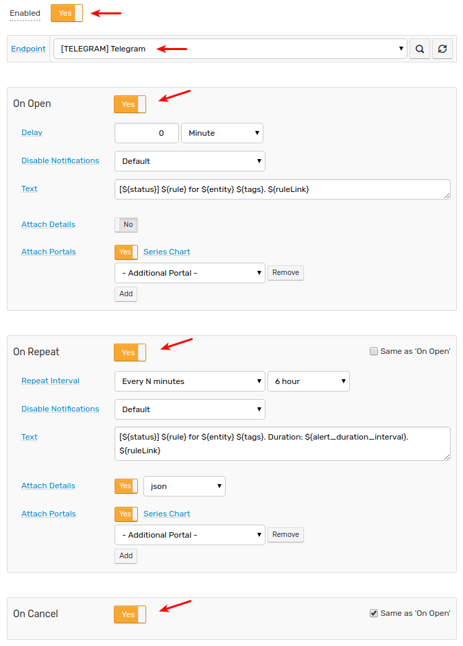

* The rule will create new windows based on incoming data.
It may take a few seconds for the first commands to arrive and to trigger the notifications. You can open and refresh the **Alerts > Open Alerts** page to verify that an alert is open for your rule.

## Test

* Check the channel messages.

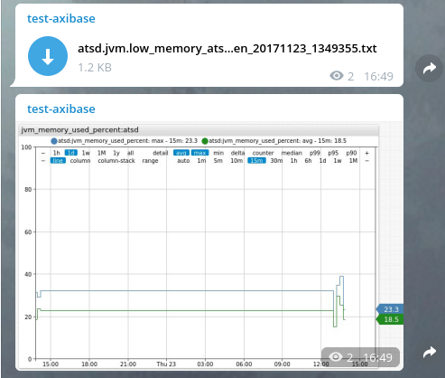

Sample alert table file.


## Notifications examples


