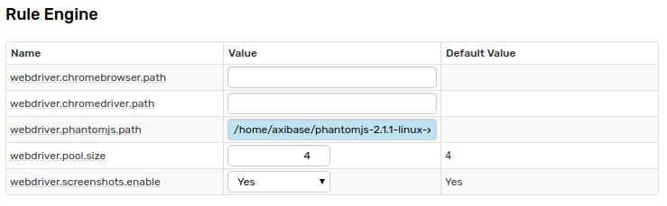
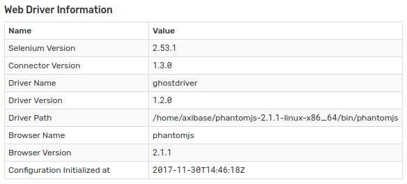
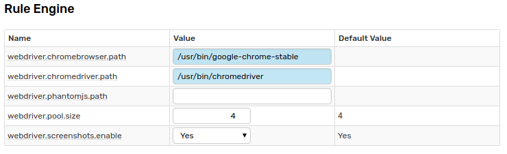
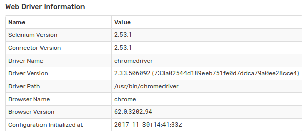

# Web Driver Installation

## Overview

There are two types of supported Web Drivers: [PhantomJS](http://phantomjs.org/) and [Chrome Driver](https://sites.google.com/a/chromium.org/chromedriver/).

> If you are installing the Web Driver inside the Docker container, log in as root and execute the commands without `sudo`
>
> ```bash
> docker exec -it -u root atsd bash
> ```

## Option 1: PhantomJS

* Install wget if necessary.

```bash
sudo apt-get update && sudo apt-get install wget
```

* Download and install PhantomJS:

```bash
cd /home/axibase
wget https://axibase.com/public/phantomjs-2.1.1-linux-x86_64.tar.gz
tar xzf phantomjs-2.1.1-linux-x86_64.tar.gz
```

* Make phantomjs executable available to axibase user 

```bash
sudo chown -R axibase /home/axibase/phantomjs-2.1.1-linux-x86_64
```

* Set path to `/home/axibase/phantomjs-2.1.1-linux-x86_64/bin/phantomjs` in **Settings > Server Properties > webdriver.phantomjs.path**.

    
    
* Open Rules > Web Notifications page. Create and test one of TYPE-specific web notifications such as [Telegram](telegram.md) or [Slack](slack.md). Verify that screenshot was successfully received in the chat client.
    
* Review Web Driver settings on **Settings > System** Information page, no error should be displayed.

    


## Option 2: Chrome Driver

* Install Сhrome (see https://www.google.com/linuxrepositories/).

Ubuntu:

```bash
sudo apt-get update && sudo apt-get install wget
wget https://dl.google.com/linux/direct/google-chrome-stable_current_amd64.deb
sudo dpkg -i google-chrome-stable_current_amd64.deb
sudo apt-get install -f --no-install-recommends
```

RedHat, CentOS:

```bash
wget https://dl.google.com/linux/direct/google-chrome-stable_current_x86_64.rpm
sudo yum install ./google-chrome-stable_current_*.rpm
```

* Install `chromedriver`

Ubuntu:

```bash
sudo apt-get install unzip
wget https://chromedriver.storage.googleapis.com/2.33/chromedriver_linux64.zip
unzip chromedriver_linux64.zip
sudo mv chromedriver /usr/bin/chromedriver
```

RedHat, CentOS:

```bash
sudo yum install unzip
wget https://chromedriver.storage.googleapis.com/2.33/chromedriver_linux64.zip
unzip chromedriver_linux64.zip
sudo mv chromedriver /usr/bin/chromedriver
```
* Set path to `/usr/bin/chromedriver` and `/usr/bin/google-chrome-stable` in **Settings > Server Properties > webdriver.chromedriver.path** and **webdriver.chromebrowser.path**.

    

* Open Rules > Web Notifications page. Create and test one of TYPE-specific web notifications such as Telegram or Slack. Verify that screenshot was successfully received in the chat client.

* Review Web Driver settings on **Settings > System Information** page, no error should be displayed.

    
