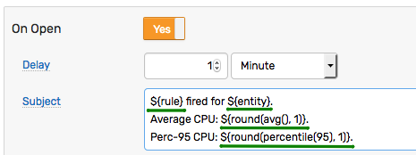

# Placeholders

## Overview

Placeholders can be used to include contextual information in email messages, web notifications, system commands, and logging messages.



## Syntax

The placeholder is declared with the dollar sign `$` and curly braces `{}`.

```ruby
  ${expression}
```

When the response action is triggered, the expression between the braces is resolved to a concrete value based on the window context.

The replacements in the original input text, such as email subject, are performed _in-place_ where each placeholder is substituted with the value of its expression, converted to a string.

The expression may refer to:

* [window](window.md#window-fields) fields
* [entity](../api/meta/entity/list.md#fields) fields
* user-defined [variables](variables.md)
* [function](functions.md) results

Unknown fields and variables are evaluated to `null`.

If the expression itself evaluates to `null`, the placeholder is substituted with an **empty** string.

If the expression cannot be evaluated due to an error, the placeholder is left unchanged and the error message is presented on the **Rule Errors** page.

## Examples

```sh
ActiveMQ on ${entity} recorded unauthorized connection from ${tags.remoteaddress}.
---
ActiveMQ on nurswgvml007 recorded unauthorized connection from 10.102.0.106.
```

```sh
Average CPU usage on ${entity} is high: ${round(avg()*100,1)}%
---
Average CPU usage on nurswgvml007 exceeds threshold: 70.2%
```

```sh
File System '${tags.file_system}' is low on disk space: ${value} (used)
---
File System '/opt/apps' is low on disk space: 95.567 (used)
```

```sh
Server ${entity.label}/${entity} located at site ${lower(entity.tags.location)} is shutting down.
---
Server Apps-NUR/nurswgvml007 located at site NUR is shutting down.
```
