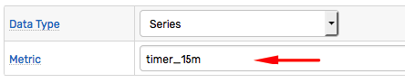
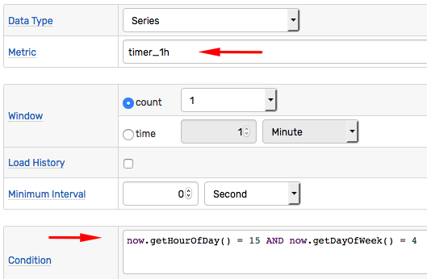

# Scheduled Rules

## Overview

The rule engine implemented in ATSD is **event driven**: the condition specified in the rule is evaluated when a new command is added or an old command is removed from the window.

To evaluate the rule on schedule instead of event, use **timer** metrics which are produced regularly by the database itself:

**Metric Name** | **Frequency**
---|:---
`timer_15s` | 15 seconds.
`timer_1m` | 1 minute.
`timer_15m` | 15 minutes.
`timer_1h` | 1 hour.

By reacting to a `timer` metric, the rule can be evaluated at the desired frequency, for example, every 15 minutes:



## Analyzing Data

To analyze data for the metric of interest (not the `timer` metric itself), use [db](functions-db.md) and [lookup](functions-lookup.md) functions.

* Example:

The condition is `true` if the average value for the given series exceeds the threshold.

```javascript
db_statistic('avg', '3 hour', 'temperature', 'sensor-01') > 50
```

* Example:

The condition is `true` if one of the entities collecting `jmx.zookeeper.tick` metric has stopped inserting data.

```javascript
getEntityCount('jmx.zookeeper.tick', 'now - 1*DAY', 'now - 1*HOUR', '') > 0
```

## Calendar Filter

To restrict the times of the day when the rule is active, evaluate the `now` field as part of the condition.

The [`now`](window-fields.md#time-fields) field represents current server time as a [`DateTime`](object-datetime.md) object which properties can be accessed with various `get()` methods.

```javascript
now.getHourOfDay() = 15
```


