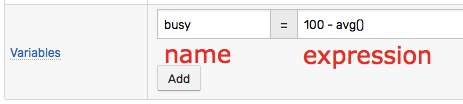
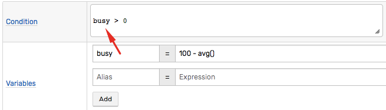
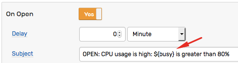
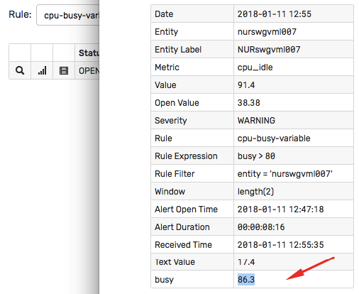

# Variables

## Overview

Variables are defined on the **Overview** tab and consist of a unique name and an expression.



## Usage

### Condition

The user-defined variables can be referenced in the rule [condition](condition.md).



### Response Actions

Similar to the built-in window [placeholders](placeholders.md), the variables can be also included by name in the notifications messages, system commands, and logging messages:

```sh
${busy}
```



### Filter

Variables **cannot** be included in the [filter](filters.md) expression because filters are evaluated prior to the command is assigned to windows.

## Data Types

### number

  ```javascript
  avar = 123
  bvar = 3.1415
  ```

### string

  ```javascript
  state = CA
  ```

  > Quotes are not necessary to declare a string variable.

### list

  ```javascript
  alist = ['a', 'b', 'c']
  ```

  ```javascript
  alist = ["a", "b", "c"]
  ```  

  > Both single and double quote can be used to specify list elements.  

### map

  ```javascript
  ['type' : 'park', 'state': 'CA']
  ```

  ```javascript
  ["type" : "park", "state": "CA"]
  ```

  > Both single and double quote can be used to specify map keys and values.

### function

  ```javascript
  last_msg = db_message_last('1 week', 'alert', 'rule-engine', 'rule=abc')
  ```

  ```javascript
  since_start = formatIntervalShort(elapsedTime(property('docker.container.state::startedat')))
  ```  

  ```javascript
  server = upper(keepBefore(entity, ':'))
  ```  

### expression

  ```javascript
  annotation = tags.note == null ? '' : tags.note
  ```

### Execution

The variables are evaluated for each incoming command regardless of the window status.

If the variable invokes an external function such as [`scriptOut`](functions-script.md) it must execute quickly (less than a few seconds). The long-running functions should not be included in variables.

The current value of variables can be accessed on the window detail page.


