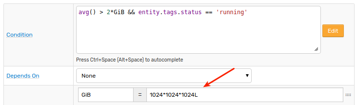
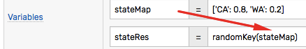
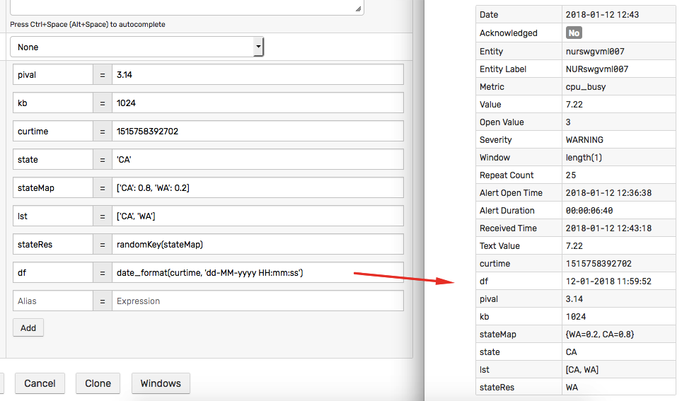

# Variables

## Overview

Variables are defined on the **Overview** tab and consist of a unique name and an expression.


## Usage

### Condition

The user-defined variables can be referenced in the rule [condition](condition.md).


### Response Actions

Similar to the built-in window [fields](window.md#window-fields), variables can be included by name in the notifications messages, system commands, and logging messages using [placeholders](placeholders.md):

```css
${busy}
```


### Filter

Variables **cannot** be included in a [filter](filters.md) expression because filters are evaluated prior to the command being added to a window.

## Data Types

### double

  ```javascript
  pival = 3.14
  ```

### integer

  ```javascript
  kb = 1024
  ```  

### long

  ```javascript
  curtime = 1515758392702
  ```  
> Classify large integers as Long (64-bit integer) or floating numbers to avoid 32-bit integer overflow. The range of values that a regular 32-bit integer can hold is [-2147483647, 2147483648].



### string

Use single or double **quotes** when declaring a string variable. 

  ```javascript
  state = 'CA'
  ```

Inner quotes can be escaped with backslash.

  ```javascript
  sqlQuery = 'SELECT value AS used_mb FROM "fs.rw" WHERE entity = \'' + entity + '\''
  ```

  ```javascript
  sqlQuery = "SELECT value AS used_mb FROM \"fs.rw\" WHERE entity = '" + entity + "'"
  ```

### collection

  ```javascript
  errorCodes = [401, 403, 404]
  ```  
  
A collection can include elements of different types.

Both single and double quotes can be used to specify elements of string type.   

  ```javascript
  stateList = ['CA', 'WA']
  ```

  ```javascript
  stateList = ["CA", "WA"]
  ```  
  
To check the size of the collection, use the `.size()` method.

To access the n-th element in the collection, use square brackets `[index]` or the `get(index)` method (starting with 0 for the first element).

  ```javascript
  authors = split(tags.authors, ',')
  authors.size() == 0 ? 'n/a' : authors[0]
  ```  

### map

  ```javascript
  stateMap = ['CA': 0.8, 'WA': 0.2]
  ```

  ```javascript
  stateMap = ["CA": 0.8, "WA": 0.2]
  ```

  > Both single and double quotes can be used to specify map keys and values.

### function

  ```javascript
  last_msg = db_message_last('1 week', 'alert', 'rule-engine')
  ```

  ```javascript
  since_start = formatIntervalShort(elapsedTime(property('dkr.state::started')))
  ```  

  ```javascript
  server = upper(keepBefore(entity, ':'))
  ```  

### expression

  ```javascript
  annotation = tags.note == null ? 'N/A' : tags.note
  ```

## Cross-Reference

These variables can refer to other variables declared in the same rule.



### Order

Variables are evaluated in the order defined on the **Overview** tab.

A dependent variable must be declared **after** the variable that it refers to.

### References

Variables that are dependent on other variables can be included in a condition.


## Execution

Variables are evaluated for each incoming command regardless of the window status.

If the variable invokes an external function such as [`scriptOut`](functions-script.md) it must execute quickly (less than a few seconds). Long-running functions should not be included in variables.

The current value of a variable can be accessed on the window detail page.




